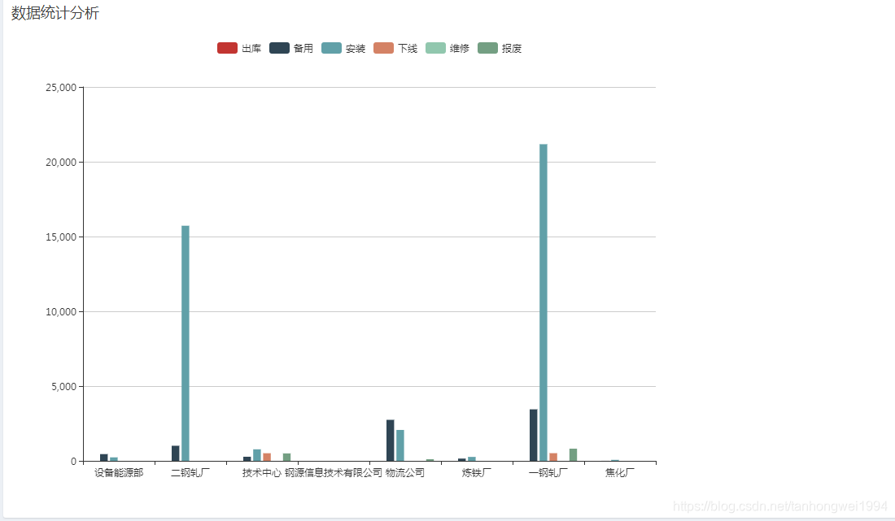

# Echarts——使用 dataset 管理数据

> 原创 于 2018-10-30 15:51:00 发布 · 公开 · 1w 阅读 · 1 · 7 · 本内容遵循CC 4.0 BY-SA版权协议 版权声明：本文为博主原创文章，遵循 CC 4.0 BY-SA 版权协议，转载请附上原文出处链接和本声明。 · 编辑
> 文章链接：https://blog.csdn.net/tanhongwei1994/article/details/83543096

一、前端源码

```html
<#--noinspection ALL-->
<!DOCTYPE html>
<html>
<head>
    <meta charset="utf-8">
    <meta http-equiv="X-UA-Compatible" content="IE=edge">
    <title>dataset demo</title>
<#include "common_css.ftl">
    <!-- DataTables -->
    <link rel="stylesheet" href="/assets/AdminLTE2/plugins/datatables/dataTables.bootstrap.css">
</head>
<body class="hold-transition skin-blue sidebar-mini">
<style>
    .selected {
        background: green
    }
 
    ;
    .details-control {
        width: 150px;
    }
</style>
<div class="wrapper">
<#include "header.ftl">
    <!-- Content Wrapper. Contains page content -->
    <div class="content-wrapper">
        <input type="hidden" id="menuName" value="area_list">
 
        <div style="display:none">
            <input type="file" name="_f" id="_f"/>
        </div>
        <!-- Main content -->
        <section class="content">
            <div class="row">
                <div class="col-xs-12">
                    <div class="box">
                        <div class="box-header" >
                            <h3 class="box-title">数据统计分析</h3>
                        </div>
                        <!-- /.box-header -->
                        <div class="box-body" id="demo" style="width: 900px;height:600px;">
                        </div>
                        <!-- /.box-body -->
                    </div>
                    <!-- /.box -->
                </div>
                <!-- /.col -->
            </div>
            <!-- /.row -->
        </section>
        <!-- /.content -->
    </div>
    <!-- /.content-wrapper -->
<#include "footer.ftl">
    <!-- Add the sidebar's background. This div must be placed
         immediately after the control sidebar -->
    <div class="control-sidebar-bg"></div>
</div>
<!-- ./wrapper -->
<#include "common_js.ftl">
 
<!-- DataTables -->
<script src="/assets/AdminLTE2/plugins/datatables/jquery.dataTables.min.js"></script>
<script src="/assets/AdminLTE2/plugins/datatables/dataTables.bootstrap.min.js"></script>
<!-- SlimScroll -->
<script src="/assets/AdminLTE2/plugins/slimScroll/jquery.slimscroll.min.js"></script>
<script src="/js/echarts/echarts.common.min.js"></script>
<script language="javascript" type="text/javascript" src="/jquery/My97DatePicker/WdatePicker.js"></script>
 
<!-- page script -->
<script type="text/javascript">
    var dataArray = ['product', '出库', '备用', '安装', '下线', '维修', '报废'];
    var myChart = echarts.init(document.getElementById('demo'));
    // 显示标题，图例和空的坐标轴
    myChart.setOption({
        legend: {},
        tooltip: {},
        dataset: {
            // 提供一份数据。
            source: [
                dataArray,
                ['设备能源部', 43.3, 85.8, 93.7, 1, 23, 55],
                ['二钢轧厂', 83.1, 73.4, 55.1, 123, 34, 54],
                ['技术中心', 86.4, 65.2, 82.5, 90, 76, 80],
                ['钢源信息技术有限公司', 72.4, 53.9, 39.1, 50, 60, 70]
            ]
        },
        // 声明一个 X 轴，类目轴（category）。默认情况下，类目轴对应到 dataset 第一列。
        xAxis: {type: 'category'},
        // 声明一个 Y 轴，数值轴。
        yAxis: {},
        // 声明多个 bar 系列，默认情况下，每个系列会自动对应到 dataset 的每一列。
        series: [
            {type: 'bar'},
            {type: 'bar'},
            {type: 'bar'}
        ]
    });
    myChart.showLoading();// 加载动画
    // 异步加载数据
    $.post('../echarts/getData.do',{}).done(function(data) {//jQuery触发ajax 从后台异步获取数据
        //var str = eval('(' + data + ')'); //解析json
        var jsonObj =  JSON.parse(data);//转换为json对象
        var amountArray=[];
        var nameArray=[];
        for(var i=0;i<jsonObj.length;i++){
            amountArray.push(jsonObj[i].amountList);
            nameArray.push(jsonObj[i]. productAreaName);
        }
        for(var j=0;j<nameArray.length;j++){
            amountArray[j].unshift(nameArray[j]);
        }
        amountArray.unshift(dataArray);
        myChart.hideLoading();
        // 填入数据
        myChart.setOption({
            legend: {},
            tooltip: {},
            dataset: {
                // 提供一份数据。 source对应的是个二元数组
                source:
                amountArray
            },
            // 声明一个 X 轴，类目轴（category）。默认情况下，类目轴对应到 dataset 第一列。
            xAxis: {
                type: 'category',
                axisLabel: {
                    show: true,
                    interval: 0
                }},
            // 声明一个 Y 轴，数值轴。
            yAxis: {},
            // 声明多个 bar 系列，默认情况下，每个系列会自动对应到 dataset 的每一列。
            series: [
                {type: 'bar'},
                {type: 'bar'},
                {type: 'bar'},
                {type: 'bar'},
                {type: 'bar'},
                {type: 'bar'},
            ]
        });
    });
</script>
</body>
</html>
```

二、效果图


 

