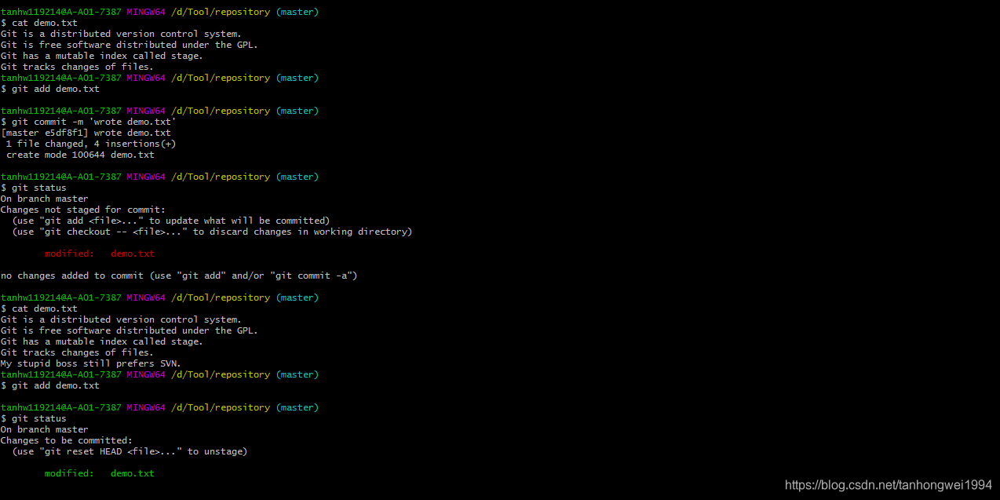
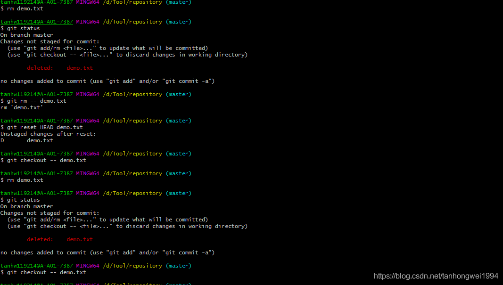
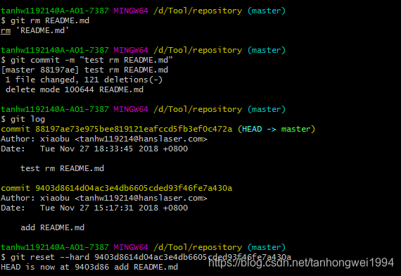
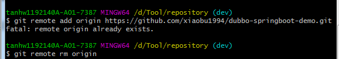
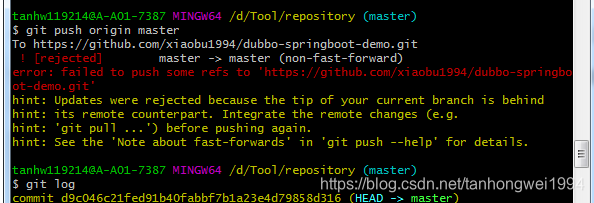

# Git 常用命令总结（二）

> 原创 于 2018-10-31 11:45:18 发布 · 公开 · 279 阅读 · 0 · 0 · 本内容遵循CC 4.0 BY-SA版权协议 版权声明：本文为博主原创文章，遵循 CC 4.0 BY-SA 版权协议，转载请附上原文出处链接和本声明。 · 编辑
> 文章链接：https://blog.csdn.net/tanhongwei1994/article/details/83510484

一、撤销修改

 

1.1 若只是添加一行My stupid boss still prefers SVN.

只需要执行一下命令即可(放弃工作区的修改)

```sql
git checkout -- demo.txt
```

1.2 若已经gitadd 到了暂存区 则需先把暂存区的修改撤销掉（unstage），重新放回工作区然后执行1.1的操作

```perl
git reset HEAD demo.txt
 
git checkout -- demo.txt
```

OK 世界终于清静了。

用git diff HEAD -- demo.txt命令可以查看工作区和版本库里面最新版本的区别

若已经提交了不合适的修改到版本库时，想要撤销本次提交，参考版本回退一节，不过前提是没有推送到远程库。

二、删除文件

2.1执行 rm demo.txt  工作区和版本库就不一致了

现在你有两个选择，一是确实要从版本库中删除该文件，那就用命令 `git rm` 删掉，并且 `git commit` ：

`git checkout` 其实是用版本库里的版本替换工作区的版本，无论工作区是修改还是删除，都可以“一键还原”。

2.2直接执行 git rm  demo.txt 则需要把还原到最新版本 git reset HEAD demo.txt再执行2.1的操作

 

2.3、若不仅git rm  文件 还commit了则需要查看日志，根据版本号来恢复。

 

三、创建并推送远程Git仓库

要关联一个远程库，使用命令

```cobol
git remote add origin https://github.com/xiaobu1994/learnGit.git
```

若出现 fatal: remoteoriginalready exists.

 

则需执行删除命令（这里用dev只是做演示，实际需要切换到master）

```java
git remote rm origin
```

然后在执行上面关联远程库的命令


关联后，使用命令第一次推送master分支的所有内容；

```perl
git push -u origin master
```

此后，每次本地提交后，只要有必要，就可以使用命令 `git push origin master` 推送最新修改；

```perl
git push origin master
```

若出现下图错误，表明(github中的README.md文件不在本地代码目录中)

 

先pull下来

```java
git pull --rebase origin master
```

再push上去

```java
git push  origin master
```


四、clone远程仓库

新建个仓库，必须初始化 [README.md](https://github.com/xiaobu1994/gitskills/blob/master/README.md) 文件

然后执行clone代码

```cobol
git clone https://github.com/xiaobu1994/gitskills.git
```

然后仓库就会克隆到你所在的文件夹目录下了。