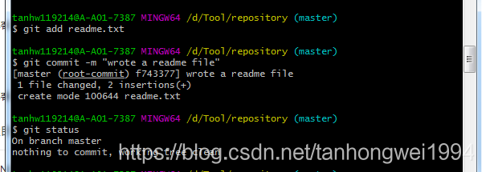
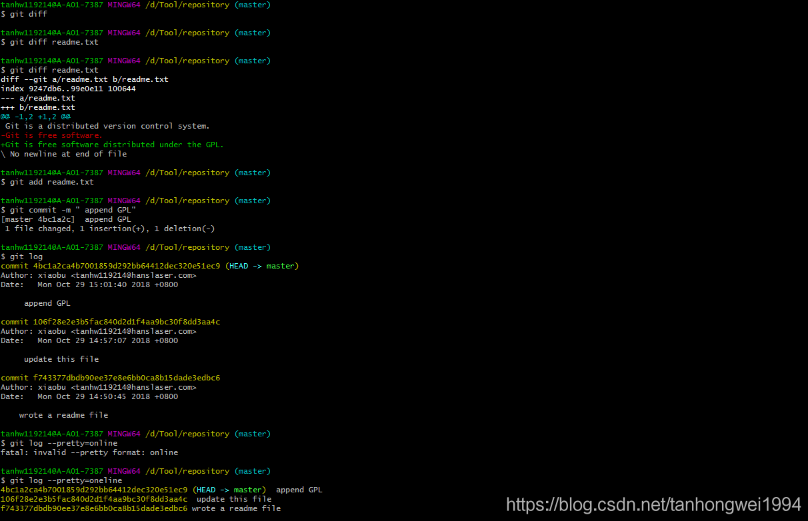
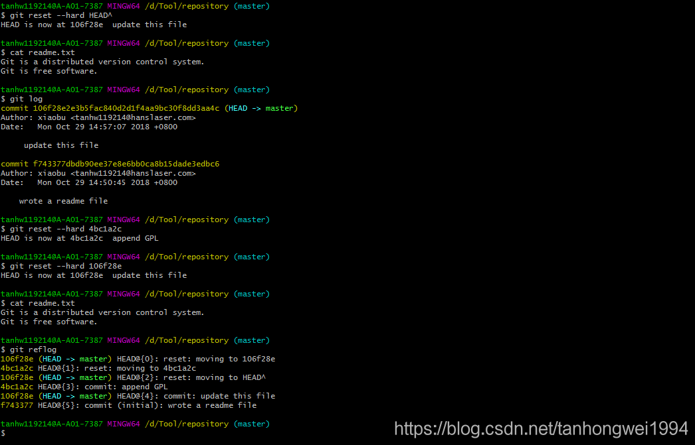

# Git 常用命令总结（一）

> 原创 于 2018-10-31 11:45:27 发布 · 公开 · 219 阅读 · 0 · 0 · 本内容遵循CC 4.0 BY-SA版权协议 版权声明：本文为博主原创文章，遵循 CC 4.0 BY-SA 版权协议，转载请附上原文出处链接和本声明。 · 编辑
> 文章链接：https://blog.csdn.net/tanhongwei1994/article/details/83506500

一、设置基本信息

gitconfig --global user.name "xiaobu"

gitconfig--global user.email "tanhw119214@hanslaser.com"

查看配置信息

git config --list

设置本地仓库

cd D:/Tool/repository

gitinit


二、上传文件

在本地仓库目录（repository）下新建个文件readme.txt 执行增加

readme.txt的初始内容

```cobol
Git is a version control system.
Git is free software.
```

git addreadme.txt

把文件提交到仓库(后面说说明)

gitcommit-m "wrote a readme file"

查看当前状态

git status

 

修改readme.txt的内容

```cobol
Git is a distributed version control system.
Git is free software.
```

查看两个版本的内容区别

gitdiffreadme.txt

查看日志信息

git log(版本库的详细信息)

git log ----pretty=oneline(只看到版本号和版本说明)

 

Git的版本回退

- `HEAD` 指向的版本就是当前版本，因此，Git允许我们在版本的历史之间穿梭，使用命令 `git reset --hard commit_id` 。

- 穿梭前，用 `git log` 可以查看提交历史，以便确定要回退到哪个版本。

- 要重返未来，用 `git reflog` 查看命令历史，以便确定要回到未来的哪个版本。

 

