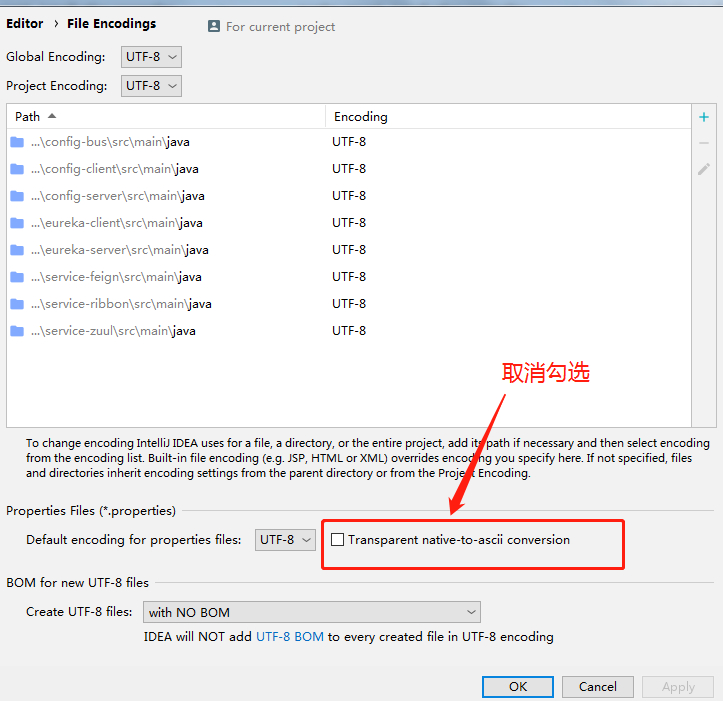

# .properties文件 git 提交后中文字符会乱码

> 原创 于 2021-01-14 14:20:39 发布 · 公开 · 1.8k 阅读 · 4 · 2 · 本内容遵循CC 4.0 BY-SA版权协议 版权声明：本文为博主原创文章，遵循 CC 4.0 BY-SA 版权协议，转载请附上原文出处链接和本声明。 · 编辑
> 文章链接：https://blog.csdn.net/tanhongwei1994/article/details/112606969

取消下面的勾选

 

参考:

[git 提交后中文字符会乱码。](https://blog.csdn.net/yilongchuan/article/details/92833077) 