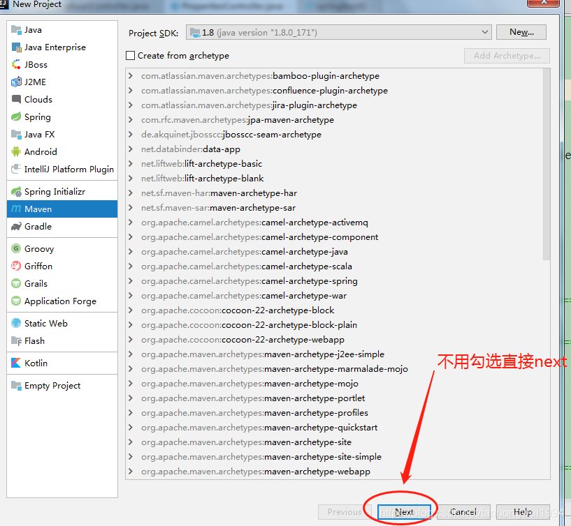
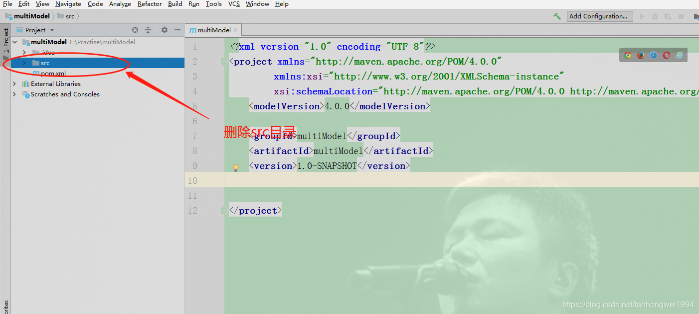
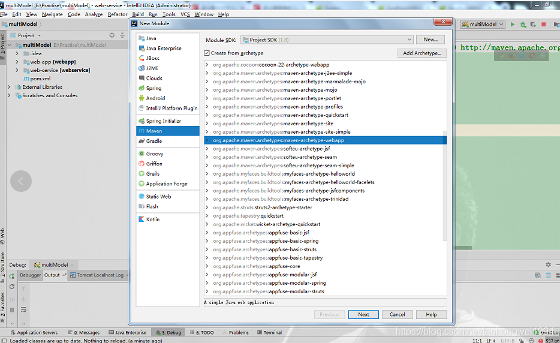
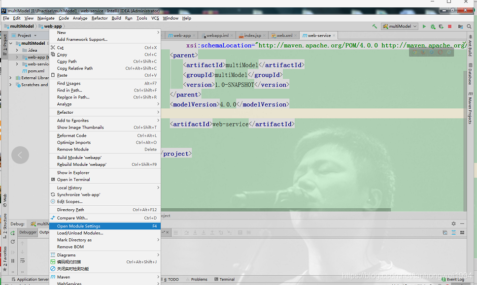
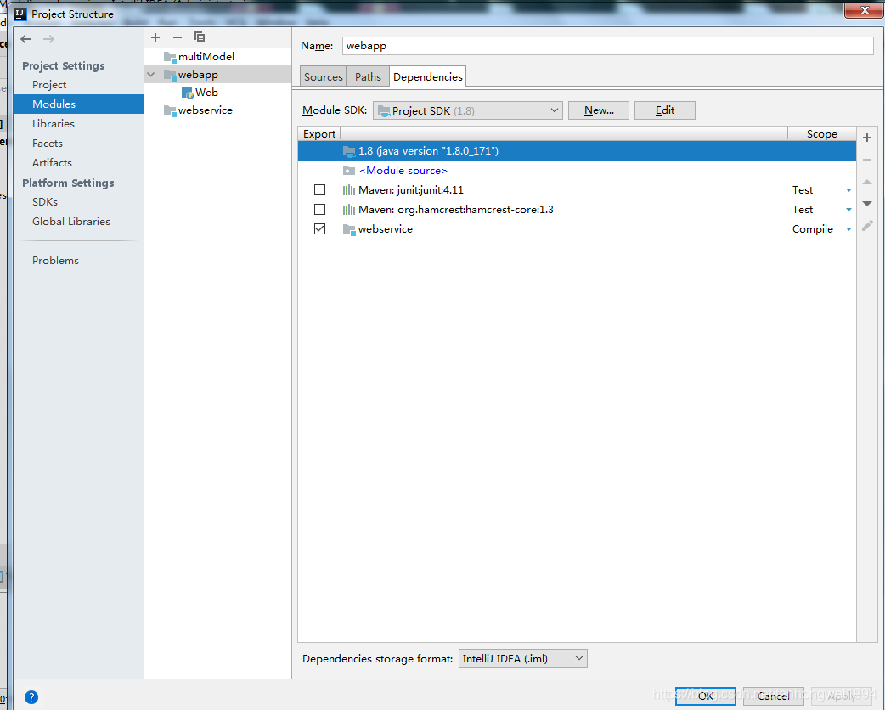

# 使用IntelliJ IDEA2018创建Maven多模块项目

> 原创 于 2018-11-05 17:37:25 发布 · 公开 · 1.2k 阅读 · 0 · 0 · 本内容遵循CC 4.0 BY-SA版权协议 版权声明：本文为博主原创文章，遵循 CC 4.0 BY-SA 版权协议，转载请附上原文出处链接和本声明。 · 编辑
> 文章链接：https://blog.csdn.net/tanhongwei1994/article/details/83752684

一、新建个父模块（不勾选archetype）

 

二、然后删除src目录

 

然后在这个新建个web-service模块 同样不需要勾选archetype (不需要删除src 要写逻辑代码)

新建个web-app模块，这次需要勾选archetype(选择webapp选项)

 

引入依赖（web-service）

 

 

配置tomcat启动项目，即可。