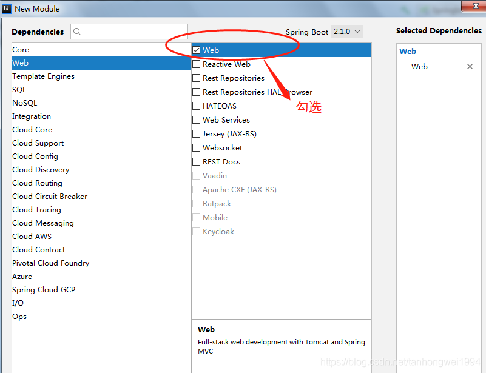

# SpringBoot多模块项目实践（Multi-Module）

> 原创 于 2018-11-05 19:13:05 发布 · 公开 · 1.6k 阅读 · 0 · 0 · 本内容遵循CC 4.0 BY-SA版权协议 版权声明：本文为博主原创文章，遵循 CC 4.0 BY-SA 版权协议，转载请附上原文出处链接和本声明。 · 编辑
> 文章链接：https://blog.csdn.net/tanhongwei1994/article/details/83754423

## 一、创建聚合父工程

首先使用 [Spring Initializr](http://www.jianshu.com/p/d2b08a671e27) 来快速创建好一个Maven工程。然后删除无关的文件，只需保留pom.xml 文件。（勾选web）

 

改造之后的pom.xml如图下所示   <packaging>必须为pom 修改build模块

```java
<?xml version="1.0" encoding="UTF-8"?>
<project xmlns="http://maven.apache.org/POM/4.0.0" xmlns:xsi="http://www.w3.org/2001/XMLSchema-instance"
         xsi:schemaLocation="http://maven.apache.org/POM/4.0.0 http://maven.apache.org/xsd/maven-4.0.0.xsd">
    <modelVersion>4.0.0</modelVersion>
 
    <groupId>com.example</groupId>
    <artifactId>springboot-multi-module</artifactId>
    <version>0.0.1-SNAPSHOT</version>
    <packaging>pom</packaging>
 
    <name>springboot-multi-module</name>
    <description>Demo project for Spring Boot</description>
 
    <modules>
        <module>mm-web</module>
        <module>mm-repo</module>
        <module>mm-service</module>
        <module>mm-entity</module>
    </modules>
 
    <parent>
        <groupId>org.springframework.boot</groupId>
        <artifactId>spring-boot-starter-parent</artifactId>
        <version>2.1.0.RELEASE</version>
        <relativePath/> <!-- lookup parent from repository -->
    </parent>
 
    <properties>
        <project.build.sourceEncoding>UTF-8</project.build.sourceEncoding>
        <project.reporting.outputEncoding>UTF-8</project.reporting.outputEncoding>
        <java.version>1.8</java.version>
    </properties>
 
    <dependencies>
        <dependency>
            <groupId>org.springframework.boot</groupId>
            <artifactId>spring-boot-starter-web</artifactId>
        </dependency>
 
        <dependency>
            <groupId>org.springframework.boot</groupId>
            <artifactId>spring-boot-starter-test</artifactId>
            <scope>test</scope>
        </dependency>
    </dependencies>
 
   <build>
        <plugins>
            <plugin>
                <groupId>org.apache.maven.plugins</groupId>
                <artifactId>maven-compiler-plugin</artifactId>
                <version>3.1</version>
                <configuration>
                    <source>${java.version}</source>
                    <target>${java.version}</target>
                </configuration>
            </plugin>
            <plugin>
                <groupId>org.apache.maven.plugins</groupId>
                <artifactId>maven-surefire-plugin</artifactId>
                <version>2.19.1</version>
                <configuration>
                    <skipTests>true</skipTests>    <!--默认关掉单元测试 -->
                </configuration>
            </plugin>
        </plugins>
    </build>
 
</project>
```


## 二、创建子模块

- 1.对着父工程右键 - New - Module - > 输入 mm-web

- 2.对着父工程右键 - New - Module - > 输入 mm-service

- 3.对着父工程右键 - New - Module - > 输入 mm-repo

- 4.对着父工程右键 - New - Module - > 输入 mm-entity

- 1~4 步骤完成后，分别调整它们的pom.xml 以继承上面的父工程。

例如mm-web模块的pom.xml 需要改造成这样：  删除build模块

```java
<?xml version="1.0" encoding="UTF-8"?>
<project xmlns="http://maven.apache.org/POM/4.0.0" xmlns:xsi="http://www.w3.org/2001/XMLSchema-instance"
         xsi:schemaLocation="http://maven.apache.org/POM/4.0.0 http://maven.apache.org/xsd/maven-4.0.0.xsd">
    <modelVersion>4.0.0</modelVersion>
 
    <artifactId>mm-web</artifactId>
    <version>0.0.1-SNAPSHOT</version>
    <packaging>jar</packaging>
 
    <name>mm-web</name>
    <description>Demo project for Spring Boot</description>
 
    <parent>
        <groupId>com.example</groupId>
        <artifactId>springboot-multi-module</artifactId>
        <version>0.0.1-SNAPSHOT</version>
    </parent>
 
    <dependencies>
        <dependency>
            <groupId>com.example</groupId>
            <artifactId>mm-entity</artifactId>
            <version>0.0.1-SNAPSHOT</version>
        </dependency>
        <dependency>
            <groupId>com.example</groupId>
            <artifactId>mm-service</artifactId>
            <version>0.0.1-SNAPSHOT</version>
        </dependency>
        <dependency>
            <groupId>com.example</groupId>
            <artifactId>mm-repo</artifactId>
            <version>0.0.1-SNAPSHOT</version>
        </dependency>
    </dependencies>
 
    
 
</project>
```

再删除掉出mm-web之外的启动类和resources文件夹。