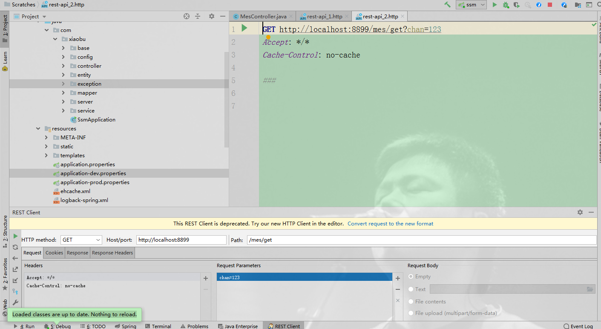
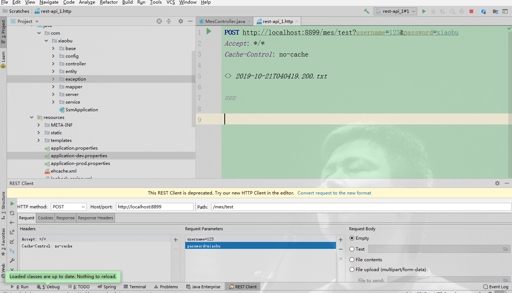
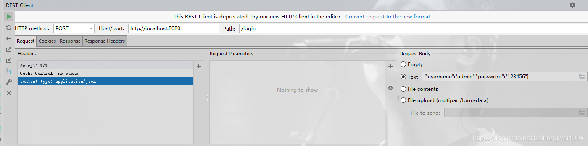

# IDEA RESTful Client 数据请求

> 原创 于 2019-10-21 16:30:17 发布 · 公开 · 599 阅读 · 0 · 1 · 本内容遵循CC 4.0 BY-SA版权协议 版权声明：本文为博主原创文章，遵循 CC 4.0 BY-SA 版权协议，转载请附上原文出处链接和本声明。 · 编辑
> 文章链接：https://blog.csdn.net/tanhongwei1994/article/details/102666699

### Get方式

 

```text
### type=1
GET http://localhost:11266/getUserDTO?type=1&userName=xiaobu&password=666666
```

自定义header模拟一个来源为 test 的请求

[](https://www.iocoder.cn/images/Spring-Boot/2020-09-01/44.png) 

```text
###

GET http://localhost:8088/demo/echo
s-user: test
```

### Post 表单方式

 

### PostJson方式

Content-Type: application/json;charset=UTF-8

 

```text
###
POST http://localhost:11266/postUserDTO
Content-Type: application/json

{
"userName": "admin",
"password": "666666"
}

```

### 上传文件excel

```text
POST http://localhost:8888/file/noticeFileUpload?userId=123
Accept: */*
Cache-Control: no-cache
Content-Type: multipart/form-data; boundary=WebAppBoundary

--WebAppBoundary
Content-Disposition: form-data; name="file"; filename="demo.xlsx"
Content-Type: application/vnd.openxmlformats-officedocument.spreadsheetml.sheet
# 文件上传路径
< D:\Users\admin\Desktop\demo.xlsx
```

### 上传文件不指定类型,

```text
###
POST http://localhost:8888/file/noticeFileUpload?userId=admin
Accept: */*
Cache-Control: no-cache
Content-Type: multipart/form-data; boundary=WebAppBoundary

--WebAppBoundary
#filename="1.png" 到时候指定上传文件的名字 必填
Content-Disposition: form-data; name="file";filename="1.png"
#下面这个可填写可不填写 表明类型 相关类型Content-Type:： https://www.runoob.com/http/http-content-type.html
#Content-Type: image/png
# 文件上传路径
< D:\Users\admin\Desktop\Screenshot_1.png
```