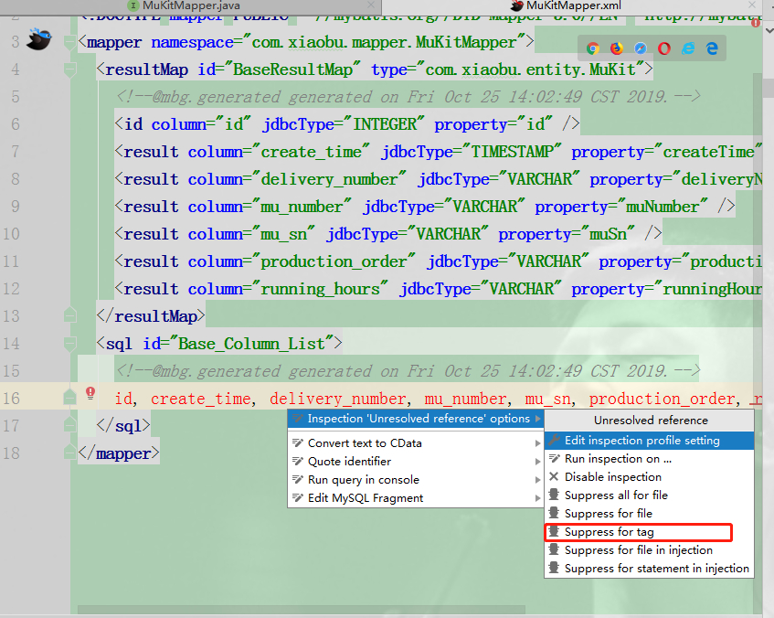
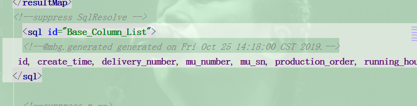

# Idea使用MyBatisCodeHelperPro生成base column报错

> 原创 于 2019-10-25 14:12:34 发布 · 公开 · 1.5k 阅读 · 1 · 0 · 本内容遵循CC 4.0 BY-SA版权协议 版权声明：本文为博主原创文章，遵循 CC 4.0 BY-SA 版权协议，转载请附上原文出处链接和本声明。 · 编辑
> 文章链接：https://blog.csdn.net/tanhongwei1994/article/details/102742055

结果图:
 

