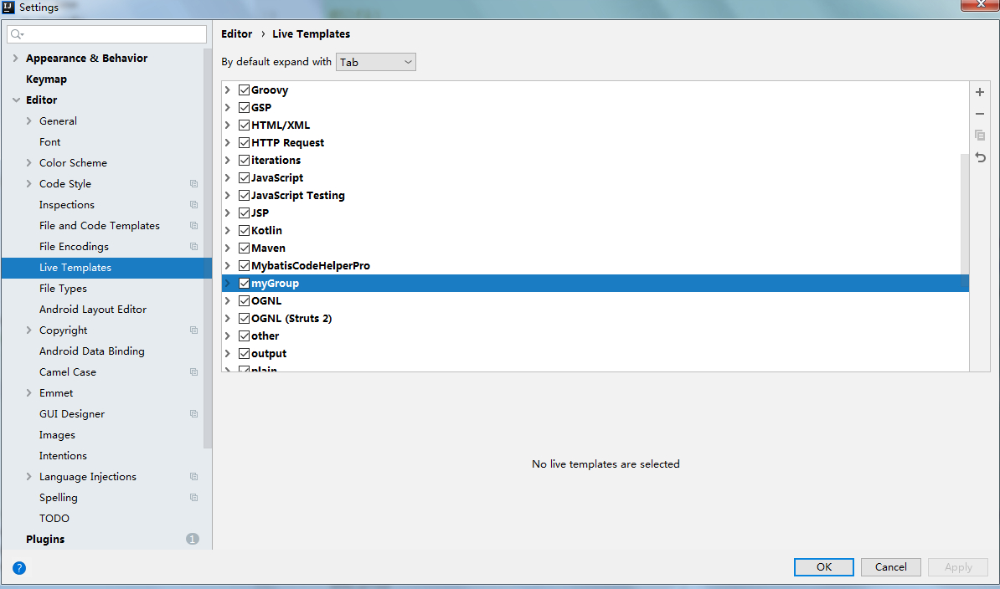
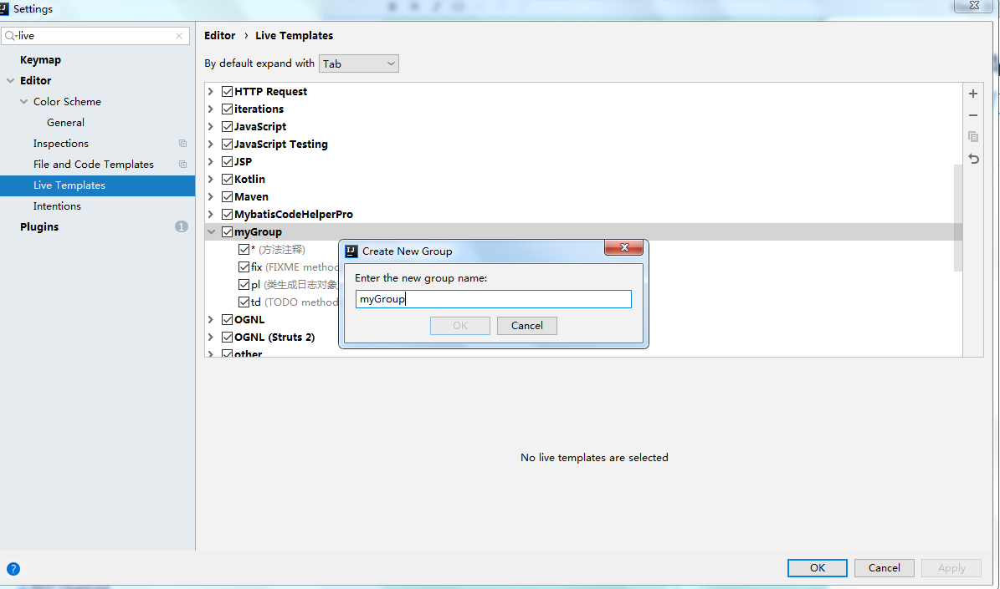
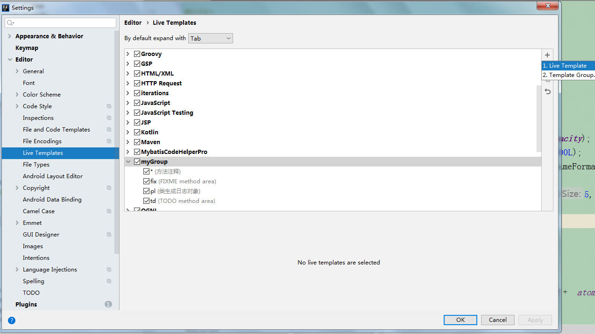
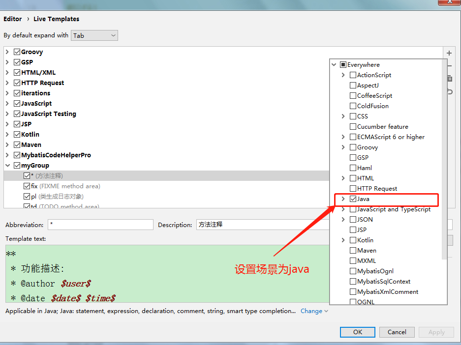
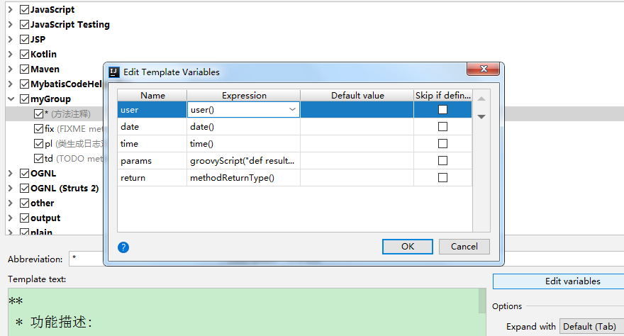
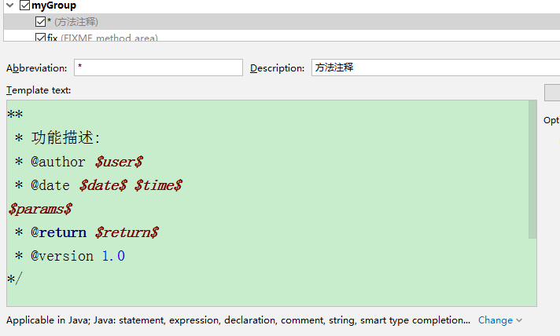
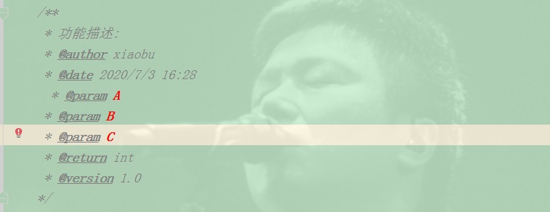
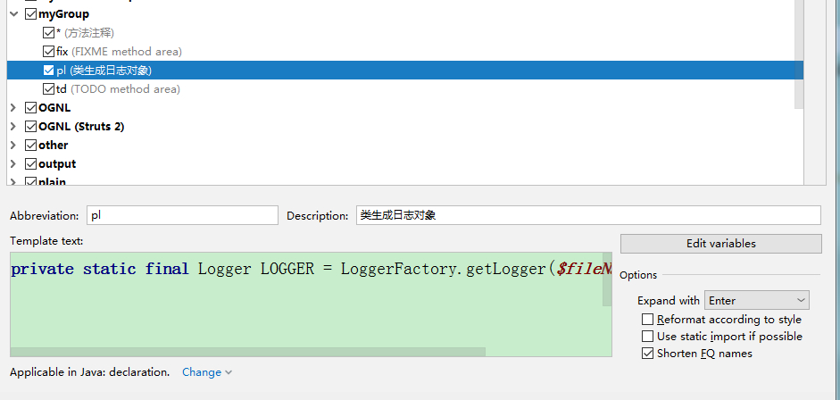
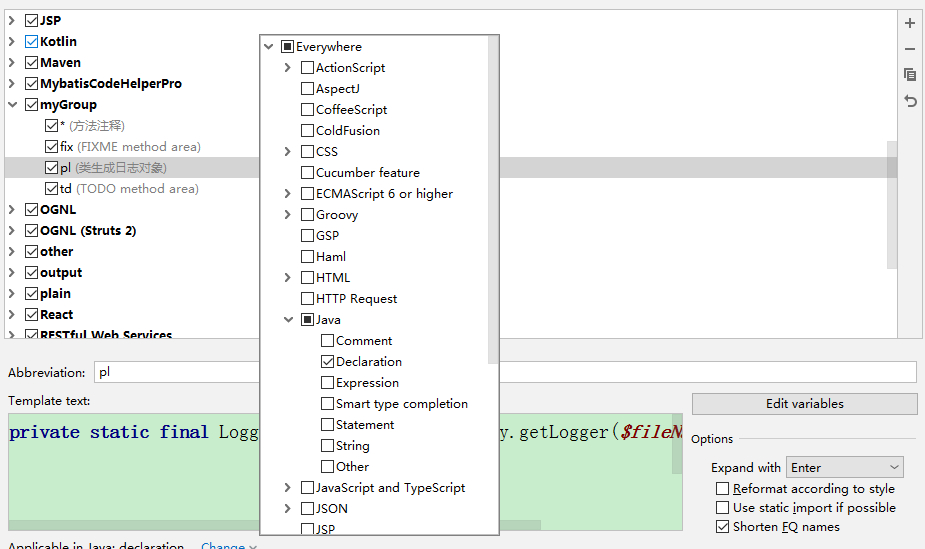
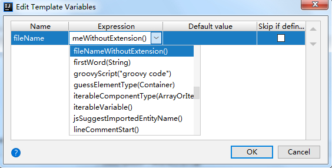

# Intellij IDEA 自定义 LIVE TEMPLATES

> 原创 于 2020-07-03 16:35:23 发布 · 公开 · 927 阅读 · 1 · 2 · 本内容遵循CC 4.0 BY-SA版权协议 版权声明：本文为博主原创文章，遵循 CC 4.0 BY-SA 版权协议，转载请附上原文出处链接和本声明。 · 编辑
> 文章链接：https://blog.csdn.net/tanhongwei1994/article/details/107108707

### 一、自定义方法注释

1. 进入setting，打开Live Templates设置面板

 

1. 新建个自定义的group

 

1. 新建Live Template

 

1. 设置应用场景

 

1. 编辑变量 点击edit variables

 

其中的params是自定义变量 ,需要输入自己的变量表达式(Groovy脚本) , 这里需要填入的脚本如下

```groovy
groovyScript("def result=''; def params=\"${_1}\".replaceAll('[\\\\[|\\\\]|\\\\s]', '').split(',').toList(); for(i = 0; i < params.size(); i++) {result+=' * @param ' + params[i] + ' '+params[i]  + ((i < params.size() - 1) ? '\\n' : '')}; return result", methodParameters()) 
```

1. template text

```
 
 ** 
 * $methodName$
 * 
 * @author $author$
        * @date $date$ $time$
        $param$
* @return $return$
        */

```

 

1. 效果图（输入/*+tab键）

 

### 二、自定义类日志对象

1. 在前面的myGroup里面新建个Live Template

 

1. 选择应用场景

 

1. 编辑值

 

1. template text的内容

```java
private static final Logger LOGGER = LoggerFactory.getLogger($fileName$.class);
```

三、设置类模板

```
/**
 * @className ${NAME}.java
 * @author 小布
 * @version 1.0.0
 * @createTime ${YEAR}年${MONTH}月${DAY}日 ${HOUR}:${MINUTE}:00
 */
```

快速添加打印日志语句

Applicablecontext选择java=>statement&expression&declaration

templatetext的内容

```properties
log.$VAR$("[$METHOD_NAME$]::$PLACE_HOLDERS$",$ARGUMENTS$);

```

参数内容

```properties
PLACE_HOLDERS=groovyScript("_1.collect { it + ' = [{}]'}.join(', ') ", methodParameters())
ARGUMENTS=groovyScript("_1.collect { it }.join(', ') ", methodParameters())
METHOD_NAME=methodName()
```