# IDEA中的Git操作

> 原创 于 2020-10-16 15:16:44 发布 · 公开 · 577 阅读 · 0 · 2 · 本内容遵循CC 4.0 BY-SA版权协议 版权声明：本文为博主原创文章，遵循 CC 4.0 BY-SA 版权协议，转载请附上原文出处链接和本声明。 · 编辑
> 文章链接：https://blog.csdn.net/tanhongwei1994/article/details/109117235

### push项目到远程服务器

一、 用Idea打开项目，创建一个本地Git仓库,默认路径就选择该项目路径，此时项目的文件名会变红。

 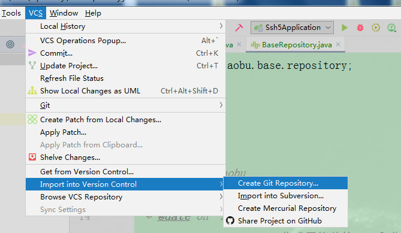

 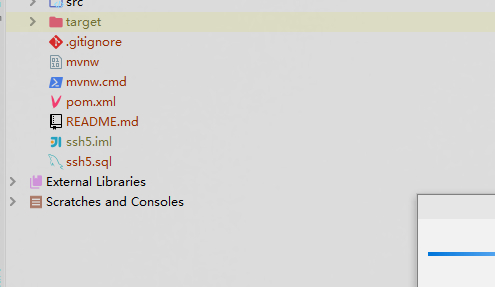

二、右键工程–>git–> Add 接着项目的文件名会变绿

 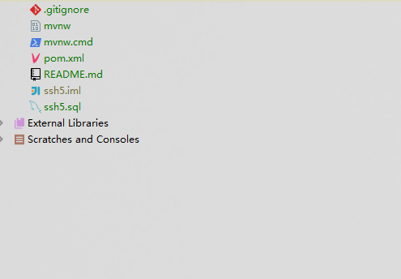

三、上传远程仓库
3.1
 

3.2Commit和Push
 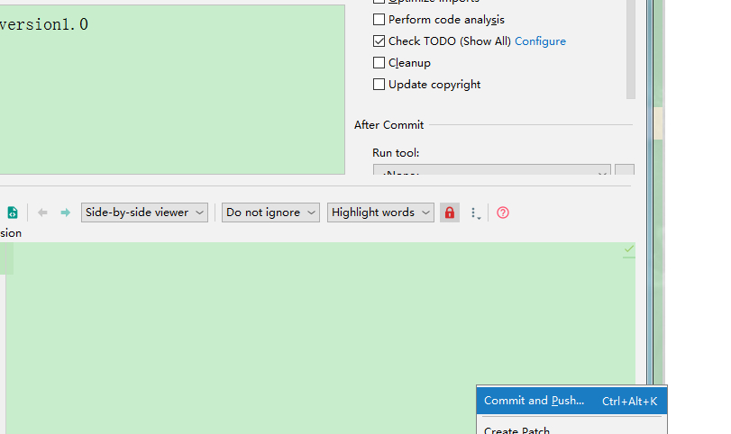

3.3 指定远程仓库的地址。如下图，点击Define remote
[外链图片转存失败,源站可能有防盗链机制,建议将图片保存下来直接上传(img-A6poOrTI-1602832569566)(http://ww1.sinaimg.cn/large/0062Ue2Wgy1gjqyjq3xs7j30g1099jrx.jpg)]

如提交遭到拒绝有可能是新建仓库初始化了 README.md导致的

### 从远程服务器clone项目到本地

 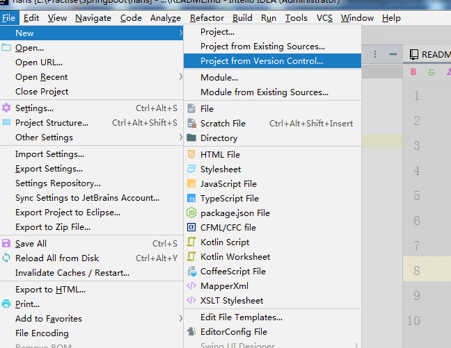

### 更新项目编码到远程仓库

> 先add ->commit -> push

 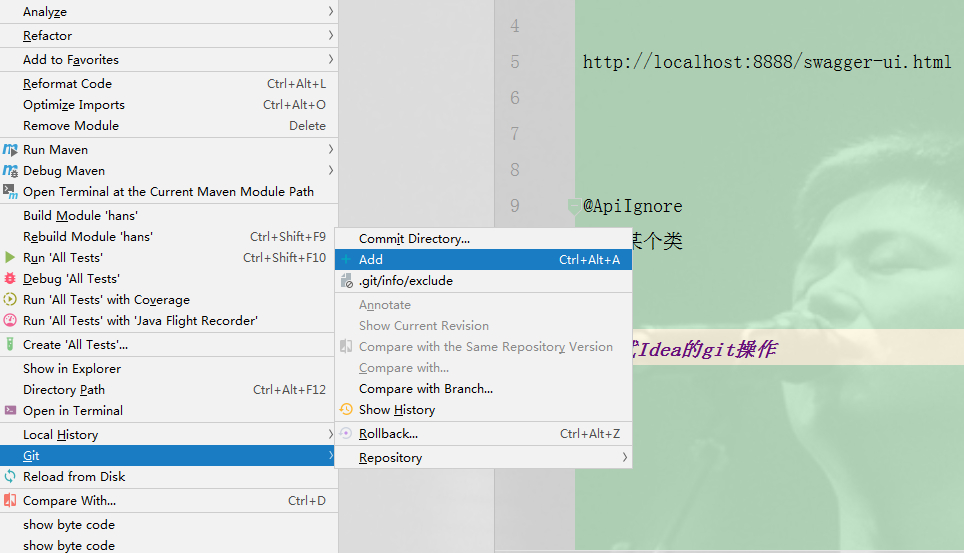

 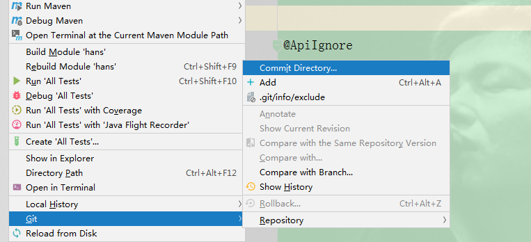

 

### 从远程仓库获取提交

> Fetch和Pull，Fetch是从远程仓库下载文件到本地的origin/master，然后可以手动对比修改决定是否合并到本地的master库。Push则是直接下载并合并。如果各成员在工作中都执行修改前先更新的规范，则可以直接使用Pull方式以简化操作。

 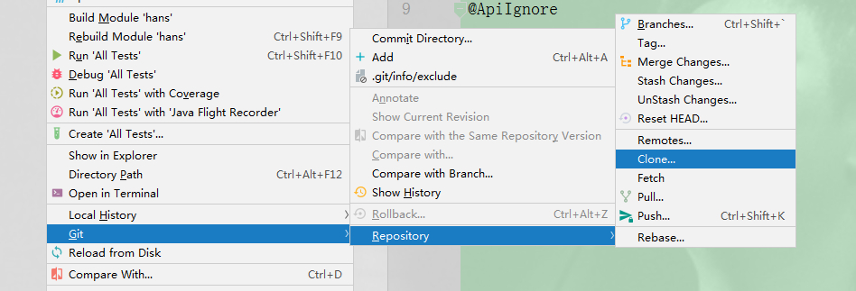

### 创建分支 推送分支到远程仓库

> 新建分支

 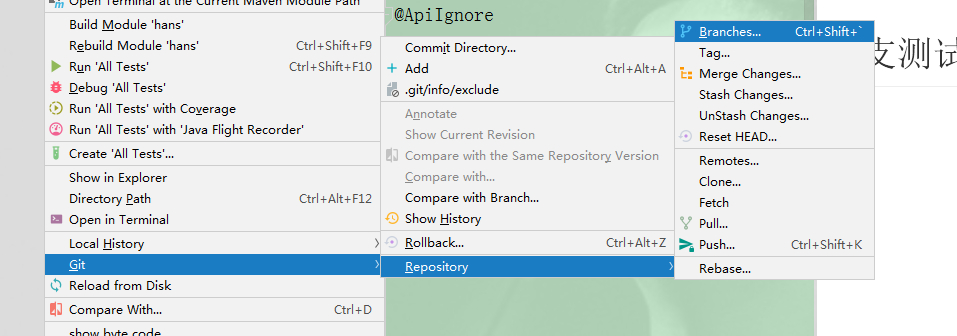

 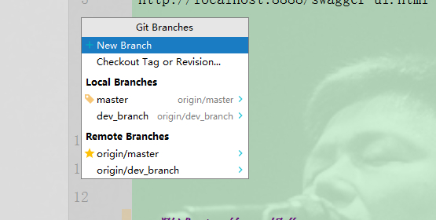

> 推送分支到远程仓库

 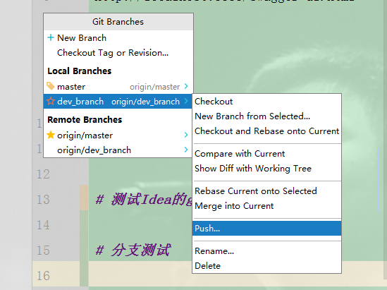

### 获取他人提交的分支

> 使用Pull功能打开更新窗口，点击Remote栏后面的刷新

 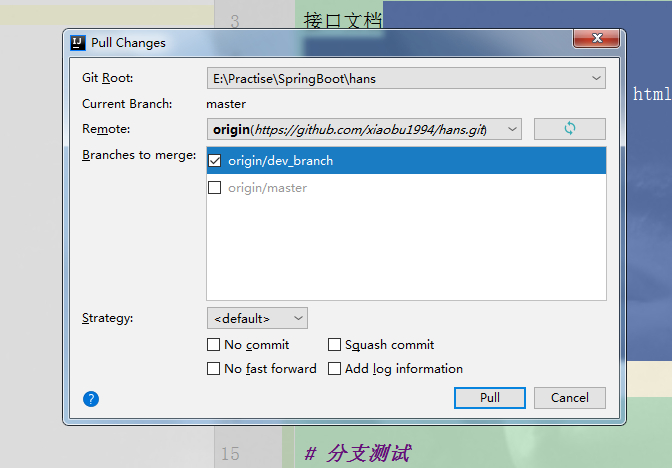

### 合并他人提交的分支到主干

 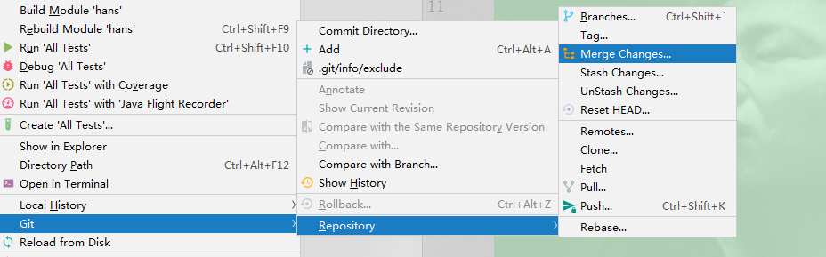

参考:

[在IDEA中实战Git](https://blog.csdn.net/autfish/article/details/52513465) 