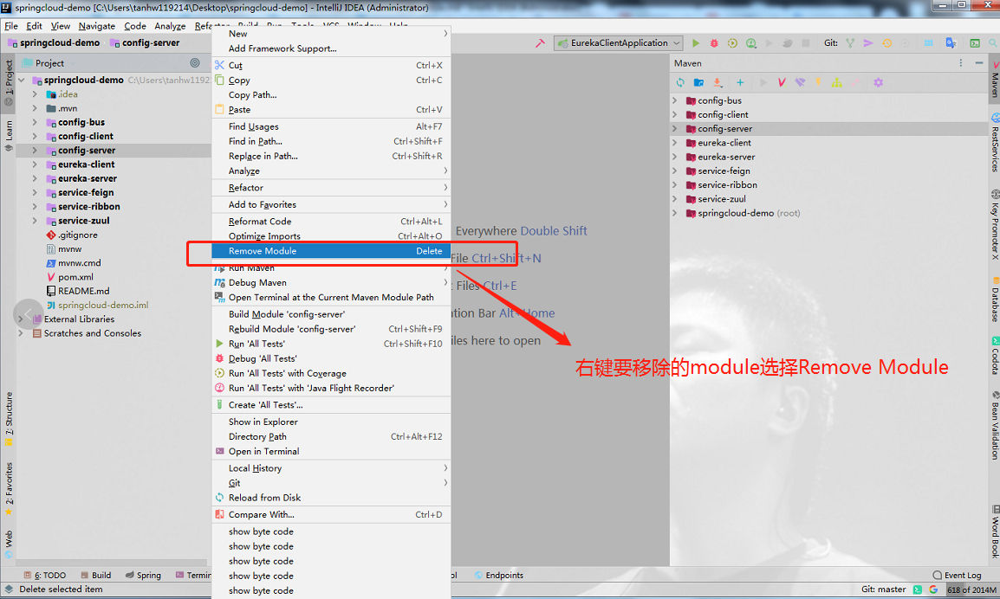
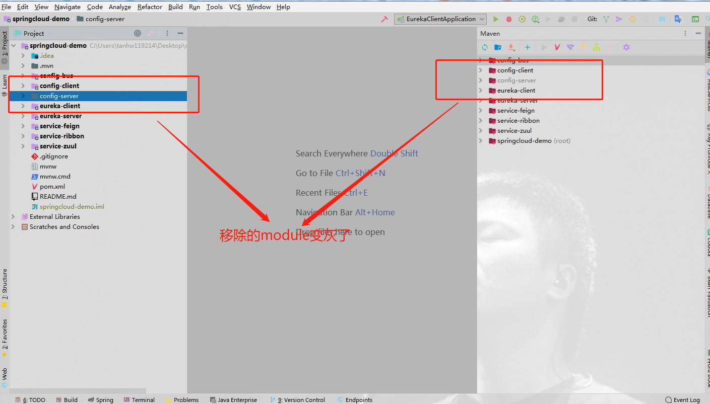
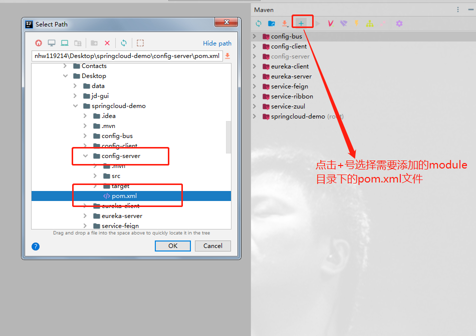
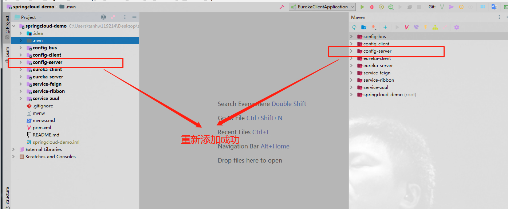
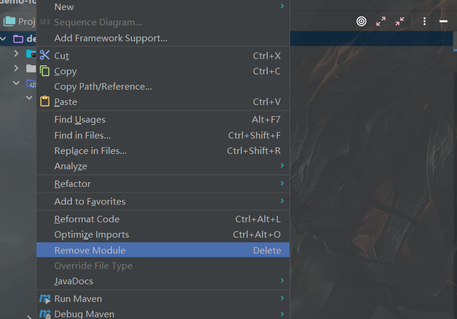
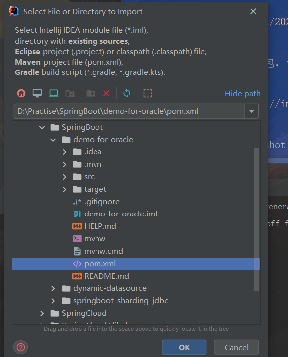
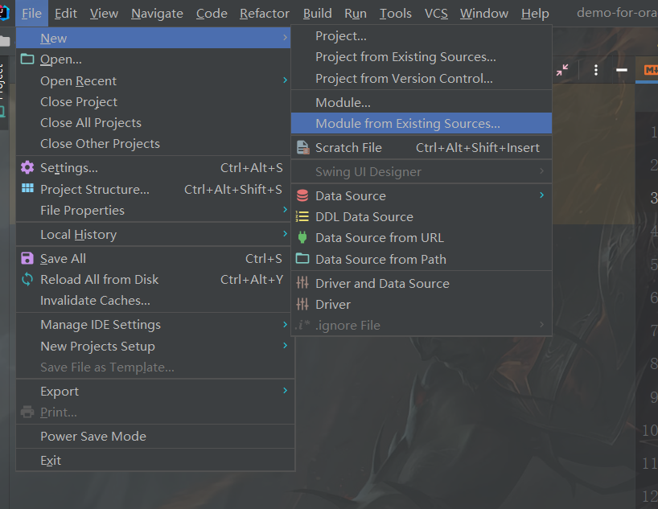

# Idea移除和重新导入Maven工程module

> 原创 于 2021-01-15 17:32:30 发布 · 公开 · 6.2k 阅读 · 0 · 5 · 本内容遵循CC 4.0 BY-SA版权协议 版权声明：本文为博主原创文章，遵循 CC 4.0 BY-SA 版权协议，转载请附上原文出处链接和本声明。 · 编辑
> 文章链接：https://blog.csdn.net/tanhongwei1994/article/details/112680473

1. 移除module

 

1. 移除后

 

1. 重新添加移除的module

 

1. 添加后的效果

 

整个工程移除 重新添加

 

 

 

