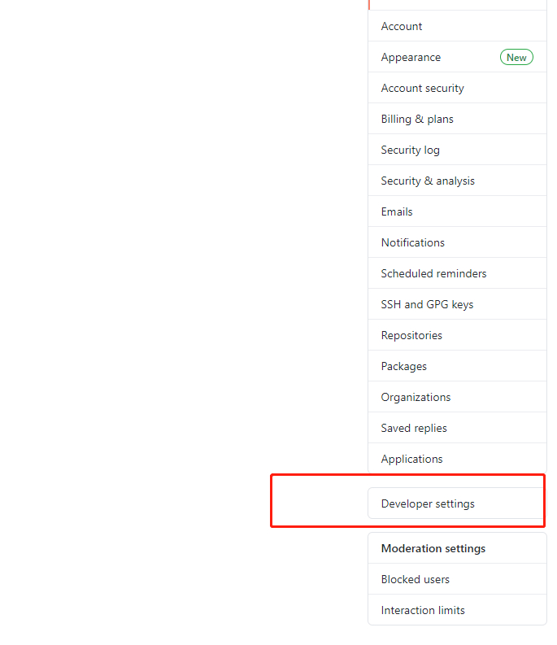
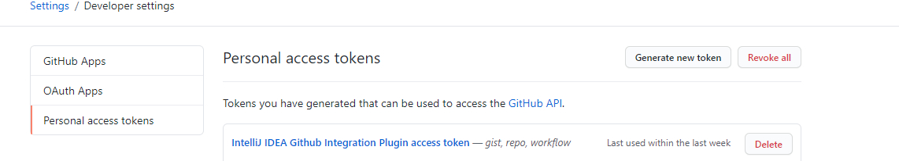

# IDEA无法登录github解决

> 原创 于 2021-02-27 10:35:31 发布 · 公开 · 5.4k 阅读 · 0 · 3 · 本内容遵循CC 4.0 BY-SA版权协议 版权声明：本文为博主原创文章，遵循 CC 4.0 BY-SA 版权协议，转载请附上原文出处链接和本声明。 · 编辑
> 文章链接：https://blog.csdn.net/tanhongwei1994/article/details/114164214

Idea账号密码无法登录github，然后重新在github上生成令牌就好了

 

 

