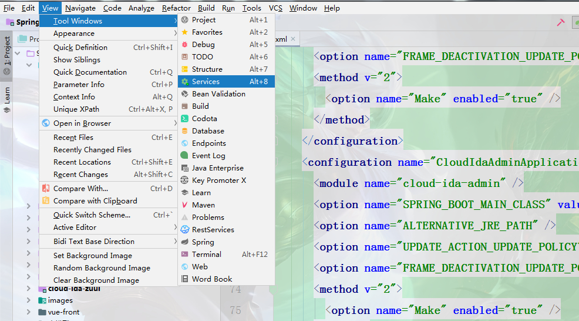
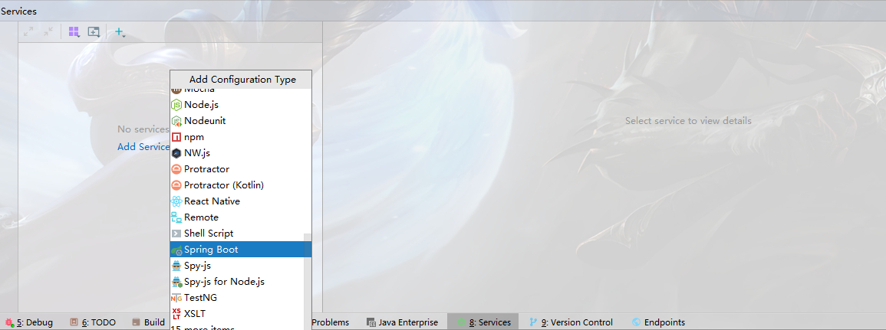

# IDEA中设置Run Dashboard(Services)

> 原创 于 2021-03-26 16:42:04 发布 · 公开 · 357 阅读 · 1 · 0 · 本内容遵循CC 4.0 BY-SA版权协议 版权声明：本文为博主原创文章，遵循 CC 4.0 BY-SA 版权协议，转载请附上原文出处链接和本声明。 · 编辑
> 文章链接：https://blog.csdn.net/tanhongwei1994/article/details/115250057

基于Idea版本 2019.3.3

1. idea开启 Dashboard , View->Tool Windows->Services
    

2. Run Configuration Type ->Add Configuration Type->Spring Boot

 

