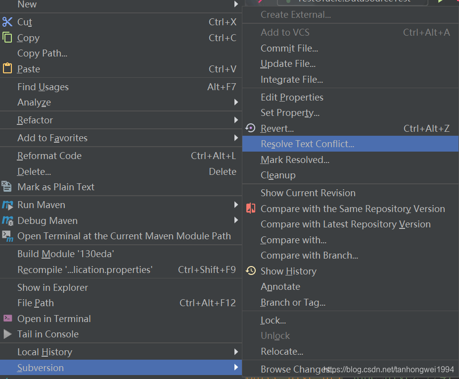

# Idea 解决SVN冲突

> 原创 于 2021-04-27 22:07:17 发布 · 公开 · 1k 阅读 · 0 · 0 · 本内容遵循CC 4.0 BY-SA版权协议 版权声明：本文为博主原创文章，遵循 CC 4.0 BY-SA 版权协议，转载请附上原文出处链接和本声明。 · 编辑
> 文章链接：https://blog.csdn.net/tanhongwei1994/article/details/116211370

Idea提交包的时候报包冲突先新建对应的包然后 选择Subversion==> Reconvert

subversion ==> ignore 忽略文件