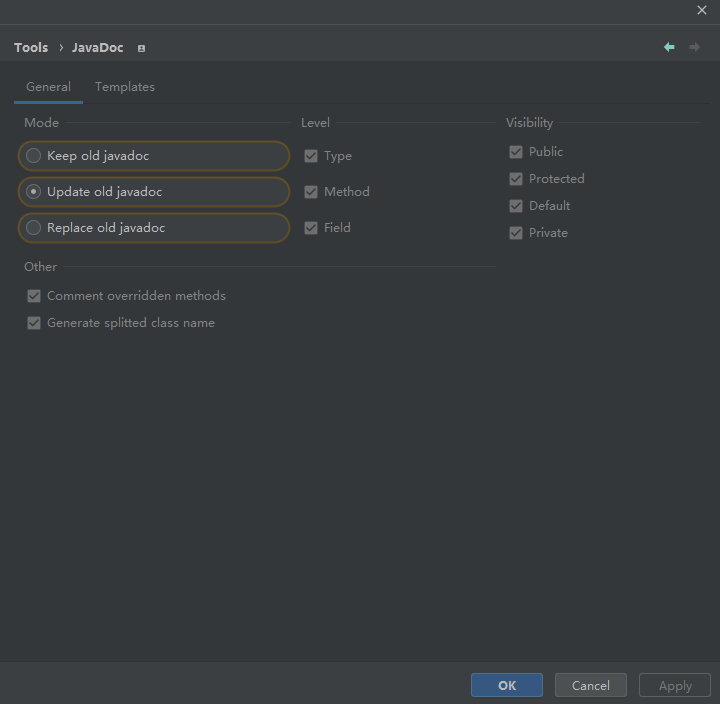
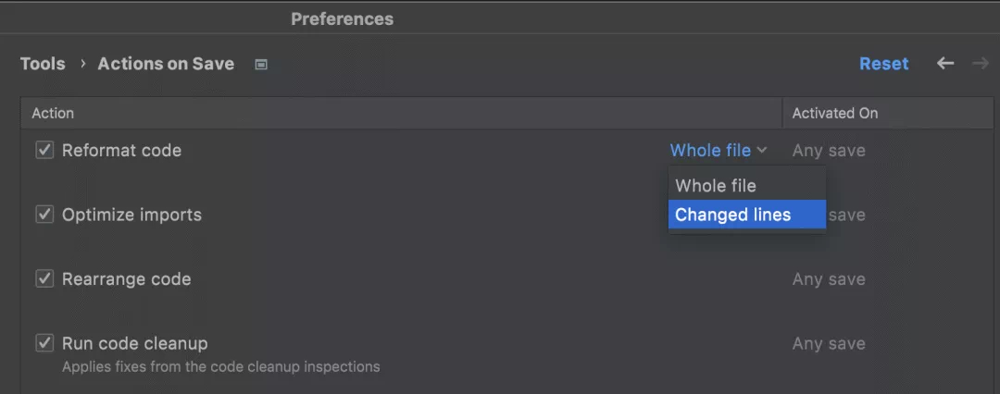
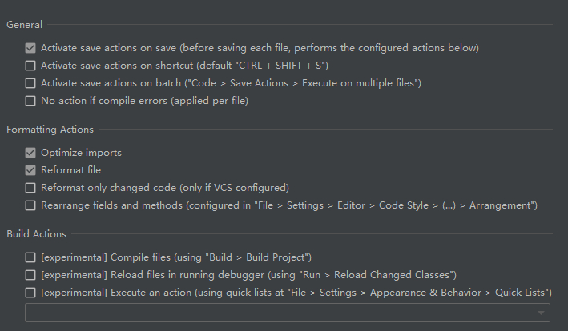
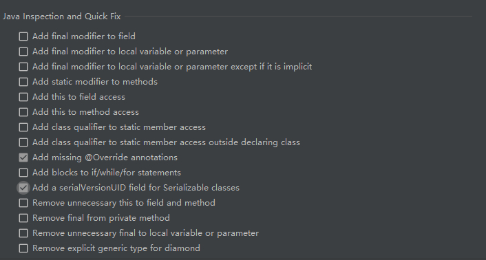
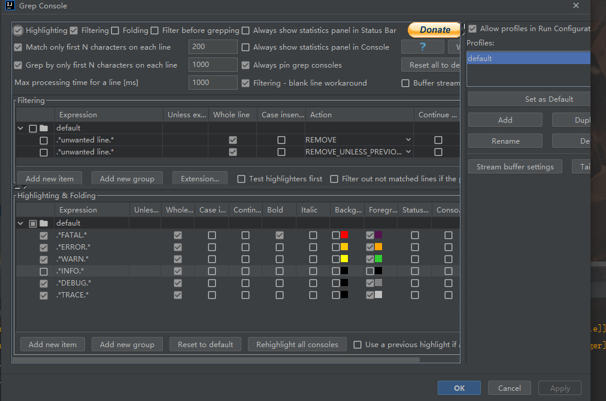
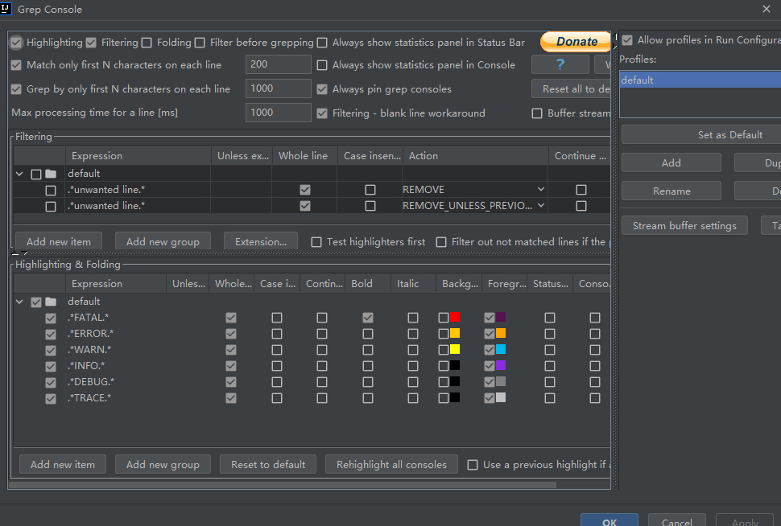
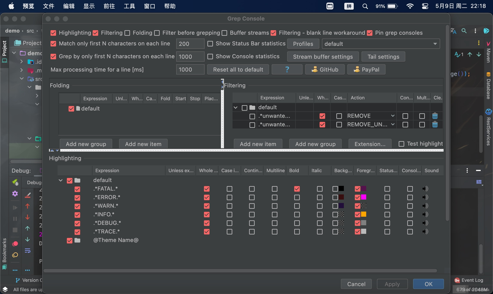

# IntelliJ IDEA2021插件和配置

> 原创 已于 2025-01-16 10:59:46 修改 · 5.4k 阅读 · 0 · 3 · 编辑
> 文章链接：https://blog.csdn.net/tanhongwei1994/article/details/119845692

### 自定义IntelliJIdea的logconfig路径

```text
# IntelliJ IDEA 个性化化配置目录
#---------------------------------------------------------------------
idea.config.path=${idea.home.path}/.IntelliJIdea/config

#---------------------------------------------------------------------
# Uncomment this option if you want to customize path to IDE system folder. Make sure you're using forward slashes.
# IntelliJ IDEA系统文件目录
#---------------------------------------------------------------------
idea.system.path=${idea.home.path}/.IntelliJIdea/system

#---------------------------------------------------------------------
# Uncomment this option if you want to customize path to user installed plugins folder. Make sure you're using forward slashes.
# IntelliJ IDEA插件存放目录
#---------------------------------------------------------------------
idea.plugins.path=${idea.config.path}/plugins

#---------------------------------------------------------------------
# Uncomment this option if you want to customize path to IDE logs folder. Make sure you're using forward slashes.
# IntelliJ IDEA日志目录
#---------------------------------------------------------------------
idea.log.path=${idea.system.path}/log


```

### 设置IntelliJIdea的 bin下面idea64.exe.vmoptions

如果-Duser.name要设置中文，需要先把idea64.exe.vmoptions文件编码设置为ANSI在修改

```text
-Xmx2048m
-XX:ReservedCodeCacheSize=1024m
-Xms512m
-XX:+UseG1GC
-XX:SoftRefLRUPolicyMSPerMB=50
-XX:CICompilerCount=2
-XX:+HeapDumpOnOutOfMemoryError
-XX:-OmitStackTraceInFastThrow
-ea
-Dsun.io.useCanonCaches=false
-Djdk.http.auth.tunneling.disabledSchemes=""
-Djdk.attach.allowAttachSelf=true
-Djdk.module.illegalAccess.silent=true
-Dkotlinx.coroutines.debug=off
-Dsplash=true
-Dfile.encoding=UTF-8
-Duser.name=xiaobu

```

### 常用插件

```text
1、 .ignore
2、 Alibaba Java Coding Guidelines
3、 Atom Material Icons
4、 github copilot
5、 Grep Console
6、 HighlightBracketPair
8、 javadocs
9、 rainbow-brackets
10、 jrebel
11、 jrebel-mybatisplus-extension
12、 Key-Promoter-X
13、 Maven Helper
14、 MyBatisCodeHelperPro ​(Marketplace Edition)​
15、 Presentation Assistant
16、 RestfulToolkit-fix
18、 string-manipulation
19、 Translation
20、 save action
21、 mybatis-log-plugin
24、 jprofiler


```

#### javadoc 设置

 

#### save action 设置

 

 

 

#### GrepConsole 设置

INFO和DEBUG采用默认

 

INFO采用自定义颜色 推荐ERROR  洋红色 和INFO 橙黄色

 



RGB对应

```text
FATAL  56124E  深紫
ERROR   8A2BE2 紫色
ERROR  FF00FF 洋红色
WARN   00B7EB 青色
WARN   32CD32 绿色
INFO  FFA500 橙黄色
DEBUG  808080  灰色
TRACE  C0C0C0 银色

```