# IntelliJ IDEA 调试技巧

> 原创 于 2022-04-14 18:39:41 发布 · 公开 · 552 阅读 · 0 · 2 · 本内容遵循CC 4.0 BY-SA版权协议 版权声明：本文为博主原创文章，遵循 CC 4.0 BY-SA 版权协议，转载请附上原文出处链接和本声明。 · 编辑
> 文章链接：https://blog.csdn.net/tanhongwei1994/article/details/124178732

### Idea多线程断点调试

示例代码

```java
package com.xiaobu.JUC;

/**
 * @author 小布
 * @className ThreadTest1.java
 * @createTime 2022年04月01日 19:39:00
 */
public class ThreadTest1 {
    public static void main(String[] args) {
        new Thread(()->{
            System.out.println("线程1-1");
            System.out.println("线程1-2");
            System.out.println("线程1-3");
        }).start();

        new Thread(()->{
            System.out.println("线程2-1");
            System.out.println("线程2-2");
            System.out.println("线程2-3");
        }).start();

    }
}

```

在需要的地方打上断点，并设置为Thread

 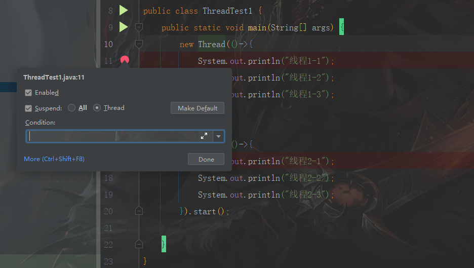

想要按照 线程1-1，线程2-1，线程1-2，线程2-2，线程1-3，线程2-3 需要如下面两图反复切换

 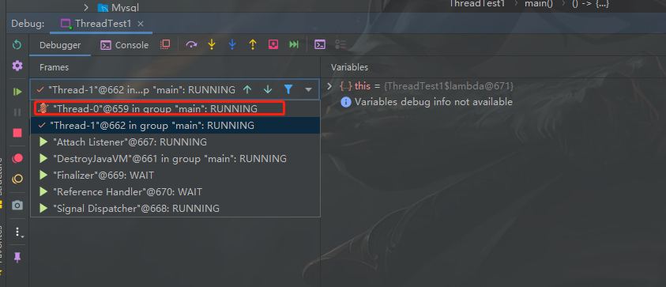

 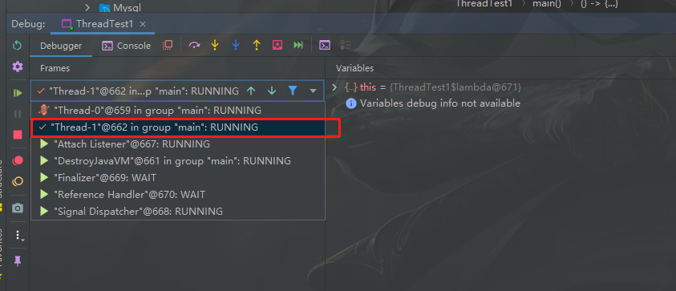

Controller 也是一样

```java
package com.xiaobu.controller;

import org.springframework.web.bind.annotation.GetMapping;
import org.springframework.web.bind.annotation.RequestMapping;
import org.springframework.web.bind.annotation.RestController;

/**
 * @author 小布
 * @className DemoController.java
 * @createTime 2022年04月01日 19:52:00
 */
@RestController
@RequestMapping("demo")
public class DemoController {

    @GetMapping("test1")
    public String test1() {
        return "test1";
    }

    @GetMapping("test2")
    public String test2() {
        return "test2";
    }
}

```

 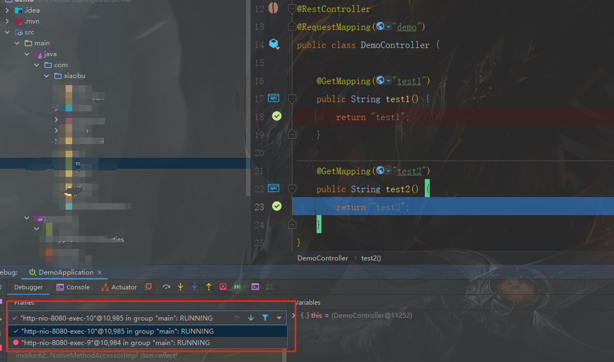

### Idea 强制返回 Force Return

Demo1.java

```java
package com.xiaobu.demo;

/**
 * @author 小布
 * @version 1.0.0
 * @className Demo1.java
 * @createTime 2022年03月01日 20:58:00
 */
public class Demo1 {
    public static void main(String[] args) {
        String test = test();
        System.out.println("test = " + test);
    }

    public static String test() {
        return "123";

    }

}

```

 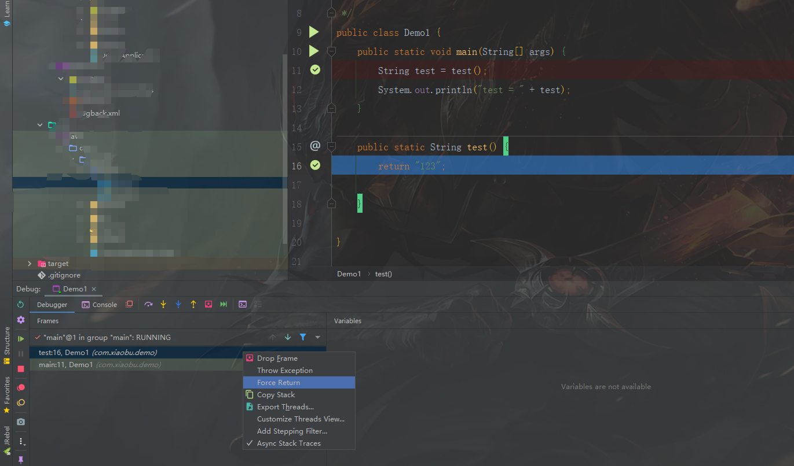

输入字符串admin( **类型一定要与之对应** )

 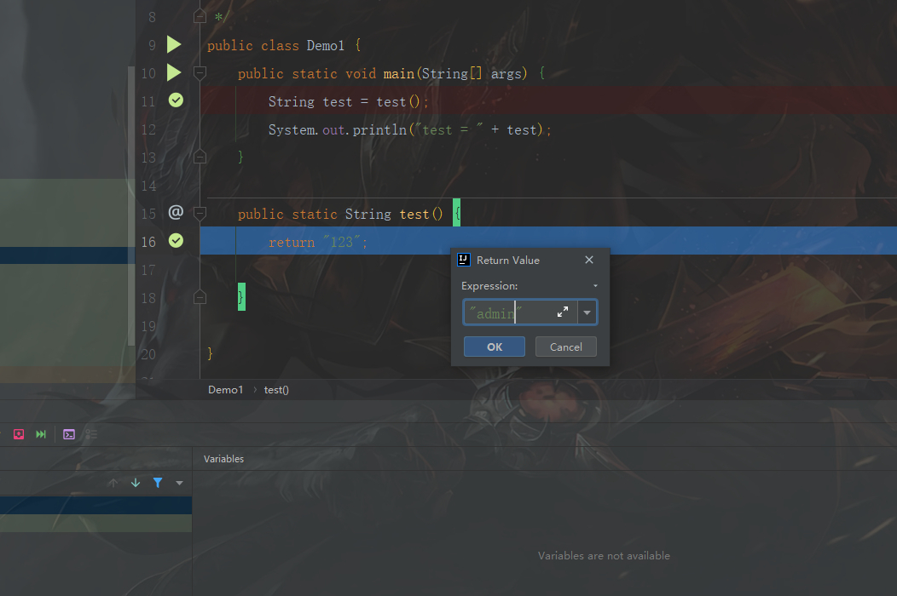

结果:

```text
test = admin
```

### 强制抛出异常

 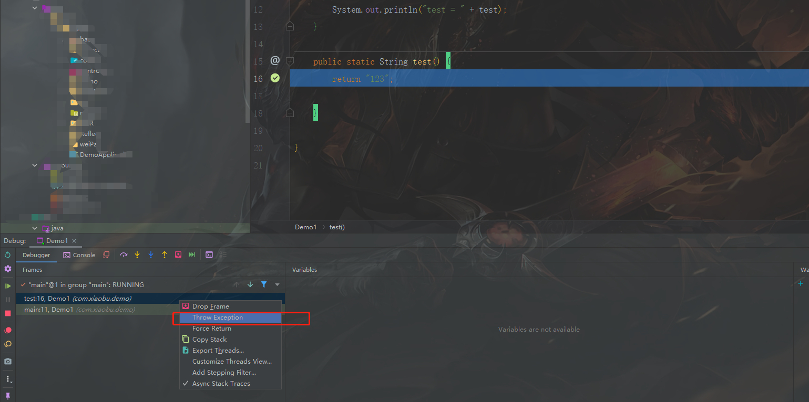

输入下面的命令:

```text
throw new NullPointerException()
```

结果：

```text
Connected to the target VM, address: '127.0.0.1:10879', transport: 'socket'
Exception in thread "main" java.lang.NullPointerException
	at com.xiaobu.demo.Demo1.test(Demo1.java:16)
	at com.xiaobu.demo.Demo1.main(Demo1.java:11)
Disconnected from the target VM, address: '127.0.0.1:10879', transport: 'socket'
```

### Overhead

> Overhead选项卡为您提供有关每个调试器功能使用的命中数和处理器时间的信息。视图是动态更新的，因此您不必暂停应用程序即可查看结果。

 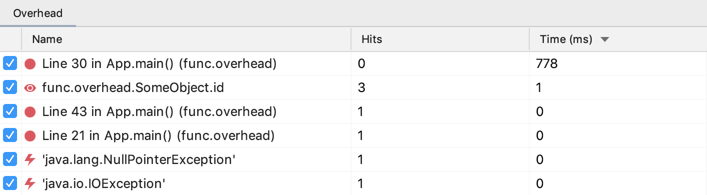

### Memory 使用Memory选项卡查看堆中所有对象的详细信息。

> 此信息对于检测内存泄漏及其原因很有用。单独的代码检查可能无法提供任何线索，因为一些错误很容易被忽略。例如，内部类可能会阻止外部类成为垃圾收集的条件，这可能最终导致OutOfMemoryError. 在这种情况下，将“内存”选项卡与“显示引用对象”选项结合使用可以让您轻松找到泄漏。

新建user之前

 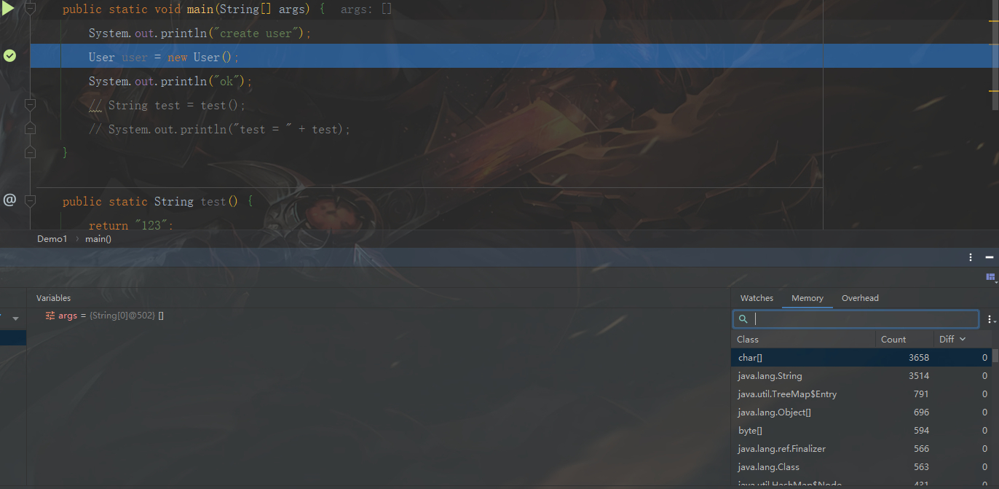

新建user之后

 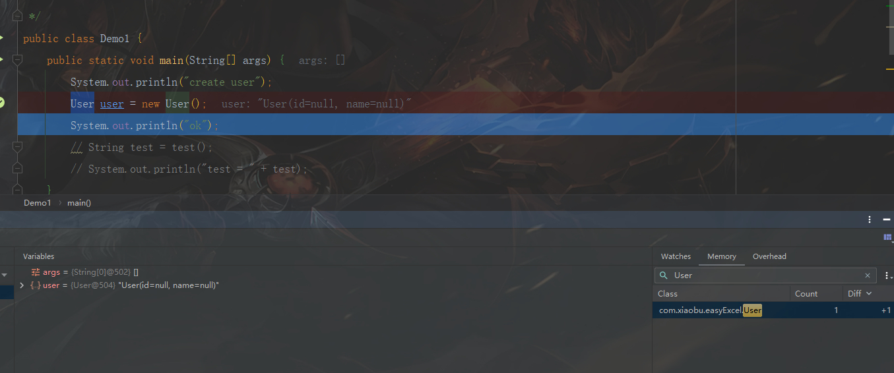

双击可以查看实例

 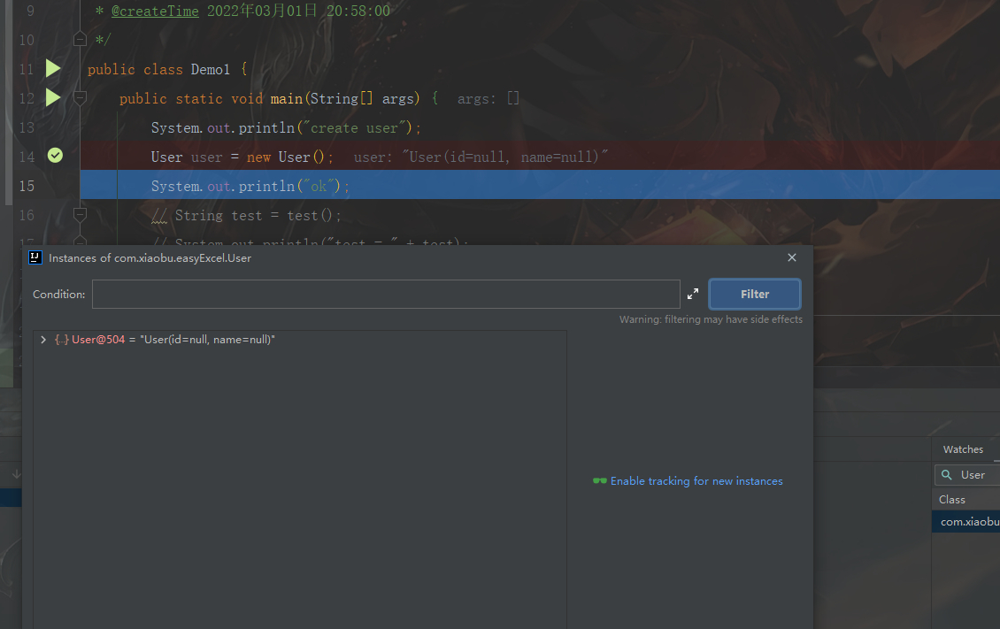

参考:

[挖掘IntelliJ IDEA的调试功能](http://qinghua.github.io/intellij-idea-debug/) 

[IDEA官方调试文档](https://www.jetbrains.com/help/idea/tutorial-java-debugging-deep-dive.html) 