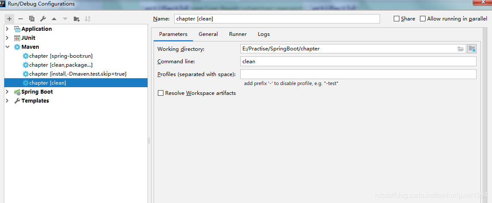
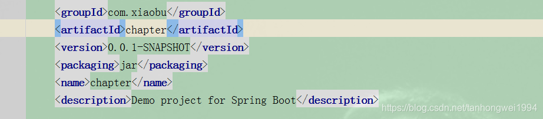
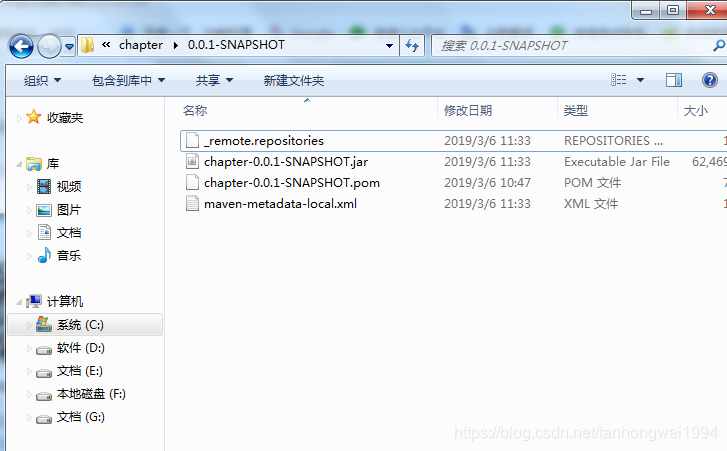

# Maven常用命令

> 原创 最新推荐文章于 2025-11-02 08:18:58 发布 · 公开 · 189 阅读 · 0 · 0 · 本内容遵循CC 4.0 BY-SA版权协议 版权声明：本文为博主原创文章，遵循 CC 4.0 BY-SA 版权协议，转载请附上原文出处链接和本声明。 · 编辑
> 文章链接：https://blog.csdn.net/tanhongwei1994/article/details/88226843

一、clean

 

删除target目录。

---


二、install

```java
install -Dmaven.test.skip=true
```

 

 

已打包安装到我的本地maven ，路径:C:\Users\tanhw119214\.m2\repository\com\xiaobu\chapter\0.0.1-SNAPSHOT


---

三、package

```java
clean package -Dmaven.test.skip=true
```

先删除在打包在项目的target目录下。

---

四、deploy

- **deploy命令完成了项目编译、单元测试、打包功能，同时把打好的可执行jar包（war包或其它形式的包）布署到本地maven仓库和远程maven私服仓库**

---

若是cmd命令行执行的话，需要加mvn 命令