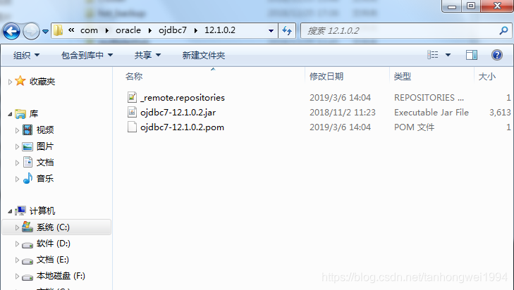

# SpringBoot | 运行报错，无法加载oracle连接驱动

> 原创 最新推荐文章于 2025-02-26 13:19:16 发布 · 公开 · 2.5k 阅读 · 1 · 0 · 本内容遵循CC 4.0 BY-SA版权协议 版权声明：本文为博主原创文章，遵循 CC 4.0 BY-SA 版权协议，转载请附上原文出处链接和本声明。 · 编辑
> 文章链接：https://blog.csdn.net/tanhongwei1994/article/details/88234425

一、配置好maven环境变量

application.properties


```
spring.datasource.driver-class-name=oracle.jdbc.driver.OracleDriver
spring.datasource.url=jdbc:oracle:thin:@192.168.0.11:1521:orcl
spring.datasource.username=xiaobu
spring.datasource.password=xiaobu
```

pom 文件


```
<!-- Spring Boot JDBC -->
        <dependency>
            <groupId>org.springframework.boot</groupId>
            <artifactId>spring-boot-starter-jdbc</artifactId>
        </dependency>
        <!-- oracle -->
        <dependency>
            <groupId>com.oracle</groupId>
            <artifactId>ojdbc6</artifactId>
            <version>11.2.0.2.0</version>
        </dependency>

        <!-- 通用Mapper插件
 文档地址：https://gitee.com/free/Mapper/wikis/Home -->
        <dependency>
            <groupId>tk.mybatis</groupId>
            <artifactId>mapper-spring-boot-starter</artifactId>
            <version>2.0.2</version>
        </dependency>
        <!-- 分页插件
         文档地址：https://github.com/pagehelper/Mybatis-PageHelper/blob/master/wikis/zh/HowToUse.md -->
        <dependency>
            <groupId>com.github.pagehelper</groupId>
            <artifactId>pagehelper-spring-boot-starter</artifactId>
            <version>1.2.5</version>
        </dependency>
        <!--mybatis-->
        <dependency>
            <groupId>org.mybatis.spring.boot</groupId>
            <artifactId>mybatis-spring-boot-starter</artifactId>
            <version>1.3.2</version>
        </dependency>
```


二、用install命令打包到本地仓库


```java
//E:/ojdbc6.jar 为你下载的jar包的路径

mvn install:install-file -Dfile=E:/ojdbc6.jar -DgroupId=com.oracle -DartifactId=ojdbc6 -Dversion=11.2.0.2.0 -Dpackaging=jar -DgeneratePom=true 
```

 

成功后maven本地库就会出现 上图结果。