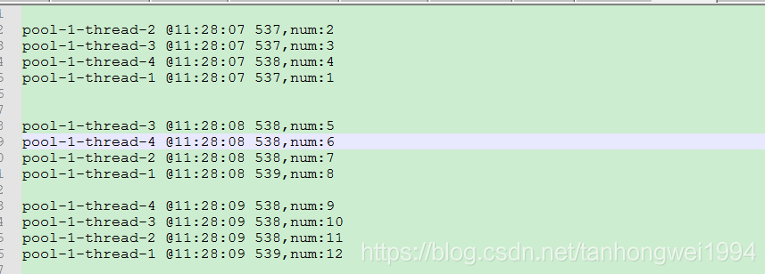
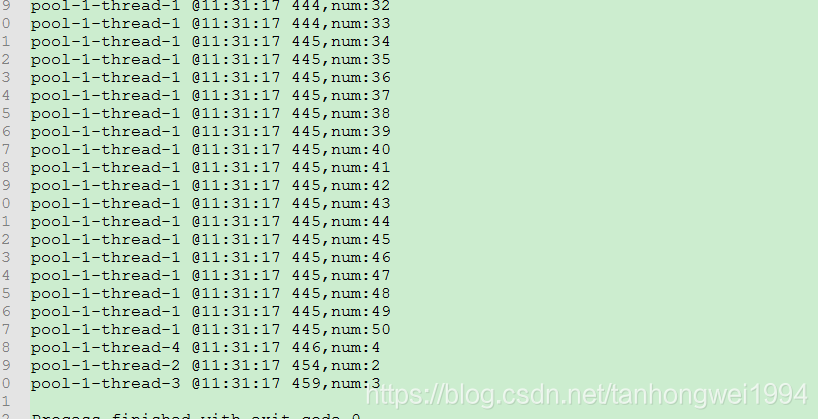

# 定长线程池的应用

> 原创 最新推荐文章于 2026-05-15 01:34:19 发布 · 公开 · 1k 阅读 · 0 · 2 · 本内容遵循CC 4.0 BY-SA版权协议 版权声明：本文为博主原创文章，遵循 CC 4.0 BY-SA 版权协议，转载请附上原文出处链接和本声明。 · 编辑
> 文章链接：https://blog.csdn.net/tanhongwei1994/article/details/83412543

一、新建一个类实现Runnable接口

```
package Thread;

import java.text.SimpleDateFormat;
import java.util.Date;
import java.util.concurrent.TimeUnit;

/**
 * @author tanhw119214
 * @version JDK1.8.0_171
 * @date on  2018/8/6 13:56
 */
public class ThreadRunner implements Runnable {


    private static SimpleDateFormat format = new SimpleDateFormat("HH:mm:ss SSS");

   public ThreadRunner(Integer num){
       this.num=num;
   }
    private Integer num;
    @Override
    public void run() {
        System.out.println(Thread.currentThread().getName()+" @"+format.format(new Date())+",num:"+num);
        try {
            TimeUnit.SECONDS.sleep(1);
        } catch (InterruptedException e) {
            e.printStackTrace();
        }
    }
}

```

二、写一个测试类，用线程池来创建线程。

```
package Thread;

import java.util.concurrent.ExecutorService;
import java.util.concurrent.Executors;

/**
 * @author tanhw119214
 * @version JDK1.8.0_171
 * @date on  2018/8/6 14:07
 * @description 定长线程池
 */
public class FixedThreedPoolDemo {
    public static void main(String[] args) {
        ExecutorService pool = Executors.newFixedThreadPool(4);
        for(int i = 0 ; i < 50 ; i++){
            pool.submit(new ThreadRunner((i + 1)));
        }
        pool.shutdown();
    }
}

```

 

如果取消Thread.sleep()的话就会出现
 

