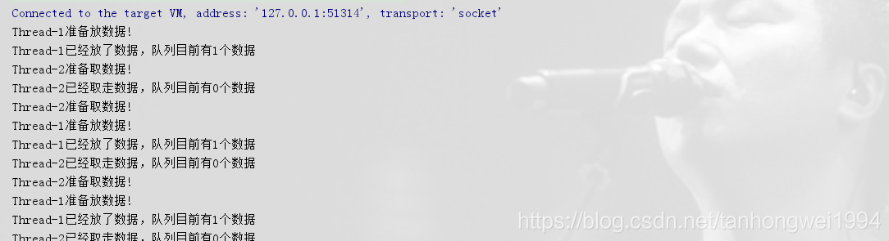
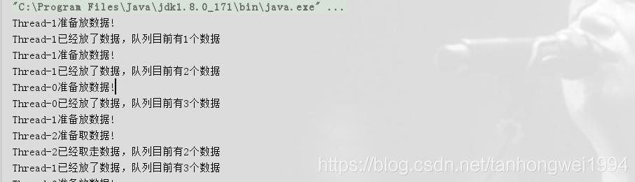

# ArrayBlockingQueue的简单使用

> 原创 最新推荐文章于 2025-04-11 09:43:52 发布 · 公开 · 3.2k 阅读 · 0 · 3 · 本内容遵循CC 4.0 BY-SA版权协议 版权声明：本文为博主原创文章，遵循 CC 4.0 BY-SA 版权协议，转载请附上原文出处链接和本声明。 · 编辑
> 文章链接：https://blog.csdn.net/tanhongwei1994/article/details/83414854

> 一、Queue一般分为先进先出和后进先出两种

先进先出（FIFO）：先插入的队列的元素也最先出队列，类似于排队的功能。从某种程度上来说这种队列也体现了一种公平性。后进先出（LIFO）：后插入队列的元素最先出队列，这种队列优先处理最近发生的事件。  如果生产者产出数据的速度大于消费者消费的速度，并且当生产出来的数据累积到一定程度的时候，那么生产者必须暂停等待一下（阻塞生产者线程），以便等待消费者线程把累积的数据处理完毕，反之亦然。

> 二、ArrayBlockingQueue的特点

ArrayBlockingQueue，一个由数组实现的有界阻塞队列。该队列采用FIFO的原则对元素进行排序添加的。

ArrayBlockingQueue为有界且固定，其大小在构造时由构造函数来决定，确认之后就不能再改变了。ArrayBlockingQueue支持对等待的生产者线程和使用者线程进行排序的可选公平策略，但是在默认情况下不保证线程公平的访问，在构造时可以选择公平策略（fair = true）。公平性通常会降低吞吐量，但是减少了可变性和避免了“不平衡性”。

> 三、ArrayBlockingQueue的例子

```java
package BlockQueue;

import java.util.concurrent.ArrayBlockingQueue;
import java.util.concurrent.BlockingQueue;

/**
 * @author xiaobu
 * @version JDK1.8.0_171
 * @date on  2018/10/26 14:21
 * @descrption
 */
public class BlockQueueDemo {

        public static void main(String[] args) {
            final BlockingQueue queue = new ArrayBlockingQueue(3);
            for(int i=0;i<2;i++){
                new Thread(){
                    public void run(){
                        while(true){
                            try {
                                Thread.sleep((long) (Math.random()*1000));
                                System.out.println(Thread.currentThread().getName() + "准备放数据!");
                                queue.put(1);
                                System.out.println(Thread.currentThread().getName() + "已经放了数据，" +
                                        "队列目前有" + queue.size() + "个数据");
                            } catch (InterruptedException e) {
                                e.printStackTrace();
                            }

                        }
                    }

                }.start();
            }

            new Thread(){
                public void run(){
                    while(true){
                        try {
                            //将此处的睡眠时间分别改为100和1000，观察运行结果
                            Thread.sleep(100);
                            System.out.println(Thread.currentThread().getName() + "准备取数据!");
                            queue.take();
                            System.out.println(Thread.currentThread().getName() + "已经取走数据，" +
                                    "队列目前有" + queue.size() + "个数据");
                        } catch (InterruptedException e) {
                            e.printStackTrace();
                        }
                    }
                }

            }.start();
        }
}
```

这是10ms的效果图，他只会在队列里面有数据的时候才会去取不然则会阻塞在那里。

 

这是1s的效果图，当队列插满的时候，是不会再往里面插入数据的，需要等到队列有消耗，才能再往里面插数据。

 

---

方式二、

```java
package com.xiaobu.test.BlockQueue.ArrayBlockingQueue;

import com.google.common.util.concurrent.ThreadFactoryBuilder;

import java.util.concurrent.*;

/**
 * @author xiaobu
 * @version JDK1.8.0_171
 * @date on  2019/1/3 16:19  阿里巴巴规范线程池调用线程资源
 * @description V1.0 基于ArrayBlockingQueue的生产者消费者模式  put和take都是阻塞操作
 */
public class ArrayBlockingQueueDemo2 {

    private static BlockingQueue queue = new ArrayBlockingQueue(3);
    private static ThreadFactory threadFactory = new ThreadFactoryBuilder().setNameFormat("demo-pool-%d").build();
    private static ThreadPoolExecutor executor = new ThreadPoolExecutor(3, 5, 60L, TimeUnit.SECONDS, new ArrayBlockingQueue<>(1), threadFactory);

    public static void main(String[] args) {
        for (int i = 0; i < 2; i++) {
            executor.execute(new Runnable() {
                @Override
                public void run() {
                    while (true) {
                        try {
                            TimeUnit.MILLISECONDS.sleep((long) (Math.random() * 1000));
                            System.out.println(Thread.currentThread().getName() + "准备放数据！");
                            queue.put(1);
                            System.out.println(Thread.currentThread().getName() + "已经放了数据,目前队列存在" + queue.size() + "个数据");
                        } catch (InterruptedException e) {
                            e.printStackTrace();
                        }
                    }
                }
            });

        }


        executor.execute(new Runnable() {
            @Override
            public void run() {
                while (true) {
                    try {
                        TimeUnit.MILLISECONDS.sleep(5000L);
                        System.out.println(Thread.currentThread().getName() + "准备取数据。。。");
                        queue.take();
                        System.out.println(Thread.currentThread().getName() + "已经取完数据,目前队列里面还有" + queue.size() + "个数据");
                    } catch (InterruptedException e) {
                        e.printStackTrace();
                    }
                }

            }
        });


    }

}
```