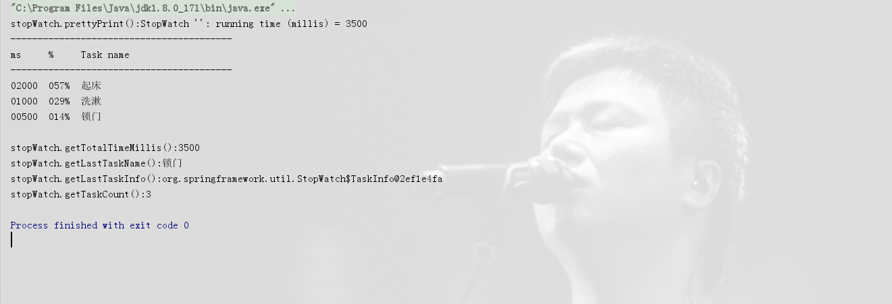

# Spring计时器StopWatch的使用

> 原创 最新推荐文章于 2025-04-29 13:33:03 发布 · 公开 · 1.9k 阅读 · 2 · 1 · 本内容遵循CC 4.0 BY-SA版权协议 版权声明：本文为博主原创文章，遵循 CC 4.0 BY-SA 版权协议，转载请附上原文出处链接和本声明。 · 编辑
> 文章链接：https://blog.csdn.net/tanhongwei1994/article/details/101267705

> spring提供的计时器StopWatch对于秒、毫秒为单位方便计时的程序，尤其是单线程、顺序执行程序的时间特性的统计输出支持比较好。也就是说假如我们手里面有几个在顺序上前后执行的几个任务，而且我们比较关心几个任务分别执行的时间占用状况，希望能够形成一个不太复杂的日志输出，StopWatch提供了这样的功能。而且Spring的StopWatch基本上也就是仅仅为了这样的功能而实现。

```java
package com.xiaobu.demo2;

import org.springframework.util.StopWatch;

import java.util.concurrent.TimeUnit;

/**
 * @author xiaobu
 * @version JDK1.8.0_171
 * @date on  2019/9/19 13:47
 * @description  计时器
 */
public class StopSwatch {
    public static void main(String[] args) {
        work();
    }

    public static void work() {
        StopWatch stopWatch = new StopWatch();
        stopWatch.start("起床");
        try {
            TimeUnit.MILLISECONDS.sleep(2000);
        } catch (InterruptedException e) {
            e.printStackTrace();
        }
        stopWatch.stop();


        stopWatch.start("洗漱");
        try {
            TimeUnit.MILLISECONDS.sleep(1000);
        } catch (InterruptedException e) {
            e.printStackTrace();
        }
        stopWatch.stop();

        stopWatch.start("锁门");
        try {
            TimeUnit.MILLISECONDS.sleep(500);
        } catch (InterruptedException e) {
            e.printStackTrace();
        }
        stopWatch.stop();

        System.out.println("stopWatch.prettyPrint():" + stopWatch.prettyPrint());
        System.out.println("stopWatch.getTotalTimeMillis():" + stopWatch.getTotalTimeMillis());
        System.out.println("stopWatch.getLastTaskName():" + stopWatch.getLastTaskName());
        System.out.println("stopWatch.getLastTaskInfo():" + stopWatch.getLastTaskInfo());
        System.out.println("stopWatch.getTaskCount():" + stopWatch.getTaskCount());
    }
}

```

 

