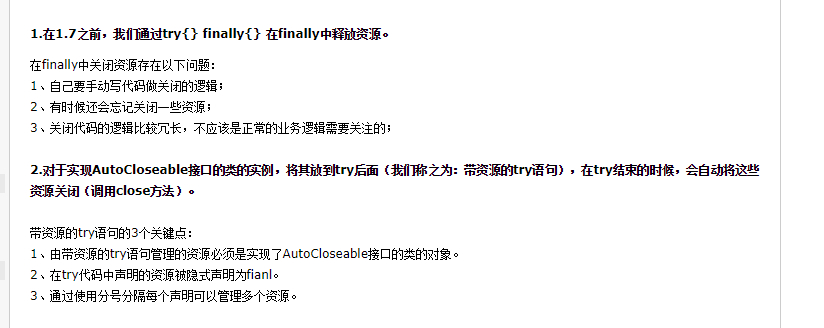
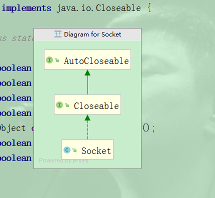
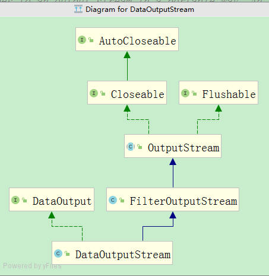
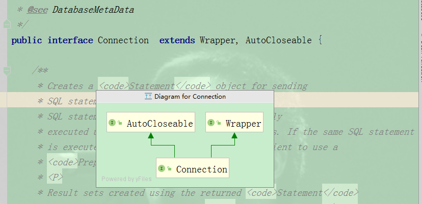

# Java SE 7 更好地管理资源：不仅仅是语法糖 try-with-resources

> 原创 最新推荐文章于 2023-08-28 10:33:32 发布 · 公开 · 248 阅读 · 0 · 0 · 本内容遵循CC 4.0 BY-SA版权协议 版权声明：本文为博主原创文章，遵循 CC 4.0 BY-SA 版权协议，转载请附上原文出处链接和本声明。 · 编辑
> 文章链接：https://blog.csdn.net/tanhongwei1994/article/details/98034314

```java
package com.xiaobu.test.daily.autoCloseAble;

import java.io.DataOutputStream;
import java.io.FileOutputStream;
import java.io.IOException;

/**
 * @author xiaobu
 * @version JDK1.8.0_171
 * @date on  2019/7/31 17:33
 * @description
 */
public class AutoClose implements AutoCloseable {

    @Override
    public void close() throws Exception {
        System.out.println(">>> close()");
        throw new RuntimeException("Exception in close()");
    }


    public void work() throws RuntimeException {
        System.out.println(">>> work()");
        throw new RuntimeException("Exception in work()");
    }

    public static void main(String[] args) {
        try {
            writingWithARM();
        } catch (IOException e) {
            e.printStackTrace();
        }
        try (AutoClose autoClose = new AutoClose()) {
            autoClose.work();
        } catch (Exception e) {
            e.printStackTrace();
        }finally {
            System.out.println("123 = " + 123);
        }
    }


    private static void writingWithARM() throws IOException {
        try (DataOutputStream out
                     = new DataOutputStream(new FileOutputStream("data"));
        ) {
            out.writeInt(666);
            out.writeUTF("Hello");
        }
    }
}

```

```java
java.lang.RuntimeException: Exception in work()
	at com.xiaobu.test.daily.autoCloseAble.AutoClose.work(AutoClose.java:20)
	at com.xiaobu.test.daily.autoCloseAble.AutoClose.main(AutoClose.java:25)
	Suppressed: java.lang.RuntimeException: Exception in close()
		at com.xiaobu.test.daily.autoCloseAble.AutoClose.close(AutoClose.java:14)
		at com.xiaobu.test.daily.autoCloseAble.AutoClose.main(AutoClose.java:26)
>>> work()
>>> close()
123 = 123
```

> 可以看出先执行try块里面的代码，然后再关闭在try里面声明的资源，多个资源用;隔开

 

Socket、OutputStream、InputStream和sql Connection在JDK7之后都实现了AutoCloseAble接口。

 

 

 

示例:

```java
try (
       FileOutputStream out = new FileOutputStream("output");
       FileInputStream  in1 = new FileInputStream(“input1”);
       FileInputStream  in2 = new FileInputStream(“input2”)
   ) {
       // Do something useful with those 3 streams!
   }   // out, in1 and in2 will be closed in any case
```

> 代码一

```java
   static void printToFile1(String text, File file) {
       try (BufferedWriter bw = new BufferedWriter(new FileWriter(file))) {
           bw.write(text);
       } catch (IOException ex) {
           // handle ex
       }
   }
```

> 代码二

```java
static void printToFile2(String text, File file) {
    try (FileWriter fw = new FileWriter(file);
            BufferedWriter bw = new BufferedWriter(fw)) {
        bw.write(text);
    } catch (IOException ex) {
        // handle ex
    }
}
```

经查看字节码文件发现代码一FileWriter没有close(),BufferedWriter执行了close()方法。方法二两个对象都执行了close()方法。

参考:

[在try-with-resources块中管理多个链接资源的正确习惯吗？](https://stackoverflow.com/a/12665271) 