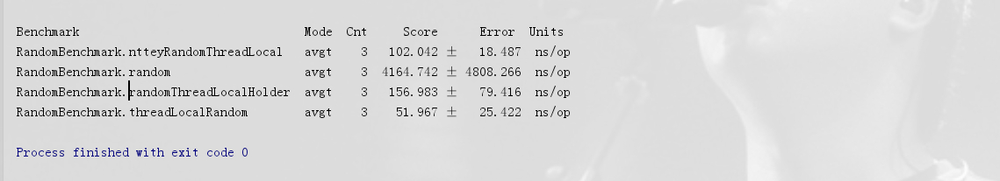

# 基于JMH检验多种生成随机数方法的效率

> 原创 最新推荐文章于 2026-06-21 12:59:44 发布 · 公开 · 425 阅读 · 0 · 0 · 本内容遵循CC 4.0 BY-SA版权协议 版权声明：本文为博主原创文章，遵循 CC 4.0 BY-SA 版权协议，转载请附上原文出处链接和本声明。 · 编辑
> 文章链接：https://blog.csdn.net/tanhongwei1994/article/details/103876035

maven依赖

```xml
 <!-- jmh -->
        <dependency>
            <groupId>org.openjdk.jmh</groupId>
            <artifactId>jmh-core</artifactId>
            <version>1.21</version>
        </dependency>
        <dependency>
            <groupId>org.openjdk.jmh</groupId>
            <artifactId>jmh-generator-annprocess</artifactId>
            <version>1.21</version>
            <scope>provided</scope>
        </dependency>
        <!-- netty -->
        <dependency>
            <groupId>io.netty</groupId>
            <artifactId>netty-all</artifactId>
            <version>4.1.42.Final</version>
        </dependency>
        
        
        <plugin>
                        <groupId>org.apache.maven.plugins</groupId>
                        <artifactId>maven-shade-plugin</artifactId>
                        <version>2.0</version>
                        <executions>
                            <execution>
                                <phase>package</phase>
                                <goals>
                                    <goal>shade</goal>
                                </goals>
                                <configuration>
                                    <finalName>microbenchmarks</finalName>
                                    <transformers>
                                        <transformer implementation="org.apache.maven.plugins.shade.resource.ManifestResourceTransformer">
                                            <mainClass>org.openjdk.jmh.Main</mainClass>
                                        </transformer>
                                    </transformers>
                                </configuration>
                            </execution>
                        </executions>
                    </plugin>
```

基本概念
Mode
Mode 表示 JMH 进行 Benchmark 时所使用的模式。通常是测量的维度不同，或是测量的方式不同。目前 JMH 共有四种模式：
(1).Throughput: 整体吞吐量，例如“1秒内可以执行多少次调用”。
(2).AverageTime: 调用的平均时间，例如“每次调用平均耗时xxx毫秒”。
(3).SampleTime: 随机取样，最后输出取样结果的分布，例如“99%的调用在xxx毫秒以内，99.99%的调用在xxx毫秒以内”
(4).SingleShotTime: 以上模式都是默认一次 iteration 是 1s，唯有 SingleShotTime 是只运行一次。往往同时把 warmup 次数设为0，用于测试冷启动时的性能。

Iteration
Iteration是JMH进行测试的最小单位。大部分模式下，iteration代表的是一秒，JMH会在这一秒内不断调用需要benchmark的方法，然后根据模式对其采样，计算吞吐量，计算平均执行时间等。
Warmup
Warmup是指在实际进行Benchmark前先进行预热的行为。因为JVM的JIT机制的存在，如果某个函数被调用多次以后，JVM会尝试将其编译成为机器码从而提高执行速度。所以为了让benchmark的结果更加接近真实情况就需要进行预热。

@Benchmark
表示该方法是需要进行 benchmark 的对象，用法和 JUnit 的 @Test 类似。
@Mode
Mode 如之前所说，表示 JMH 进行 Benchmark 时所使用的模式。
@State
State 用于声明某个类是一个“状态”，然后接受一个 Scope 参数用来表示该状态的共享范围。因为很多 benchmark 会需要一些表示状态的类，JMH 允许你把这些类以依赖注入的方式注入到 benchmark 函数里。Scope 主要分为两种。
(1).Thread: 该状态为每个线程独享。
(2).Benchmark: 该状态在所有线程间共享。
关于State的用法，官方的 code sample 里有比较好的例子。
@OutputTimeUnit
benchmark 结果所使用的时间单位。

include
benchmark 所在的类的名字，注意这里是使用正则表达式对所有类进行匹配的。
fork
进行 fork 的次数。如果 fork 数是2的话，则 JMH 会 fork 出两个进程来进行测试。
warmupIterations
预热的迭代次数。
measurementIterations
实际测量的迭代次数。

```java
package com.xiaobu;

import lombok.SneakyThrows;
import lombok.extern.slf4j.Slf4j;
import org.openjdk.jmh.annotations.*;
import org.openjdk.jmh.runner.Runner;
import org.openjdk.jmh.runner.options.Options;
import org.openjdk.jmh.runner.options.OptionsBuilder;

import java.util.Random;
import java.util.concurrent.ThreadLocalRandom;
import java.util.concurrent.TimeUnit;

/**
 * @author xiaobu
 * @version JDK1.8.0_171
 * @date on  2020/1/7 10:44
 * @description
 */
@Slf4j
@BenchmarkMode(Mode.AverageTime)
@OutputTimeUnit(TimeUnit.NANOSECONDS)
@State(Scope.Benchmark)
@Threads(50)
@Fork(1)
@Warmup(iterations = 3, time = 5)
@Measurement(iterations = 3, time = 5)

public class RandomBenchmark{

    Random random = new Random();
    ThreadLocal<Random> randomThreadLocalHolder = ThreadLocal.withInitial(Random::new);

    @Benchmark
    public int random(){
        return random.nextInt();
    }


    @Benchmark
    public int threadLocalRandom(){
        return ThreadLocalRandom.current().nextInt();
    }

    @Benchmark
    public int randomThreadLocalHolder(){
        return randomThreadLocalHolder.get().nextInt();
    }

    @Benchmark
    public int ntteyRandomThreadLocal(){
        return io.netty.util.internal.ThreadLocalRandom.current().nextInt();
    }

    @SneakyThrows
    public static void main(String[] args) {
        Options opt = new OptionsBuilder().include(RandomBenchmark.class.getSimpleName()).build();
        new Runner(opt).run();
    }

}
```

 

在并发条件下，ThreadLocalRandom的性能最强。