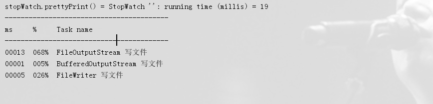
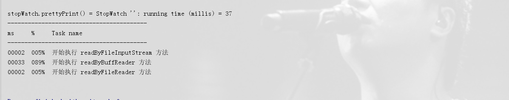

# 读写文件效率测试

> 原创 最新推荐文章于 2025-08-20 22:32:33 发布 · 公开 · 412 阅读 · 0 · 0 · 本内容遵循CC 4.0 BY-SA版权协议 版权声明：本文为博主原创文章，遵循 CC 4.0 BY-SA 版权协议，转载请附上原文出处链接和本声明。 · 编辑
> 文章链接：https://blog.csdn.net/tanhongwei1994/article/details/103984123

#### 写文件

```java
package com.xiaobu.note.daily.autoCloseAble;

import lombok.SneakyThrows;
import org.springframework.util.StopWatch;

import java.io.BufferedOutputStream;
import java.io.File;
import java.io.FileOutputStream;
import java.io.FileWriter;

/**
 * @author xiaobu
 * @version JDK1.8.0_171
 * @date on  2019/7/31 17:33
 * @description
 */
public class WriteFile {

    public static void main(String[] args) {
        StopWatch stopWatch = new StopWatch();
        stopWatch.start("FileOutputStream 写文件");
        writeByFileOutStream();
        stopWatch.stop();
        stopWatch.start("BufferedOutputStream 写文件");
        writeByBufferedOutputStream();
        stopWatch.stop();
        stopWatch.start("FileWriter 写文件");
        writeByFileWriter();
        stopWatch.stop();
        System.out.println("stopWatch.prettyPrint() = " + stopWatch.prettyPrint());
    }

    @SneakyThrows
    public static void writeByFileOutStream() {
        FileOutputStream out = null;
        int count = 1000;//写文件行数
        out = new FileOutputStream(new File("D:\\data1.txt"));
        for (int i = 0; i < count; i++) {
            out.write("测试java 文件操作\r\n".getBytes());
        }
    }


    @SneakyThrows
    public static void writeByBufferedOutputStream() {
        FileOutputStream outSTr = new FileOutputStream(new File("D:\\data2.txt"));
        BufferedOutputStream bufferedOutputStream = new BufferedOutputStream(outSTr);
        int count = 1000;//写文件行数
        for (int i = 0; i < count; i++) {
            bufferedOutputStream.write("测试java 文件操作\r\n".getBytes());
        }
    }


    @SneakyThrows
    public static void writeByFileWriter() {
        FileWriter fw = new FileWriter("D:\\data3.txt");
        int count = 1000;//写文件行数
        for (int i = 0; i < count; i++) {
            fw.write("测试java 文件操作\r\n");
        }
    }
}


```

 

可以看出写文件最快的是BufferedOutputStream

#### 读文件

```java
package com.xiaobu.note.daily.autoCloseAble;

import lombok.SneakyThrows;
import org.springframework.util.StopWatch;

import java.io.*;

/**
 * @author xiaobu
 * @version JDK1.8.0_171
 * @date on  2019/7/31 17:33
 * @description
 */
public class ReadFile {

    public static void main(String[] args) {
        StopWatch stopWatch = new StopWatch();
        stopWatch.start("开始执行 readByFileInputStream 方法");
        readByFileInputStream();
        stopWatch.stop();
        stopWatch.start("开始执行 readByBuffReader 方法");
        readByBuffReader();
        stopWatch.stop();
        stopWatch.start("开始执行 readByFileReader 方法");
        readByFileReader();
        stopWatch.stop();
        System.out.println("stopWatch.prettyPrint() = " + stopWatch.prettyPrint());

    }


    @SneakyThrows
    public static void readByFileInputStream(){
        File file = new File("D:/data1.txt");
        try (FileInputStream fileInputStream = new FileInputStream(file);
             //FileOutputStream fileOutputStream = new FileOutputStream(file)
        ) {
            byte[] buf = new byte[1024];
            int length=0;
            String result = null;
            while ((length=fileInputStream.read(buf))!=-1){
                result = new String(buf,0,length);
            }
            System.out.println("result = " + result);;
        }
    }


    @SneakyThrows
    public static void readByFileReader(){
        File file = new File("D:/data2.txt");
        FileReader fileReader = new FileReader(file);
        char[] buf = new char[1024];
        int length=0;
        String result=null;
        while ((length=fileReader.read(buf))!=-1){
            result = new String(buf,0,length);
        }
        System.out.println("result = " + result);
    }


    @SneakyThrows
    public static void readByBuffReader(){
        File file = new File("D:/data3.txt");
        FileReader fileReader = new FileReader(file);
        BufferedReader bufferedReader = new BufferedReader(fileReader);
        String result=null;
        while ((result=bufferedReader.readLine())!=null){
            System.out.println("result = " + result);
        }
    }


}


```

 

可以看出读效率最快的是FileReader