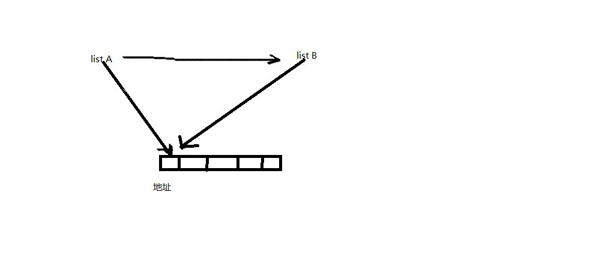
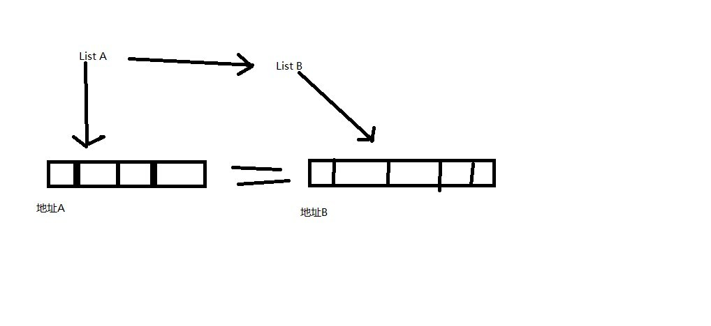
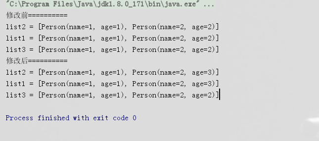

# list复制 浅拷贝和深拷贝

> 原创 最新推荐文章于 2025-01-18 23:41:28 发布 · 公开 · 554 阅读 · 0 · 2 · 本内容遵循CC 4.0 BY-SA版权协议 版权声明：本文为博主原创文章，遵循 CC 4.0 BY-SA 版权协议，转载请附上原文出处链接和本声明。 · 编辑
> 文章链接：https://blog.csdn.net/tanhongwei1994/article/details/105995792

浅拷贝

> list A浅拷贝给list B，由于进行的是浅拷贝，所以直接将A的内容复制给了B，java中相同内容的数组指向同一地址，即进行浅拷贝后A与B指向同一地址。造成的后果就是，改变B的同时也会改变A，因为改变B就是改变B所指向地址的内容，由于A也指向同一地址，所以A与B一起改变。

 

深拷贝

> 深拷贝就是将A复制给B的同时，给B创建新的地址，再将地址A的内容传递到地址B。ListA与ListB内容一致，但是由于所指向的地址不同，所以改变相互不受影响。
>  
> 
> 

```java
package com.xiaobu.note.List;

import lombok.Data;

import java.io.Serializable;

/**
 * @author xiaobu
 * @version JDK1.8.0_171
 * @date on  2020/4/22 15:51
 * @description
 */
@Data
public class Person  implements Serializable {
    private static final long serialVersionUID = 4985979692978416419L;

    private String name;

    private Integer age;

    public Person(){
    }

    public Person(String name,Integer age){
        this.name = name;
        this.age = age;
    }
}
```

```java
package com.xiaobu.note.List;

import java.io.*;
import java.util.ArrayList;
import java.util.List;

/**
 * @author xiaobu
 * @version JDK1.8.0_171
 * @date on  2018/11/9 17:31
 * @description V1.0
 */
public class Demo6 {
    public static void main(String[] args) {
        List list1 = new ArrayList<>();
        Person person1 = new Person("1", 1);
        Person person2 = new Person("2", 2);
        list1.add(person1);
        list1.add(person2);
        List list2 = new ArrayList<>();
        List list3;
        list2.addAll(list1);
        list3 = deepCopy(list1);
        System.out.println("修改前==========");
        System.out.println("list2 = " + list2);
        System.out.println("list1 = " + list1);
        System.out.println("list3 = " + list3);
        person2.setAge(3);
        System.out.println("修改后==========");
        System.out.println("list2 = " + list2);
        System.out.println("list1 = " + list1);
        System.out.println("list3 = " + list3);
    }


    /**
     * 功能描述:深拷贝
     * @author xiaobu
     * @date 2020/4/22 17:17
     * @param src list
     * @return java.util.List<T>
     * @version 1.0
     */
    public static <T> List<T> deepCopy(List<T> src) {
        try {
            ByteArrayOutputStream byteOut = new ByteArrayOutputStream();
            ObjectOutputStream out = new ObjectOutputStream(byteOut);
            out.writeObject(src);
            ByteArrayInputStream byteIn = new ByteArrayInputStream(byteOut.toByteArray());
            ObjectInputStream in = new ObjectInputStream(byteIn);
            @SuppressWarnings("unchecked")
            List<T> dest = (List<T>) in.readObject();
            return dest;
        } catch (IOException | ClassNotFoundException e) {
            e.printStackTrace();
        }
        return null;
    }

}


```

结果如图:
list3执行的深拷贝所以不受影响,list2执行的浅拷贝,list1和list2内存地址一致，只要有一个里面的对象属性发生变化就会随着改变。
 

参考:
[java List复制：浅拷贝与深拷贝](https://blog.csdn.net/demonliuhui/article/details/54572908) 