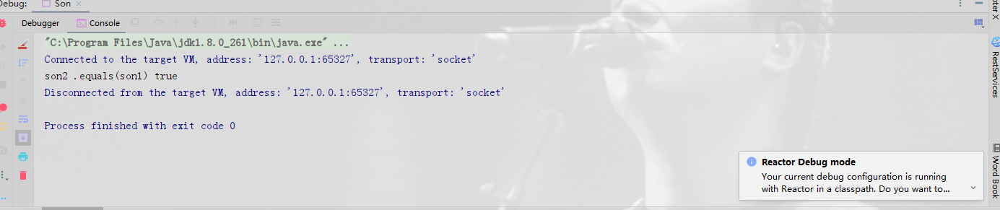

# Lombok---@EqualsAndHashCode(callSuper = true)的使用

> 原创 最新推荐文章于 2026-04-02 17:51:43 发布 · 公开 · 1.5w 阅读 · 3 · 15 · 本内容遵循CC 4.0 BY-SA版权协议 版权声明：本文为博主原创文章，遵循 CC 4.0 BY-SA 版权协议，转载请附上原文出处链接和本声明。 · 编辑
> 文章链接：https://blog.csdn.net/tanhongwei1994/article/details/108358282

```java
package com.xiaobu.entity;

import lombok.Data;

import java.io.Serializable;

/**
 * @author xiaobu
 * @version JDK1.8.0_171
 * @date on  2020/9/1 9:24
 * @description
 */
@Data
public class Father implements Serializable {

    private static final long serialVersionUID = -3605840195099107460L;
    private int age;

    private String name;


}

```

```java
package com.xiaobu.entity;

import lombok.Data;

import java.io.Serializable;

/**
 * @author xiaobu
 * @version JDK1.8.0_171
 * @date on  2020/9/1 9:24
 * @description
 */
@Data
public class Son  extends Father implements Serializable {

    private static final long serialVersionUID = -3605840195099107460L;
    private String address;


    public static void main(String[] args) {
        Son son1 = new Son();
        son1.setAge(1);
        son1.setName("laowang");
        son1.setAddress("shenzhen");
        Son son2 = new Son();
        son2.setAge(2);
        son2.setName("laoliu");
        son2.setAddress("shenzhen");
        System.out.println("son2 .equals(son1) " + son2 .equals(son1) );
    }
}

```

结果为true。

 

在Son类添加 @EqualsAndHashCode(callSuper = true) 默认为false。

可以看出没有@EqualsAndHashCode(callSuper = true)的Son类编译后的equals()方法

```java
  public boolean equals(final Object o) {
        if (o == this) {
            return true;
        } else if (!(o instanceof Son)) {
            return false;
        } else {
            Son other = (Son)o;
            if (!other.canEqual(this)) {
                return false;
            } else {
                Object this$address = this.getAddress();
                Object other$address = other.getAddress();
                if (this$address == null) {
                    if (other$address != null) {
                        return false;
                    }
                } else if (!this$address.equals(other$address)) {
                    return false;
                }

                return true;
            }
        }
    }
```

有@EqualsAndHashCode(callSuper = true)的Son类编译后的equals()方法

```java
    public boolean equals(final Object o) {
        if (o == this) {
            return true;
        } else if (!(o instanceof Son)) {
            return false;
        } else {
            Son other = (Son)o;
            if (!other.canEqual(this)) {
                return false;
            } else if (!super.equals(o)) {
                return false;
            } else {
                Object this$address = this.getAddress();
                Object other$address = other.getAddress();
                if (this$address == null) {
                    if (other$address != null) {
                        return false;
                    }
                } else if (!this$address.equals(other$address)) {
                    return false;
                }

                return true;
            }
        }
    }
```

可以看出来后者多了个

```java
else if (!super.equals(o)) {
                          return false;
                      }
```

拓展:

Data 注解生成的 toString 方法也只包含了子类自有属性。
解决方案一样，加上 @ToString(callSuper = true) 注解，其实这里真正重要的是注解中的属性，callSuper = true，加上注解后打印结果如下：

参考:

[lombok——@EqualsAndHashCode(callSuper = true)注解的和exclude使用](https://www.cnblogs.com/xxl910/p/12877776.html) 