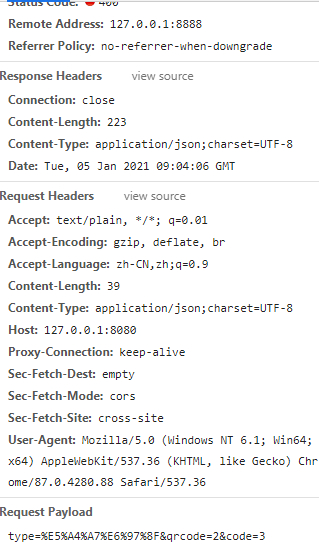

# 记录ajax 发送json数据时引发的问题

> 原创 最新推荐文章于 2026-05-24 13:45:52 发布 · 公开 · 2.5k 阅读 · 0 · 1 · 本内容遵循CC 4.0 BY-SA版权协议 版权声明：本文为博主原创文章，遵循 CC 4.0 BY-SA 版权协议，转载请附上原文出处链接和本声明。 · 编辑
> 文章链接：https://blog.csdn.net/tanhongwei1994/article/details/112246983

前端页面方法:

```js
  function doSave(){
         var type= $("#type").val();
         var qrcode= $("#qrcode").val();
         var code= $("#code").val();
         if(type==null||type===''){
             alert("型号不能为空");
             return ;
         }
         if(qrcode==null||qrcode===''){
             alert("二维码不能为空");
             return ;
         }
         if(code==null||code===''){
             alert("明码不能为空");
             return ;
         }
         var data={'type':type,'qrcode':qrcode,'code':code};
 /*       var data=JSON.stringify({
             '型号': type, '二维码': qrcode, '明码': code
         });*/
         alert(data);
         //ajax保存
         $.ajax({
             url:"http://127.0.0.1:8080/Hanslaser/Service2",
            // contentType: "text/plain;charset=utf-8",
             contentType: "application/json;charset=utf-8",
             type: 'post',
             data: data,
             cache:false,
             dataType:'text',
             async : false, //默认为true 异步
             error:function(){
                 alert('系统错误');
             },
             success:function(data){
                 alert(data);
 /*                if(data==="success"){
                     alert("保存成功");
                 }else{
                     alert("保存失败");
                 }*/
             }
         });
         return false;
     }
```

java 后台代码1

```java
@PostMapping(value = "Service2")
    @ResponseBody
    public String Service2(HttpServletRequest request, @RequestBody Map<String,String> map){
            StringBuilder result = new StringBuilder();
            for (Map.Entry<String, String> entry : map.entrySet()) {
                System.out.println("entry.getKey() = " + entry.getKey()+",entry.getValue()= " + entry.getValue());
                result.append(entry.getValue());
            }
            return result.toString();
    }
```

然后一直报错 提示json解析错误:

> > 控制台- 2021-01-05 17:00:06 [http-nio-8080-exec-2] WARN org.springframework.web.servlet.mvc.support.DefaultHandlerExceptionResolver - Resolved [org.springframework.http.converter.HttpMessageNotReadableException: JSON parse error: error parse true; nested exception is com.alibaba.fastjson.JSONException: error parse true]
> 
> 

先前一直以为是fastjosn解析的问题其实不然
①

> > contentType: "application/json”，首先明确一点，这也是一种文本类型（和text/json一样），表示json格式的字符串，如果ajax中设置为该类型，则发送的json对象必须要使用JSON.stringify进行序列化成字符串才能和设定的这个类型匹配。同时，对应的后端如果使用了Spring，接收时需要使用@RequestBody来注解，这样才能将发送过来的json字符串解析绑定到对应的 pojo 属性上。也可以用Map做简单的接收(如上JAVA代码)
> 
> 

②

> > 如ajax 请求时不设置任何contentType，默认将使用contentType: “application/x-www-form-urlencoded”，这种格式的特点就是，name/value 成为一组，并且把name和value进行UrlEncode编码
> > 每组之间用 & 联接，而 name与value 则是使用 = 连接。如： www.baidu.com/query?user=username&pass=password 这是get请求, 而 post 请求则是使用请求体，参数不在 url 中，在请求体中的参数表现形式也是: user=username&pass=password的形式。使用这种contentType时，对于简单的json对象类型，如：{“a”:1,“b”:2,“c”:3} 这种，将也会被转成user=username&pass=password 这种形式发送到服务端。而服务端接收时就按照正常从from表单中接收参数那样接收即可，不需设置@RequestBody之类的注解。但对于复杂的json 结构数据，这种方式处理起来就相对要困难，服务端解析时也难以解析，所以，就有了application/json 这种类型，这是一种数据格式的申明，明确告诉服务端是什么格式的数据，服务端只需要根据这种格式的特点来解析数据即可
> 
> 

③

> > 如果contentType设置为"application/json” 但是传的参数是JSON对象(JSON对象是JS原生对象)的话则参数也是把name和value进行UrlEncode编码 每组之间用 & 联接，而 name与value 则是使用 = 连接。(如下图)
> >  
> > 
> > 
> 
> 

> > JSON.stringify() 方法用于将 JavaScript值(如JS对象等)转换为 JSON 字符串。
> 
> 

> > JSON.parse方法用于将 JSON 字符串转换成对应的值。
> 
> 

后台用@RequsetBody来接收JSON数据

```js
function doSave() {
        var type = $("#type").val();
        var qrcode = $("#qrcode").val();
        var code = $("#code").val();
        if (type == null || type === '') {
            alert("型号不能为空");
            return;
        }
        if (qrcode == null || qrcode === '') {
            alert("二维码不能为空");
            return;
        }
        if (code == null || code === '') {
            alert("明码不能为空");
            return;
        }

        var  data=JSON.stringify({
            'type': type, 'qrcode': qrcode, 'code': code
        });
        alert(data);
        //ajax保存
        $.ajax({
            url: "http://127.0.0.1:8080/Hanslaser/Service3",
            contentType: "application/json;charset=utf-8",
            type: 'post',
            data: data,
            // data:{'type':type,'qrcode':qrcode,'code':code},
            cache: false,
            dataType: 'text',
            async: false, //默认为true 异步
            error: function () {
                alert('系统错误');
            },
            success: function (data) {
                alert(data)
                /* if(data==="success"){
                     alert("保存成功");
                 }else{
                     alert("保存失败");
                 }*/
            }
        });
        return false;
    }
```

后台JAVA代码:

```java
 @PostMapping(value = "Service3")
    @ResponseBody
    public String Service3( @RequestBody HttpTest httpTest) {
        System.out.println("httpTest = " + httpTest);
        return "null";

    }
```

返回结果为: httpTest = HttpTest(type=2, qrcode=3, code=4)

@JsonProperty
这个注解提供了序列化和反序列化过程中该java属性所对应的名称

@JsonAlias
这个注解只在反序列化时起作用，指定该java属性可以接受的更多名称 如type1,type2,type

```java
package com.xiaobu.entity;

import com.alibaba.fastjson.JSONObject;
import com.fasterxml.jackson.annotation.JsonAlias;
import com.fasterxml.jackson.annotation.JsonProperty;
import com.fasterxml.jackson.databind.ObjectMapper;
import lombok.Data;
import lombok.SneakyThrows;

import java.io.Serializable;

/**
 * @author xiaobu
 * @version JDK1.8.0_171
 * @date on  2021/1/5 14:52
 * @description
 */
@Data
public class HttpTest implements Serializable {
    private static final long serialVersionUID = -1202974160332246006L;
    @JsonAlias(value = {"type1","type2"})
    private String type;
    private String qrcode;
    @JsonProperty("Code")
    private String code;

    @SneakyThrows
    public static void main(String[] args) {
        JSONObject jsonObject=new JSONObject();
        jsonObject.put("type1", "1");
        jsonObject.put("qrcode", "2");
        jsonObject.put("Code", "3");
        ObjectMapper objectMapper = new ObjectMapper();
        HttpTest httpTest = objectMapper.readValue(jsonObject.toJSONString(), HttpTest.class);
        System.out.println("httpTest = " + httpTest);
        String labelString = objectMapper.writeValueAsString(httpTest);
        System.out.println(labelString);
    }
}

```

传入参数:

```js
{"type1":"1","qrcode":"2","Code":"3"}
```

```java
  @SneakyThrows
    @PostMapping(value = "Service3")
    //@ResponseBody
    public HttpTest Service3(@RequestBody HttpTest httpTest) {
        System.out.println("httpTest = " + httpTest);
        ObjectMapper mapper=new ObjectMapper();
        //3.调用mapper的writeValueAsString()方法把一个对象或集合转为json字符串
        String jsonStr=mapper.writeValueAsString(httpTest);
        //jsonStr : {"type":"1","qrcode":"2","Code":"3"}
        System.out.println(jsonStr);
        //4.注意：jackson使用getter方法来定位json对象的属性//return httpTest.toString();
        return httpTest;
    }
```

FastJSON用@JSONField来实现序列化和反序列化且不区分大小写 ，@JsonProperty和@JsonAlias是jackson下面的

参考:
[Chrome在Win下的跨域解决方案](https://blog.csdn.net/tanhongwei1994/article/details/112247703) 

[@RequestBody的使用](https://blog.csdn.net/justry_deng/article/details/80972817) 

[@JSONField和 @JsonFormat比较说明](https://blog.csdn.net/tanhongwei1994/article/details/84851363?ops_request_misc=%257B%2522request%255Fid%2522%253A%2522160991596416780266250360%2522%252C%2522scm%2522%253A%252220140713.130102334.pc%255Fblog.%2522%257D&request_id=160991596416780266250360&biz_id=0&utm_medium=distribute.pc_search_result.none-task-blog-2~blog~first_rank_v1~rank_blog_v1-1-84851363.pc_v1_rank_blog_v1&utm_term=json&spm=1018.2226.3001.4450) 