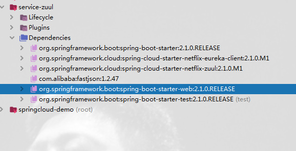

# Maven-dependencyManagement的使用

> 原创 最新推荐文章于 2025-06-30 15:49:08 发布 · 公开 · 166 阅读 · 0 · 0 · 本内容遵循CC 4.0 BY-SA版权协议 版权声明：本文为博主原创文章，遵循 CC 4.0 BY-SA 版权协议，转载请附上原文出处链接和本声明。 · 编辑
> 文章链接：https://blog.csdn.net/tanhongwei1994/article/details/112322626

父 pom

```xml
 <dependencyManagement>
        <dependencies>
            <dependency>
                <groupId>com.alibaba</groupId>
                <artifactId>fastjson</artifactId>
                <version>1.2.47</version>
            </dependency>
            <!-- druid -->
            <dependency>
                <groupId>com.alibaba</groupId>
                <artifactId>druid-spring-boot-starter</artifactId>
                <version>1.1.9</version>
            </dependency>
        </dependencies>
    </dependencyManagement>
```

子 pom

```xml
<dependency>
            <groupId>com.alibaba</groupId>
            <artifactId>fastjson</artifactId>
        </dependency>
```

然后子项目的maven 依赖出现了 fastjson 没有出现druid的

 

- dependencies即使在子项目中不写该依赖项，那么子项目仍然会从父项目中继承该依赖项（全部继承）

- dependencyManagement里只是声明依赖，并不实现引入，因此子项目需要显示的声明需要用的依赖。如果不在子项目中声明依赖，是不会从父项目中继承下来的；只有在子项目中写了该依赖项，并且没有指定具体版本，才会从父项目中继承该项，并且version和scope都读取自父pom;另外如果子项目中指定了版本号，那么会使用子项目中指定的jar版本。

