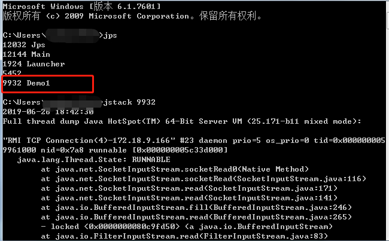
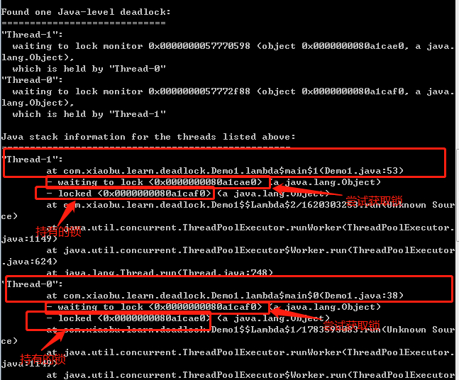
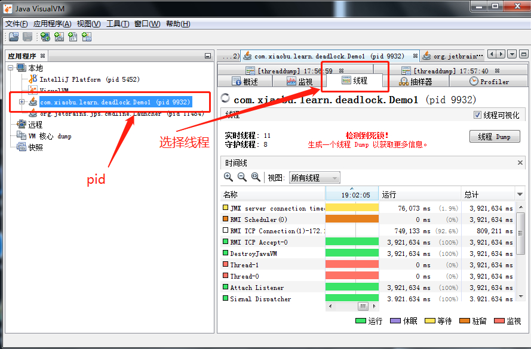
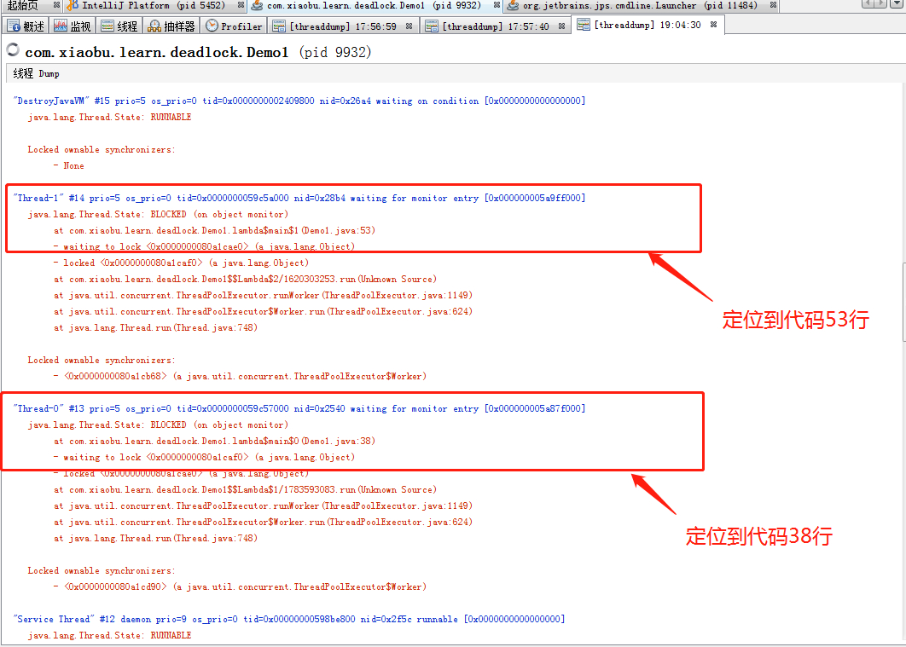
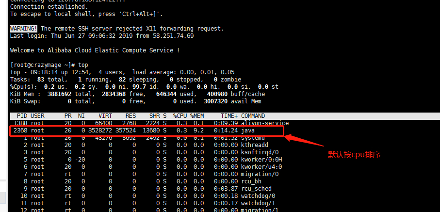
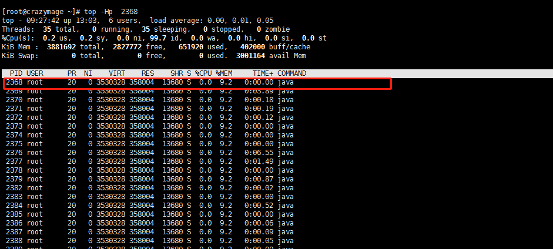
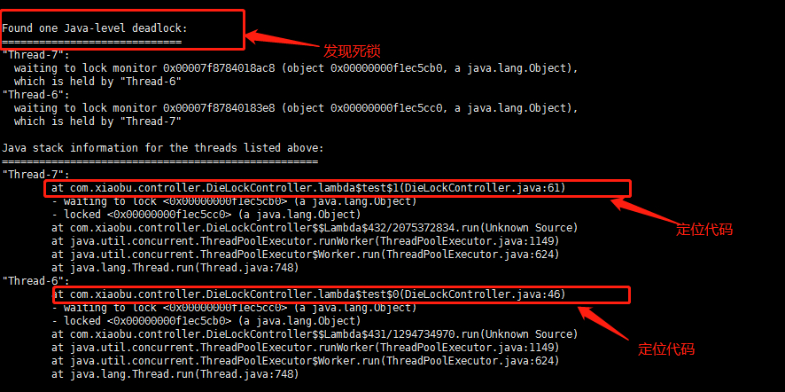

# JAVA并发| 记录一次死锁

> 原创 最新推荐文章于 2025-12-31 17:33:58 发布 · 公开 · 294 阅读 · 0 · 0 · 本内容遵循CC 4.0 BY-SA版权协议 版权声明：本文为博主原创文章，遵循 CC 4.0 BY-SA 版权协议，转载请附上原文出处链接和本声明。 · 编辑
> 文章链接：https://blog.csdn.net/tanhongwei1994/article/details/93851991

### JAVA程序检测死锁

> 测试代码

```java

package com.xiaobu.learn.deadlock;

import java.util.concurrent.LinkedBlockingQueue;
import java.util.concurrent.ThreadFactory;
import java.util.concurrent.ThreadPoolExecutor;
import java.util.concurrent.TimeUnit;


/**
 * @author xiaobu
 * @version JDK1.8.0_171
 * @date on  2019/6/26 14:53
 * @description 死锁验证
 */
public class Demo1 {
    public static void main(String[] args) {

        final Object a = new Object();

        final Object b = new Object();

        //ThreadFactory threadFactory = new ThreadFactoryBuilder().setNameFormat("thread-pool-%d").build();
        ThreadFactory threadFactory2 = new ThreadFactory() {
            @Override
            public Thread newThread(Runnable r) {
                return new Thread(r);
            }
        };

        ThreadPoolExecutor executor = new ThreadPoolExecutor(2, 10, 60L, TimeUnit.SECONDS, new LinkedBlockingQueue<>(10), threadFactory2);

        executor.execute(() -> {
            try {
                synchronized (a) {
                    System.out.println(Thread.currentThread().getName() + " got the lock of a");
                    Thread.sleep(1000);
                    System.out.println(Thread.currentThread().getName() + " was trying to get the lock of b");
                    synchronized (b) {
                        System.out.println(Thread.currentThread().getName() + " win");
                    }
                }
            } catch (InterruptedException e) {
                e.printStackTrace();
            }
        });

        executor.execute(() -> {
            try {
                synchronized (b) {
                    System.out.println(Thread.currentThread().getName() + "  got the lock of b");
                    Thread.sleep(1000);
                    System.out.println(Thread.currentThread().getName() + " was trying to get the lock of a");
                    synchronized (a) {
                        System.out.println(Thread.currentThread().getName() + " win");
                    }
                }
            } catch (InterruptedException e) {
                e.printStackTrace();
            }
        });


    }
}

```

### windows下检测

一、用命令行检测

1. cmd命令行输入jps，查看java进程id列表

```cmd
jps
```

1. 再输入jstack 进程ID，可以看到所有的线程栈

```cmd
jstack ID
```

 

1. 找到栈列表最下方，可以看到Found one Java-level deadlock

 

> Thread-1持有锁0x000000008a1caf0尝试获取0x000000008a1cae0,Thread-1持有锁0x000000008a1cae0尝试获取0x000000008a1caf0。这两个线程都在等待获取另外一个线程的锁，这状态将不会被改变直到一个线程丢弃了它的锁。

1. 使用 jstack -l pid 导出线程状态到文件中

```shell
   jstack -l pid > D:pid.txt
```

二、用jdk自带的图形工具检测

1. 打开bin目录下的jvisualvm.exe文件（cmd命令行输入jvisualvm）

 

1. 点击线程dump查看详情

 

### linux下利用jstack来分析

> 代码

```java
package com.xiaobu.controller;

import org.springframework.web.bind.annotation.GetMapping;
import org.springframework.web.bind.annotation.RequestMapping;
import org.springframework.web.bind.annotation.RestController;

import java.util.concurrent.LinkedBlockingQueue;
import java.util.concurrent.ThreadFactory;
import java.util.concurrent.ThreadPoolExecutor;
import java.util.concurrent.TimeUnit;

/**
 * @author xiaobu
 * @version JDK1.8.0_171
 * @date on  2019/6/26 19:36
 * @description
 */
@RequestMapping("dieLockTest")
@RestController
public class DieLockController {


    @GetMapping("test")
    public String test() {
        final Object a = new Object();

        final Object b = new Object();

        //ThreadFactory threadFactory = new ThreadFactoryBuilder().setNameFormat("thread-pool-%d").build();
        ThreadFactory threadFactory2 = new ThreadFactory() {
            @Override
            public Thread newThread(Runnable r) {
                return new Thread(r);
            }
        };

        ThreadPoolExecutor executor = new ThreadPoolExecutor(2, 10, 60L, TimeUnit.SECONDS, new LinkedBlockingQueue<>(10), threadFactory2);

        executor.execute(() -> {
            try {
                synchronized (a) {
                    System.out.println(Thread.currentThread().getName() + " got the lock of a");
                    Thread.sleep(1000);
                    System.out.println(Thread.currentThread().getName() + " was trying to get the lock of b");
                    synchronized (b) {
                        System.out.println(Thread.currentThread().getName() + " win");
                    }
                }
            } catch (InterruptedException e) {
                e.printStackTrace();
            }
        });

        executor.execute(() -> {
            try {
                synchronized (b) {
                    System.out.println(Thread.currentThread().getName() + "  got the lock of b");
                    Thread.sleep(1000);
                    System.out.println(Thread.currentThread().getName() + " was trying to get the lock of a");
                    synchronized (a) {
                        System.out.println(Thread.currentThread().getName() + " win");
                    }
                }
            } catch (InterruptedException e) {
                e.printStackTrace();
            }
        });
        return "success";
    }
}

```

1. 使用top命令查看CPU使用状况

```shell
top
```

 

1. 通过top -Hp pid 可以查看该进程下各个线程的cpu使用情况

```shell
top -Hp pid 
```

 

1. 使用jstack pid命令查看当前java进程的堆栈状态

```shell
jstack pid 
```

1. 使用 jstack -l pid 导出线程状态到文件中

```shell
   jstack -l pid > D:pid.txt
```

 

> jps 命令

- -q: 只显示VM 标示，不显示jar,class, main参数等信息。

- -m: 输出主函数传入的参数。

- -l: 输出应用程序主类完整package名称或jar完整名称。

- -v: 列出jvm启动参数。

- -V: 输出通过.hotsportrc或-XX:Flags=指定的jvm参数。

- -Joption: 传递参数到javac 调用的java lancher。

> jstack 命令

- -l 长列表. 打印关于锁的附加信息,例如属于java.util.concurrent 的 ownable synchronizers列表.

- -F 当’jstack [-l] pid’没有相应的时候强制打印栈信息

- -m 打印java和native c/c++框架的所有栈信息.

- -h | -help 打印帮助信息

参考:
[JVM故障分析系列之四：jstack生成的Thread Dump日志线程状态](https://www.javatang.com/archives/2017/10/25/36441958.html) 

[1.3w字，一文详解死锁！](https://mp.weixin.qq.com/s/4mJIRUShBXcxmsR6otmuwQ) 