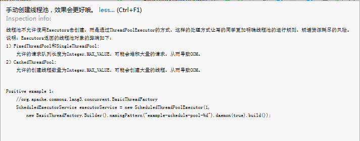
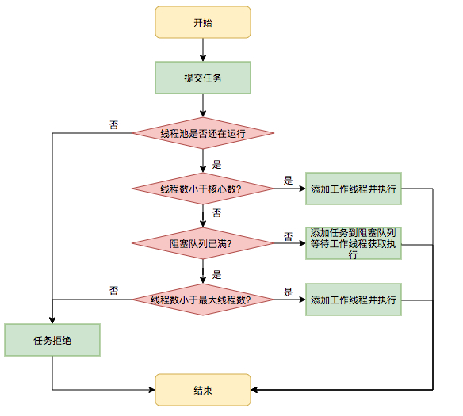

# JAVA并发| 对线程池的一点浅解

> 原创 已于 2023-06-02 16:16:44 修改 · 公开 · 210 阅读 · 0 · 0 · 本内容遵循CC 4.0 BY-SA版权协议 版权声明：本文为博主原创文章，遵循 CC 4.0 BY-SA 版权协议，转载请附上原文出处链接和本声明。 · 编辑
> 文章链接：https://blog.csdn.net/tanhongwei1994/article/details/93893690

### 线程池的简介

> ThreadPoolExecutor 继承==>AbstractExecutorService 实现===>ExecutorService 继承===>Executor

### Executors创建线程池的方式

1. **singleThreadExecutor** : 单个后台线程 (其缓冲队列是无界的)

```java
ExecutorService singleThreadExecutor=Executors.newSingleThreadExecutor();
```

> 源码解析:

```java
    public static ExecutorService newSingleThreadExecutor(){
        return new FinalizableDelegatedExecutorService
        (new ThreadPoolExecutor(1,1,
        0L,TimeUnit.MILLISECONDS,
        new LinkedBlockingQueue<Runnable>()));
        }
```

> 返回的是 FinalizableDelegatedExecutorService
> (new ThreadPoolExecutor(1, 1,0L, TimeUnit.MILLISECONDS, new LinkedBlockingQueue()))–>ExecutorService 进行了一个包装，防止暴露出不该被暴露的方法，然后加上了finalize方法保证线程池 的关闭。这个线程池只有一个核心线程在工作，也就是相当于单线程串行执行所有任务。如果这个唯一的线程因为异常结束，那么会有一个新的线程来替代它。此线程池保证所有任务的执行顺序按照任务的提交顺序执行。

> > FinalizableDelegatedExecutorService
> 
> 

```java
    static class FinalizableDelegatedExecutorService
        extends DelegatedExecutorService {
    FinalizableDelegatedExecutorService(ExecutorService executor) {
        super(executor);
    }

    protected void finalize() {
        super.shutdown();
    }
}
```

1. **fixedThreadPool** : 只有核心线程的线程池,大小固定 (其缓冲队列是无界的) 。

```
ExecutorService fixedThreadPool = Executors.newFixedThreadPool(1);
```

> 源码解析:

```java
    public static ExecutorService newFixedThreadPool(int nThreads){
        return new ThreadPoolExecutor(nThreads,nThreads,
        0L,TimeUnit.MILLISECONDS,
        new LinkedBlockingQueue<Runnable>());
        }
```

> Executors.newFixedThreadPool(1)返回的是 new ThreadPoolExecutor(nThreads, nThreads, 0L, TimeUnit.MILLISECONDS,new LinkedBlockingQueue())。每次提交一个任务就创建一个线程，直到线程达到线程池的最大大小。线程池的大小一旦达到最大值就会保持不变，如果某个线程因为执行异常而结束，那么线程池会补充一个新线程。 Executors.newFixedThreadPool(1) <==> Executors.newSingleThreadExecutor()

[newSingleThreadExecutor()和newFixedThreadPool(1)的区别](https://blog.csdn.net/qq_35580883/article/details/78740807) 

1. **CachedThreadPool** 无界线程池，可以进行自动线程回收。

```java
 ExecutorService newCachedThreadPool=Executors.newCachedThreadPool();
```

源码解析:

```java
    public static ExecutorService newCachedThreadPool(){
        return new ThreadPoolExecutor(0,Integer.MAX_VALUE,
        60L,TimeUnit.SECONDS,
        new SynchronousQueue<Runnable>());
        }
```

> 如果线程池的大小超过了处理任务所需要的线程，那么就会回收部分空闲（60秒不执行任务）的线程，当任务数增加时，此线程池又可以智能的添加新线程来处理任务。此线程池不会对线程池大小做限制，线程池大小完全依赖于操作系统（或者说JVM）能够创建的最大线程大小。SynchronousQueue是一个是缓冲区为1的阻塞队列。

1. **ScheduledThreadPool** :核心线程池固定，大小无限的线程池。此线程池支持定时以及周期性执行任务的需求。

```java
ExecutorService newCachedThreadPool=Executors.newScheduledThreadPool(corePoolSize);
```

> 源码解析

```java
    public static ScheduledExecutorService newScheduledThreadPool(int corePoolSize){
        return new ScheduledThreadPoolExecutor(corePoolSize);
        }
```

> > new ScheduledThreadPoolExecutor(corePoolSize)
> 
> 

```java
    public ScheduledThreadPoolExecutor(int corePoolSize){
        super(corePoolSize,Integer.MAX_VALUE,0,NANOSECONDS,
        new DelayedWorkQueue());
        }
```

> 创建一个周期性执行任务的线程池。如果闲置,非核心线程池会在DEFAULT_KEEPALIVEMILLIS时间内回收。

阿里开发规范里面不推荐用Executors来创建线程。
 

### ThreadPoolExecutor创建线程

> 自定义ThreadFactory

- 使用 org.apache.commons:commons-lang3下的BasicThreadFactory创建

```java
 ThreadFactory threadFactory=new BasicThreadFactory.Builder().
        namingPattern("thread-pool-%d").daemon(true).build();
```

```xml

<dependency>
    <groupId>org.apache.commons</groupId>
    <artifactId>commons-lang3</artifactId>
    <version>3.4</version>
</dependency>
```

- 使用com.google.common.util.concurrent的ThreadFactoryBuilder创建

```java
ThreadFactory threadFactory=new ThreadFactoryBuilder().
        setNameFormat("thread-pool-%d").build();
```

```xml

<dependency>
    <groupId>com.google.guava</groupId>
    <artifactId>guava</artifactId>
    <version>18.0</version>
</dependency>
```

- new ThreadFactory <==> Thread::new 默认输出:thread-pool-1 …

```java
new ThreadFactory(){
@Override
public Thread newThread(Runnable r){
        return new Thread(r);
        }
```

1. 创建个与 **singleThreadExecutor** 等价的线程池

```java
    ThreadPoolExecutor executor=new ThreadPoolExecutor(1,1,0L,
        TimeUnit.MILLISECONDS,new LinkedBlockingQueue<>(10),(ThreadFactory)Thread::new);
```

1. 创建个与 **fixedThreadPool** 等价的线程池

> corePoolSize和maximumPoolSize必须相等

```java
  ThreadPoolExecutor executor=new ThreadPoolExecutor(2,2,0L,
        TimeUnit.MILLISECONDS,new LinkedBlockingQueue<>(10),(ThreadFactory)Thread::new);
```

1. 创建个与 **CachedThreadPool** 等价的线程池

```java
  ThreadPoolExecutor executor=new ThreadPoolExecutor(2,2,0L,
        TimeUnit.MILLISECONDS,new LinkedBlockingQueue<>(10),(ThreadFactory)Thread::new);
```

1. 创建个与 **scheduledThreadPool** 等价的线程池

```java
  ScheduledThreadPoolExecutor scheduledThreadPoolExecutor=new
        ScheduledThreadPoolExecutor(1,(ThreadFactory)Thread::new);
```

### 解析ThreadPoolExecutor类

> ThreadPoolExecutor有四个构造方法

1. 分析构造方法的各个参数

- 

corePoolSize：核心池的大小，这个参数跟后面讲述的线程池的实现原理有非常大的关系。在创建了线程池后，默认情况下，线程池中并没有任何线程，而是等待有任务到来才创建线程去执行任务，除非调用了prestartAllCoreThreads()
或者prestartCoreThread()
方法，从这2个方法的名字就可以看出，是预创建线程的意思，即在没有任务到来之前就创建corePoolSize个线程或者一个线程。默认情况下，在创建了线程池后，线程池中的线程数为0，当有任务来之后，就会创建一个线程去执行任务，当线程池中的线程数目达到corePoolSize后，就会把到达的任务放到缓存队列当中；

- maximumPoolSize：线程池最大线程数，这个参数也是一个非常重要的参数，它表示在线程池中最多能创建多少个线程；

- 

keepAliveTime：表示线程没有任务执行时最多保持多久时间会终止。默认情况下，只有当线程池中的线程数大于corePoolSize时，keepAliveTime才会起作用，直到线程池中的线程数不大于corePoolSize，即当线程池中的线程数大于corePoolSize时，如果一个线程空闲的时间达到keepAliveTime，则会终止，直到线程池中的线程数不超过corePoolSize。但是如果调用了allowCoreThreadTimeOut(
boolean)方法，在线程池中的线程数不大于corePoolSize时，keepAliveTime参数也会起作用，直到线程池中的线程数为0；

- unit：参数keepAliveTime的时间单位，有7种取值，在TimeUnit类中有7种静态属性：

- workQueue：一个阻塞队列(一般使用LinkedBlockingQueue和Synchronous)，用来存储等待执行的任务，这个参数的选择也很重要，会对线程池的运行过程产生重大影响，一般来说，这里的阻塞队列有以下几种选择：

> ArrayBlockingQueue; LinkedBlockingQueue; SynchronousQueue;

- threadFactory：线程工厂，主要用来创建线程；

- handler：表示当拒绝处理任务时的策略，有以下四种取值：

> 
> 
> - ThreadPoolExecutor.AbortPolicy:丢弃任务并抛出RejectedExecutionException异常。默认
> 
> - ThreadPoolExecutor.DiscardPolicy：也是丢弃任务，但是不抛出异常。
> 
> - ThreadPoolExecutor.DiscardOldestPolicy：丢弃队列最前面的任务，然后重新尝试执行任务（重复此过程）
> 
> - ThreadPoolExecutor.CallerRunsPolicy：由调用线程处理该任务
> 
> 

1. 常用的方法分析

- execute() 执行task 无返回值

> ExecutorService.execute(Runnable runable);

- submit() 执行task 有返回值

> FutureTask task = ExecutorService.submit(Runnable runnable);

> FutureTask task = ExecutorService.submit(Runnable runnable,T Result);

> FutureTask task = ExecutorService.submit(Callable callable);

- shutdown()

> 如果调用了shutdown()方法，则线程池处于SHUTDOWN状态，此时线程池不能够接受新的任务，它会等待所有任务执行完毕；

- shutdownNow()

> 如果调用了shutdownNow()方法，则线程池处于STOP状态，此时线程池不能接受新的任务，并且会去尝试终止正在执行的任务；

> 当线程池处于SHUTDOWN或STOP状态，并且所有工作线程已经销毁，任务缓存队列已经清空或执行结束后，线程池被设置为TERMINATED状态。

1. 工作策略: 核心线程corePoolSize、任务队列workQueue、最大线程maximumPoolSize，如果三者都满了，使用handler处理被拒绝的任务。

- 下面都假设任务队列没有大小限制：

> 
> 
> - 如果线程数量<=核心线程数量，那么直接启动一个核心线程来执行任务，不会放入队列中。
> 
> - 如果线程数量>核心线程数，但<=最大线程数，并且任务队列是LinkedBlockingDeque的时候，超过核心线程数量的任务会放在任务队列中排队。
> 
> - 如果线程数量>核心线程数，但<=最大线程数，并且任务队列是SynchronousQueue的时候，线程池会创建新线程执行任务，这些任务也不会被放在任务队列中。这些线程属于非核心线程，在任务完成后，闲置时间达到了超时时间就会被清除。
> 
> - 如果线程数量>核心线程数，并且>最大线程数，当任务队列是LinkedBlockingDeque，会将超过核心线程的任务放在任务队列中排队。也就是当任务队列是LinkedBlockingDeque并且没有大小限制时，线程池的最大线程数设置是无效的，他的线程数最多不会超过核心线程数。
> 
> - 如果线程数量>核心线程数，并且>最大线程数，当任务队列是SynchronousQueue的时候，会因为线程池拒绝添加任务而抛出异常。
> 
> 

- 任务队列大小有限时:

> 
> 
> - 当LinkedBlockingDeque塞满时，新增的任务会直接创建新线程来执行，当创建的线程数量超过最大线程数量时会抛异常。
> 
> - SynchronousQueue没有数量限制。因为他根本不保持这些任务，而是直接交给线程池去执行。当任务数量超过最大线程数时会直接抛异常。
> 
> 

 

> 验证当队列满了，线程池创建新的线程是执行新的task还是队列里面的第一个task

```java
package com.xiaobu.juc.ThreadPoolExecutor;

import lombok.extern.slf4j.Slf4j;
import org.apache.commons.lang3.concurrent.BasicThreadFactory;

import java.util.concurrent.*;

/**
 * @author 小布
 * @version 1.0.0
 * @className CallerRunsPolicyDemo2.java
 * @createTime 2023年06月02日 14:07:00
 * new ThreadPoolExecutor.CallerRunsPolicy() 由调用线程处理该任务
 */
@Slf4j
public class CallerRunsPolicyDemo2 {
    public static void main(String[] args) throws InterruptedException {
        ThreadFactory threadFactory = new BasicThreadFactory.Builder().daemon(true).namingPattern("thread-pool-%d").build();
        // 创建一个 核心线程数量为2，最大数量为4,等待队列最大是3 的线程池，也就是最大容纳7个任务。
        // 默认的策略是抛出RejectedExecutionException异常，java.util.concurrent.ThreadPoolExecutor.AbortPolicy
        ThreadPoolExecutor threadPoolExecutor = new ThreadPoolExecutor(2, 4, 5, TimeUnit.SECONDS,
                new LinkedBlockingQueue<>(3), threadFactory, new ThreadPoolExecutor.CallerRunsPolicy() {
            /**
             * Executes task r in the caller's thread, unless the executor
             * has been shut down, in which case the task is discarded.
             *
             * @param r the runnable task requested to be executed
             * @param e the executor attempting to execute this task
             */
            @Override
            public void rejectedExecution(Runnable r, ThreadPoolExecutor e) {
                super.rejectedExecution(r, e);
            }
        });
        for (int i = 0; i < 8; i++) {
            int n = i;
            Future<?> submit = threadPoolExecutor.submit(() -> {
                try {
                    log.info("开始执行：" + n);
                    TimeUnit.SECONDS.sleep(1);
                    log.error("执行结束:" + n);
                } catch (InterruptedException e) {
                    e.printStackTrace();
                }
            });
            log.info("任务提交成功 :" + i);
            //可以看出核心线程池满了 任务会放在队列里面去
            log.info("当前线程池等待的数量为:" + threadPoolExecutor.getQueue().size());
        }
        // 查看线程数量，查看队列等待数量
        Thread.sleep(500L);
        log.info("当前线程池线程数量为：" + threadPoolExecutor.getPoolSize());
        log.info("当前线程池等待的数量为：" + threadPoolExecutor.getQueue().size());
        Thread.sleep(15000L);
        log.info("当前线程池线程数量为：" + threadPoolExecutor.getPoolSize());
        log.info("当前线程池等待的数量为：" + threadPoolExecutor.getQueue().size());
    }


}

```

结果显示执行新的task任务

[线程池CallerRunsPolicy()拒绝策略](https://blog.csdn.net/dabusiGin/article/details/105323796) 