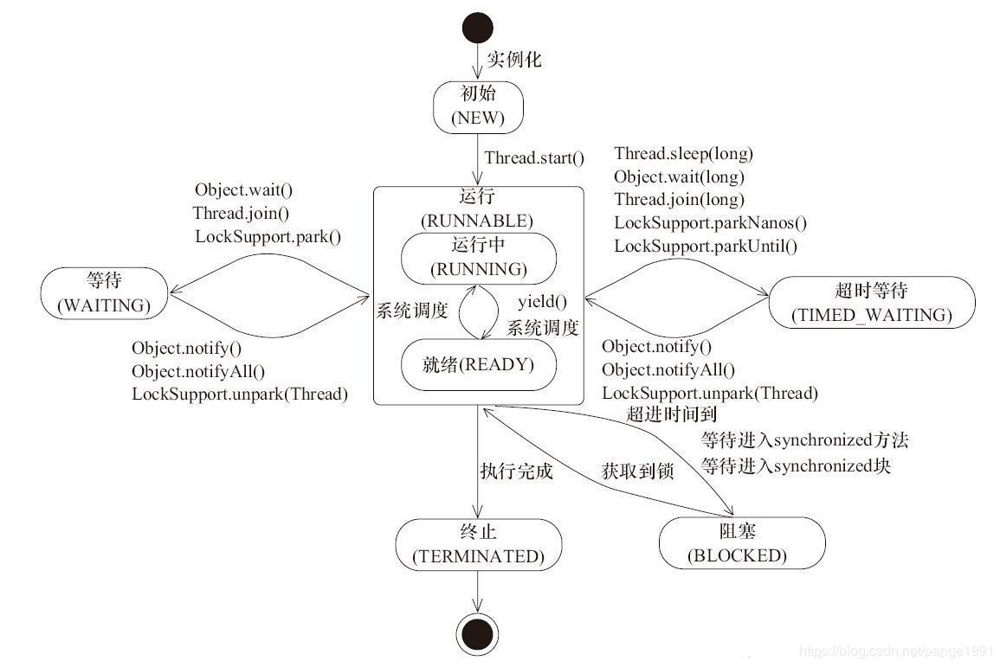
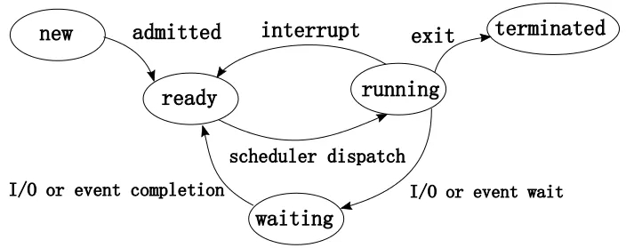
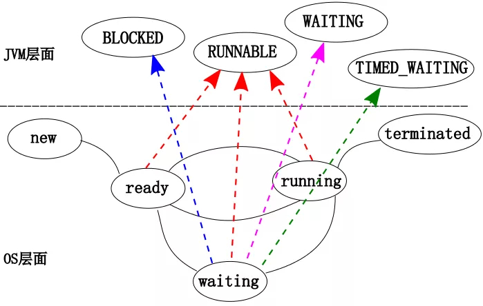

# JAVA并发| Thread的常用方法

> 原创 最新推荐文章于 2025-04-13 15:59:05 发布 · 公开 · 682 阅读 · 0 · 1 · 本内容遵循CC 4.0 BY-SA版权协议 版权声明：本文为博主原创文章，遵循 CC 4.0 BY-SA 版权协议，转载请附上原文出处链接和本声明。 · 编辑
> 文章链接：https://blog.csdn.net/tanhongwei1994/article/details/98760302

Thread的六个状态：

- NEW:初始状态，新建了一个线程对象，但是没有执行start方法。

- RUNNABLE:运行状态，传统的 ready， running 以及部分的 waiting 状态。。IO阻塞的时候也是处于RUNNABLE状态

```java
package com.xiaobu.test.JUC.Thread;

import java.util.Scanner;

/**
 * @author xiaobu
 * @version JDK1.8.0_171
 * @date on  2019/8/8 11:58
 * @description
 */
public class TestBlockedTest {
    public static void main(String[] args) {
        Scanner scanner = new Scanner(System.in);
        Thread thread = new Thread(new Runnable() {
            @Override
            public void run() {
                String input = scanner.nextLine();
                System.out.println("input = " + input);
            }
        });
        thread.start();
        //true
        System.out.println(thread.getState().equals(Thread.State.RUNNABLE));
    }
}

```

- BLOCKED:阻塞，表示线程阻塞于锁。

- WAITING:一个正在无限期等待另一个线程执行一个特别的动作的线程。进入该状态的线程需要等待其他线程做出一些特定动作(比如通知如:notify(),notifyAll()或者中断如:interrupt())。

  - 不带时限的 Object.wait 方法

  - 不带时限的 Thread.join 方法

  - LockSupport.park

- TIMED_WAITING:该状态不同于WATING，它可以在指定时间返回。

  - 带时限的 Object.wait 方法

  - 带时限的 Thread.join 方法

  - LockSupport.parkNanos

  - LockSupport.parkUntil

- TERMINATED:表示该线程已经执行完毕。

java线程状态图：
 

OS线程状态图:
 

OS线程与java线程对比图
 

常用方法

##### start()

> 用来启动一个线程，当调用start方法后，系统才会开启一个新的线程来执行用户定义的子任务，在这个过程中，会为相应的线程分配需要的资源。

##### run()

> 该方法是不需要用户来调用的，当通过start方法启动一个线程之后，当线程获得了CPU执行时间，便进入run方法体去执行具体的任务。注意，继承Thread类必须重写run方法，在run方法中定义具体要执行的任务。

##### isAlive()

> 该方法是不需要用户来调用的，当通过start方法启动一个线程之后，当线程获得了CPU执行时间，便进入run方法体去执行具体的任务。注意，继承Thread类必须重写run方法，在run方法中定义具体要执行的任务。

```java
package com.xiaobu.test.JUC.Thread;

import java.util.concurrent.TimeUnit;

/**
 * @author xiaobu
 * @version JDK1.8.0_171
 * @date on  2019/8/7 10:53
 * @description
 */
public class IsAliveTest extends Thread {

    @Override
    public void run() {
        System.out.println("run==" + this.isAlive());
    }


    public static void main(String[] args) {
        IsAliveTest isAliveTest = new IsAliveTest();
        System.out.println("begin==" + isAliveTest.isAlive());
        isAliveTest.start();
        try {
            //不加这个可能会出现begin==false end==run run==true
            TimeUnit.SECONDS.sleep(1);
        } catch (InterruptedException e) {
            e.printStackTrace();
        }
        System.out.println("end==" + isAliveTest.isAlive());
    }
}

```

##### Thread.sleep(long millis)

> sleep相当于让线程睡眠，交出CPU，让CPU去执行其他的任务。sleep方法不会释放锁，也就是说如果当前线程持有对某个对象的锁，则即使调用sleep方法，其他线程也无法访问这个对象。当前线程进入TIMED_WAITING状态

```java
package com.xiaobu.test.JUC.Thread;


/**
 * @author xiaobu
 * @version JDK1.8.0_171
 * @date on  2019/8/7 9:52
 * @description
 */
public class SleepTest {

    private static int i = 0;

    private static final Object OBJECT = new Object();

    public static void main(String[] args) {
        MyThread thread1 = new MyThread();

        MyThread thread2 = new MyThread();

        thread1.start();

        thread2.start();
    }

    static class  MyThread extends Thread {
        @Override
        public void run() {
            super.run();
            synchronized (OBJECT) {
                i++;
                System.out.println("i = " + i);
                System.out.println("线程" + Thread.currentThread().getName() + "进入睡眠状态");
                try {
                    Thread.sleep(10000);
                } catch (InterruptedException e) {
                    e.printStackTrace();
                }
                System.out.println("线程" + Thread.currentThread().getName() + "睡眠结束");
                i++;
                System.out.println("i = " + i);
            }
        }
    }
}

```

 

##### yield()

> 使当前线程从执行状态（运行状态）变为可执行态（就绪状态）。cpu会从众多的可执行态里选择，也就是说，当前也就是刚刚的那个线程还是有可能会被再次执行到的，并不是说一定会执行其他线程而该线程在下一次中不会执行到了。

```java
package com.xiaobu.test.JUC.Thread;

/**
 * @author xiaobu
 * @version JDK1.8.0_171
 * @date on  2019/8/6 16:31
 * @description 使当前线程从执行状态（运行状态）变为可执行态（就绪状态）。
 * cpu会从众多的可执行态里选择，也就是说，当前也就是刚刚的那个线程还是有可能会被再次执行到的，
 * 并不是说一定会执行其他线程而该线程在下一次中不会执行到了。
 */
public class YieldTest extends Thread {

    public YieldTest(String name){
        super(name);
    }


    @Override
    public void run() {
        super.run();
        for (int i = 0; i < 50; i++) {
            System.out.println(this.getName() + "===>" + i);
            if (i==30) {
                yield();
            }
        }
    }

    /**
     * 1.张三放弃之后李四争取到了CPU
     * 张三===>30
     * 李四===>0
     * 2.李四放弃之后还是由李四争取到了CPU
     * 李四===>30
     * 李四===>31
     */
    public static void main(String[] args) {
        YieldTest yieldTest1 = new YieldTest("张三");
        YieldTest yieldTest2 = new YieldTest("李四");
        yieldTest1.start();
        yieldTest2.start();
    }
}

```

##### wait()

> 该方法为Object的方法;当一个线程执行到wait()方法时，它就进入到一个和该对象相关的等待池中，同时失去（释放）了对象的机锁（暂时失去机锁，wait(long timeout)超时时间到后还需要返还对象锁）；其他线程可以访问。即让当前线程阻塞，并且当前线程必须拥有此对象的monitor（即锁）

#### notify()

> 唤醒一个正在等待这个对象的monitor的线程，如果有多个线程都在等待这个对象的monitor，则只能唤醒其中一个线程；

```java
package com.xiaobu.test.JUC.Thread;

import java.util.concurrent.TimeUnit;

/**
 * @author xiaobu
 * @version JDK1.8.0_171
 * @date on  2019/8/7 11:24
 * @description 先执行Thread1的方法，然后Thread1等待，接着Thread2发出唤醒信号，
 */
public class WaitTest {

    private static class Thread1 implements Runnable{

        @Override
        public void run() {
            //由于 Thread1和下面Thread2内部run方法要用同一对象作为监视器，如果用this则Thread1和Threa2的this不是同一对象
            //所以用MultiThread.class这个字节码对象，当前虚拟机里引用这个变量时指向的都是同一个对象
            synchronized (WaitTest.class){
                System.out.println("enter thread1 ...");
                System.out.println("thread1 is waiting");
                try {
                    //释放锁有两种方式：(1)程序自然离开监视器的范围，即离开synchronized关键字管辖的代码范围
                    //(2)在synchronized关键字管辖的代码内部调用监视器对象的wait()方法。这里使用wait方法
                    //释放对象锁，让当前线程阻塞。
                    WaitTest.class.wait();
                } catch (InterruptedException e) {
                    e.printStackTrace();
                }
                System.out.println("thread1 is going on ...");
                System.out.println("thread1 is being over!");
            }
        }
    }


    private static class Thread2 implements Runnable{

        @Override
        public void run() {

            synchronized (WaitTest.class){
                System.out.println("enter thread2 ...");
                System.out.println("thread2 notify other thread can release wait status ...");
                //唤醒一个正在等待这个对象的monitor的线程
                WaitTest.class.notify();
                System.out.println("thread2 is sleeping ten millisecond ...");
                try {
                    TimeUnit.MILLISECONDS.sleep(10);
                } catch (InterruptedException e) {
                    e.printStackTrace();
                }
                System.out.println("thread2 is going on ...");
                System.out.println("thread2 is being over!");
            }
        }
    }


    public static void main(String[] args) {
        new Thread(new Thread1()).start();
        try {
            TimeUnit.MILLISECONDS.sleep(10);
        } catch (InterruptedException e) {
            e.printStackTrace();
        }
        new Thread(new Thread2()).start();
    }
}

```

 

#### notifyAll()

> 唤醒所有正在等待这个对象的monitor的线程；

#### join()

> 启动线程后直接调用，即join()的作用是：“等待该线程终止”，这里需要理解的就是该线程是指的主线程等待子线程的终止。也就是在子线程调用了join()方法后面的代码，只有等到子线程结束了才能执行。join是基于wait实现的。先start(),再join()。

```java
package com.xiaobu.test.JUC.Thread;

/**
 * @author xiaobu
 * @version JDK1.8.0_171
 * @date on  2019/8/7 14:28
 * @description
 */
public class JoinTest {
    public static void main(String[] args) {
        Thread thread = new JoinThread();
        try {
            thread.start();
            thread.join();
        } catch (InterruptedException e) {
            e.printStackTrace();
        }
        for (int i = 0; i < 5; i++) {
            System.out.println(Thread.currentThread().getName()+"====>"+ i);
        }

    }

    static class JoinThread extends Thread{
        @Override
        public void run() {
            for (int i = 0; i < 5; i++) {
                System.out.println(Thread.currentThread().getName()+"==> " + i);
            }
        }
    }
}

```

```java
package com.xiaobu.test.JUC.Thread;

/**
 * @author xiaobu
 * @version JDK1.8.0_171
 * @date on  2019/8/7 14:28
 * @description 可以把Thread-1看成Thread-2的主线程
 * 结果:
 * Thread-2执行
 * Thread-1执行
 */
public class JoinTest2 {


    public static void main(String[] args) {
        Thread t2 = new Thread(() -> {
            System.out.println(Thread.currentThread().getName() + "执行");

        },"Thread-2");
        t2.start();

        Thread t1 = new Thread(new Runnable() {
            @Override
            public void run() {
                try {
                    t2.join();
                } catch (InterruptedException e) {
                    e.printStackTrace();
                }
                System.out.println(Thread.currentThread().getName() + "执行");
            }
        },"Thread-1");

        t1.start();
    }
}

```

##### interrupt()

> Thread.interrupt 的作用其实也不是中断线程，而是「通知线程应该中断了」，具体到底中断还是继续运行，应该由被通知的线程自己处理。
> 具体来说，当对一个线程，调用 interrupt() 时，① 如果线程处于被阻塞状态（例如处于sleep, wait, join 等状态），那么线程将立即退出被阻塞状态，并抛出一个InterruptedException异常。仅此而已。② 如果线程处于正常活动状态，那么会将该线程的中断标志设置为 true，仅此而已。被设置中断标志的线程将继续正常运行，不受影响。

```java
package com.xiaobu.test.JUC.Thread;

import java.util.concurrent.TimeUnit;

/**
 * @author xiaobu
 * @version JDK1.8.0_171
 * @date on  2019/8/7 14:59
 * @description
 */
public class InterruptTest extends Thread {


    public static void main(String[] args) {
        Thread thread = new InterruptTest();
        thread.start();
        try {
            TimeUnit.MILLISECONDS.sleep(10);
        } catch (InterruptedException e) {
            e.printStackTrace();
        }
        thread.interrupt();
    }

    @Override
    public void run() {
        System.out.println("进入run方法");
        try {
            TimeUnit.SECONDS.sleep(1);
            System.out.println("已完成休眠");
        } catch (InterruptedException e) {
            System.out.println("休眠被终止");
           return;
        }
        System.out.println("休眠正常结束");
    }
}
```

 

使用退出标志。

```java
public class IndexProcessor implements Runnable {

    private static final Logger LOGGER = LoggerFactory.getLogger(IndexProcessor.class);
    private volatile boolean running = true;

    public void terminate() {
        running = false;
    }

    @Override
    public void run() {
        while (running) {
            try {
                LOGGER.debug("Sleeping...");
                Thread.sleep((long) 15000);

                LOGGER.debug("Processing");
            } catch (InterruptedException e) {
                LOGGER.error("Exception", e);
                running = false;
            }
        }

    }
}
```

 

### 过时的几个方法

#### stop()

> 强行终止线程（这个方法不推荐使用，因为stop和suspend、resume一样，也可能发生不可预料的结果）。
> 因为它在终止一个线程时会强制中断线程的执行，不管run方法是否执行完了，并且还会释放这个线程所持有的所有的锁对象。这一现象会被其它因为请求锁而阻塞的线程看到，使他们继续向下执行。这就会造成数据的不一致，我们还是拿银行转账作为例子，我们还是从A账户向B账户转账500元，我们之前讨论过，这一过程分为三步，第一步是从A账户中减去500元，假如到这时线程就被stop了，那么这个线程就会释放它所取得锁，然后其他的线程继续执行，这样A账户就莫名其妙的少了500元而B账户也没有收到钱。这就是stop方法的不安全性。

#### suspend()

> suspend被弃用的原因是因为它会造成死锁。suspend方法和stop方法不一样，它不会破换对象和强制释放锁，相反它会一直保持对锁的占有，一直到其他的线程调用resume方法，它才能继续向下执行。
> 假如有A，B两个线程，A线程在获得某个锁之后被suspend阻塞，这时A不能继续执行，线程B在或者相同的锁之后才能调用resume方法将A唤醒，但是此时的锁被A占有，B不能继续执行，也就不能及时的唤醒A，此时A，B两个线程都不能继续向下执行而形成了死锁。这就是suspend被弃用的原因。

#### resume()

> Thread.suspend很容易死锁。如果目标线程挂起来，他将给监听器上锁用以保护重要的系统资源，其他线程将不能访问该资源直到目标线程恢复工作。如果线程在恢复一个企图给监听器加锁的线程前调用了resume方法，则导致死锁。这种死锁称之为冰冻过程。

### Thread使用注意

- 线程执行的业务逻辑，放在run()方法中

- 使用 thread.start() 启动线程

- wait方法需要和notify方法配套使用

- 守护线程必须在线程启动之前设置

- 如果需要等待线程执行完毕，可以调用 join()方法

参考：
[Java线程的6种状态及切换](https://blog.csdn.net/pange1991/article/details/53860651###) 

[Java中为什么反对使用Thread.stop, Thread.suspend, Thread.resume and Runtime.runFinalizersOnExit?](https://blog.csdn.net/loongshawn/article/details/53034176) 