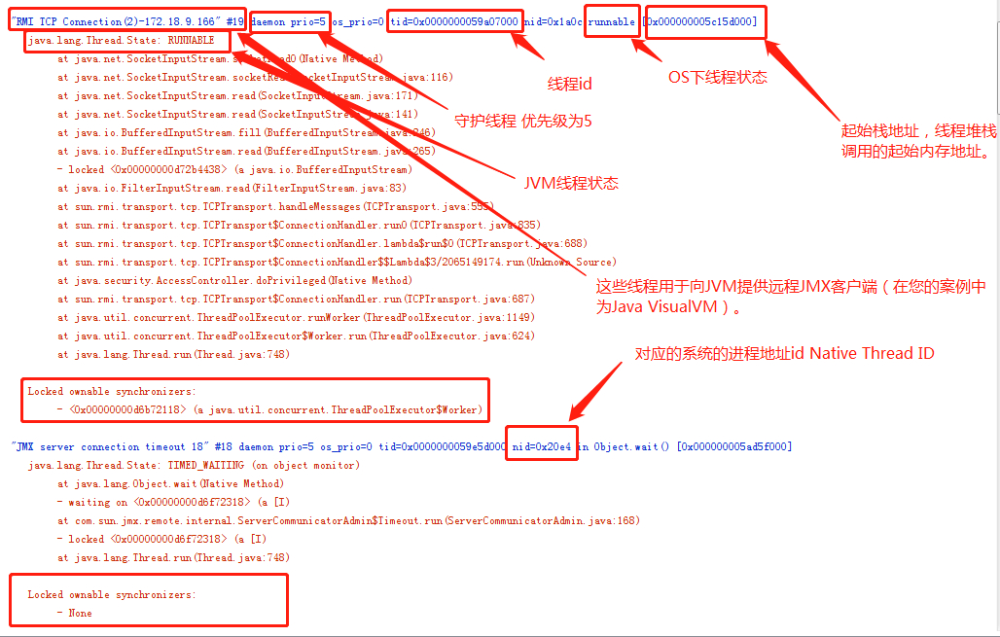
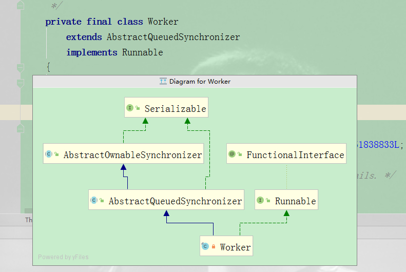
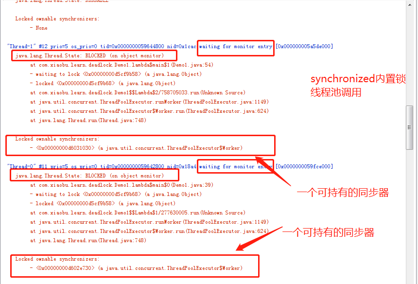
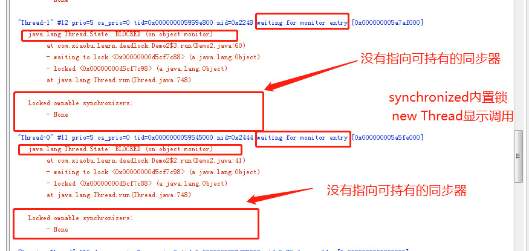
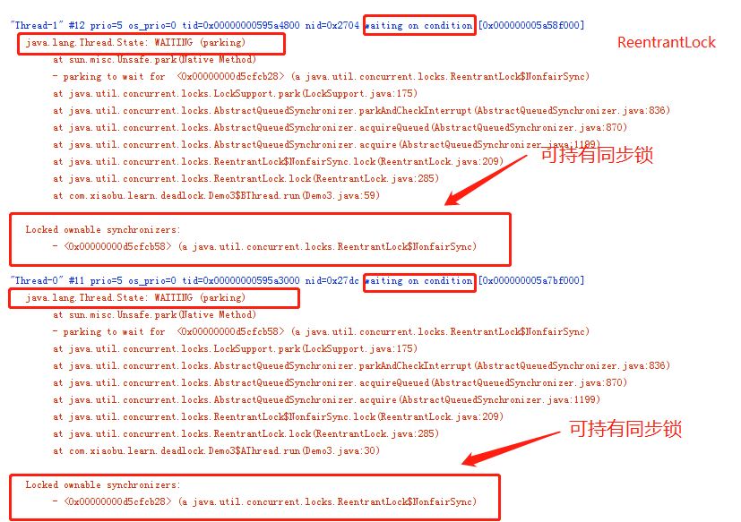
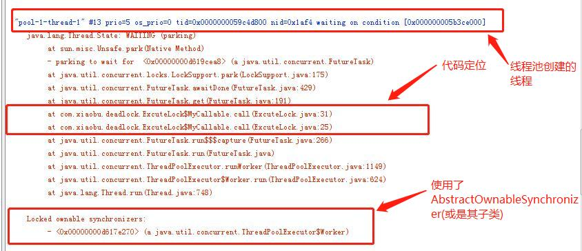

# JAVA并发| 记录一次死锁（二）与Locked ownable synchronizers

> 原创 最新推荐文章于 2026-06-20 12:09:50 发布 · 公开 · 6.4k 阅读 · 3 · 23 · 本内容遵循CC 4.0 BY-SA版权协议 版权声明：本文为博主原创文章，遵循 CC 4.0 BY-SA 版权协议，转载请附上原文出处链接和本声明。 · 编辑
> 文章链接：https://blog.csdn.net/tanhongwei1994/article/details/100144748

```java
package com.xiaobu.deadlock;

import java.util.concurrent.*;

/**
 * @author xiaobu
 * @version JDK1.8.0_171
 * @date on  2019/8/21 17:16
 * @description
 */
public class ExcuteLock {

    static ExecutorService single = Executors.newSingleThreadExecutor();


    static class AnotherCallable implements Callable<String>{

        @Override
        public String call() throws Exception {
            System.out.println(" in AnotherCallable");
            return "success another";
        }
    }

    static class MyCallable implements Callable<String>{

        @Override
        public String call() throws Exception {
            System.out.println("in MyCallable");
            Future<String> future = single.submit(new AnotherCallable());
            return "success "+future.get();
        }
    }

    /**
     * 功能描述:主线程在等待一个FutureTask完成，而线程池中一个线程也在等待一个FutureTask完成。
     * 从代码实现可以看到，主线程往线程池中扔了一个任务A，任务A又往同一个线程池中扔了一个任务B，并等待B的完成，由于线程池中只有一个线程，这将导致B会被停留在阻塞队列中，而A还得等待B的完成，这也就是互相等待导致了死锁的反生
     * @author xiaobu
     * @date 2019/8/22 16:14
     * @return void
     * @version 1.0
     */
    public static void main(String[] args) {
        MyCallable myCallable = new MyCallable();
        Future<String> submit = single.submit(myCallable);
        try {
            System.out.println(submit.get());
        } catch (InterruptedException | ExecutionException e) {
            e.printStackTrace();
        }
        System.out.println("over");
    }
}

```

 

> RMI:（Remote Method Invocation）一种用于实现远程过程调用的应用程序编程接口。

> JMX:（Java Management Extensions，即Java管理扩展）是Java平台上为应用程序、设备、系统等植入管理功能的框架。JMX可以跨越一系列异构操作系统平台、系统体系结构和网络传输协议，灵活的开发无缝集成的系统、网络和服务管理应用。

> Locked ownable synchronizers: 一个可持有的同步器多半是线程独有并且使用了AbstractOwnableSynchronizer(或是其子类)去实现它的同步特性，ReentrantLock与ReentrantReadWriteLock就是JAVA平台提供的两个例子。

可以看出第一个Locked ownable synchronizers下面有对应的锁的信息，因为ThreadPoolExecutor.Worker 继承了AbstractQueuedSynchronizer，AbstractQueuedSynchronizer继承了AbstractOwnableSynchronizer

 

第二个的话没有使用AbstractOwnableSynchronizer或其子类。所以没有锁定同步器.

```java
package com.xiaobu.learn.deadlock;

import java.util.concurrent.LinkedBlockingQueue;
import java.util.concurrent.ThreadFactory;
import java.util.concurrent.ThreadPoolExecutor;
import java.util.concurrent.TimeUnit;


/**
 * @author xiaobu
 * @version JDK1.8.0_171
 * @date on  2019/6/26 14:53
 * @description  synchronized内置锁线程池调用,而线程池里面用到的ThreadPoolExecutor.Worker 继承了AbstractQueuedSynchronizer
 */
public class Demo1 {
    public static void main(String[] args) {

        final Object a = new Object();

        final Object b = new Object();

        //ThreadFactory threadFactory = new ThreadFactoryBuilder().setNameFormat("thread-pool-%d").build();
        ThreadFactory threadFactory2 = new ThreadFactory() {
            @Override
            public Thread newThread(Runnable r) {
                return new Thread(r);
            }
        };

        ThreadPoolExecutor executor = new ThreadPoolExecutor(2, 10, 60L, TimeUnit.SECONDS, new LinkedBlockingQueue<>(10), threadFactory2);

        executor.execute(() -> {
            try {
                synchronized (a) {
                    System.out.println(Thread.currentThread().getName() + " got the lock of a");
                    Thread.sleep(1000);
                    System.out.println(Thread.currentThread().getName() + " was trying to get the lock of b");
                    synchronized (b) {
                        System.out.println(Thread.currentThread().getName() + " win");
                    }
                }
            } catch (InterruptedException e) {
                e.printStackTrace();
            }
        });

        executor.execute(() -> {
            try {
                synchronized (b) {
                    System.out.println(Thread.currentThread().getName() + "  got the lock of b");
                    Thread.sleep(1000);
                    System.out.println(Thread.currentThread().getName() + " was trying to get the lock of a");
                    synchronized (a) {
                        System.out.println(Thread.currentThread().getName() + " win");
                    }
                }
            } catch (InterruptedException e) {
                e.printStackTrace();
            }
        });


    }
}

```

 

```java
package com.xiaobu.learn.deadlock;

import java.util.concurrent.LinkedBlockingQueue;
import java.util.concurrent.ThreadFactory;
import java.util.concurrent.ThreadPoolExecutor;
import java.util.concurrent.TimeUnit;


/**
 * @author xiaobu
 * @version JDK1.8.0_171
 * @date on  2019/6/26 14:53
 * @description synchronized内置锁 new Thread 显示调用
 */
public class Demo2 {
    public static void main(String[] args) {

        final Object a = new Object();

        final Object b = new Object();

        //ThreadFactory threadFactory = new ThreadFactoryBuilder().setNameFormat("thread-pool-%d").build();
        ThreadFactory threadFactory2 = new ThreadFactory() {
            @Override
            public Thread newThread(Runnable r) {
                return new Thread(r);
            }
        };

        ThreadPoolExecutor executor = new ThreadPoolExecutor(2, 10, 60L, TimeUnit.SECONDS, new LinkedBlockingQueue<>(10), threadFactory2);

        new Thread(new Runnable() {
            @Override
            public void run() {
                try {
                    synchronized (a) {
                        System.out.println(Thread.currentThread().getName() + " got the lock of a");
                        Thread.sleep(1000);
                        System.out.println(Thread.currentThread().getName() + " was trying to get the lock of b");
                        synchronized (b) {
                            System.out.println(Thread.currentThread().getName() + " win");
                        }
                    }
                } catch (InterruptedException e) {
                    e.printStackTrace();
                }
            }
        }).start();


        new Thread(new Runnable() {
            @Override
            public void run() {
                try {
                    synchronized (b) {
                        System.out.println(Thread.currentThread().getName() + "  got the lock of b");
                        Thread.sleep(1000);
                        System.out.println(Thread.currentThread().getName() + " was trying to get the lock of a");
                        synchronized (a) {
                            System.out.println(Thread.currentThread().getName() + " win");
                        }
                    }
                } catch (InterruptedException e) {
                    e.printStackTrace();
                }
            }
        }).start();

    }
}


```

 

```java
package com.xiaobu.learn.deadlock;

import java.util.concurrent.locks.ReentrantLock;

/**
 * @author xiaobu
 * @version JDK1.8.0_171
 * @date on  2019/9/23 15:44
 * @description ReentrantLock实现锁
 */
public class Demo3 {
    static class AThread extends Thread {

        private ReentrantLock lock1;

        private ReentrantLock lock2;

        public AThread(ReentrantLock lock1, ReentrantLock lock2) {
            super();
            this.lock1 = lock1;
            this.lock2 = lock2;
        }


        public void run() {
            try {
                lock1.lock();
                Thread.sleep(3000);
                //  必须获取两个锁后才执行操作
                lock2.lock();
                System.out.println("A: I have all Locks!");
            } catch (InterruptedException e) {
                e.printStackTrace();
            } finally {
                lock2.unlock();
                lock1.unlock();
            }
        }

    }

    static class BThread extends Thread {

        private ReentrantLock lock1;

        private ReentrantLock lock2;

        public BThread(ReentrantLock lock1, ReentrantLock lock2) {
            super();
            this.lock1 = lock1;
            this.lock2 = lock2;
        }

        public void run() {
            try {
                lock2.lock();
                Thread.sleep(1000);
                //  必须获取两个锁后才执行操作
                lock1.lock();
                System.out.println("B: I have all Locks!");
            } catch (InterruptedException e) {
                e.printStackTrace();
            } finally {
                lock1.unlock();
                lock2.unlock();
            }
        }

    }

    //  测试程序主函数
    public static void main(String[] args) throws InterruptedException {
        final ReentrantLock lock1 = new ReentrantLock();
        final ReentrantLock lock2 = new ReentrantLock();
        new AThread(lock1, lock2).start();
        new BThread(lock1, lock2).start();
    }
}


```

 

发现ReentrantLock与内置锁有如下3点不同：

1. 等待的对象不同，内置锁是“monitor entry”（监视器进入点），而ReentrantLock是“condition”(条件)。

2. 线程的状态不同，内置锁是“BLOCKED”，而ReentrantLock是“WAITING”。

3. 锁定的同步器不同，内置锁没有，而ReentrantLock则指向持有的同步器。

 

> 活锁:相互协作的线程彼此响应从而修改自己状态，导致无法执行下去。比如两个很有礼貌的人在同一条路上相遇，彼此给对方让路，但是又在同一条路上遇到了。互相之间反复的避让下去。

参考:

[Java中常见死锁与活锁的实例](https://juejin.im/post/5be6929ae51d450aa46c868a) 
[stackoverflow:Locked ownable synchronizers](https://stackoverflow.com/questions/41300520/what-is-locked-ownable-synchronizers-in-thread-dump) 
[并发(九)：检查死锁与Locked ownable synchronizers](https://blog.csdn.net/yiifaa/article/details/76013837) 