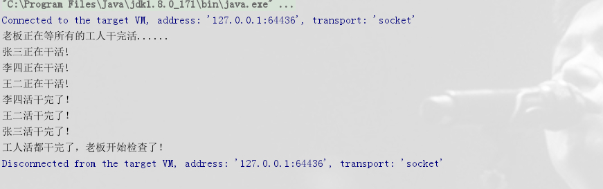
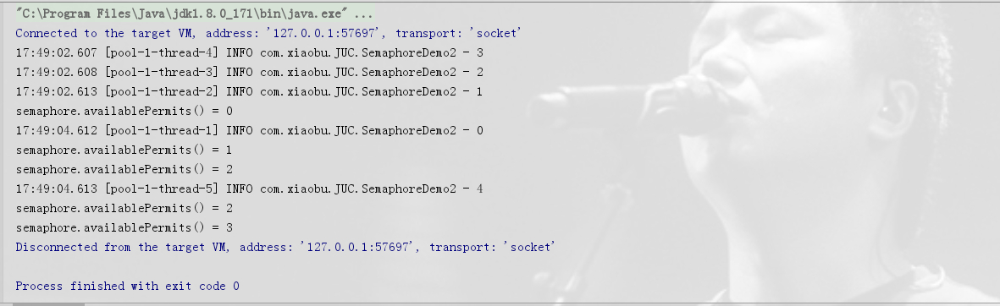
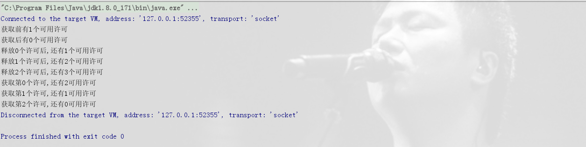
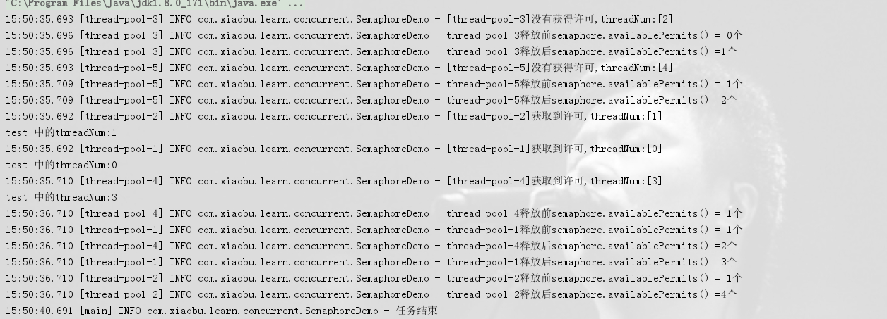

# Java并发| CountDownLatch、Semaphore和CyclicBarrier

> 原创 已于 2023-03-08 16:07:55 修改 · 公开 · 282 阅读 · 0 · 0 · 本内容遵循CC 4.0 BY-SA版权协议 版权声明：本文为博主原创文章，遵循 CC 4.0 BY-SA 版权协议，转载请附上原文出处链接和本声明。 · 编辑
> 文章链接：https://blog.csdn.net/tanhongwei1994/article/details/101541398

#### CountDownLatch

> CountDownLatch是一个计数器闭锁，通过它可以完成类似于阻塞当前线程的功能，即：一个线程或多个线程一直等待，直到其他线程执行的操作完成。当计数器值减至零时，所有因调用await()方法而处于等待状态的线程就会继续往下执行。这种现象只会出现一次，计数器不能被重置。

```java
package com.xiaobu.JUC;

import java.util.concurrent.CountDownLatch;
import java.util.concurrent.TimeUnit;

/**
 * @author xiaobu
 * @version JDK1.8.0_171
 * @date on  2019/9/20 11:27
 * @description 考试场景 20个学生参加考试 一个人老师监考，只有最后一个学生交卷 老师才算任务完成
 */
public class CountDownLatchDemo {

    private static final int count = 20;

    static class Teacher implements Runnable {

        private CountDownLatch countDownLatch;

        public Teacher() {
        }

        public Teacher(CountDownLatch countDownLatch) {
            this.countDownLatch = countDownLatch;
        }

        @Override
        public void run() {
            System.out.print("老师发卷子\n");
            try {
                countDownLatch.await();
            } catch (InterruptedException e) {
                e.printStackTrace();
            }
            System.out.print("老师收卷子\n");

        }
    }


    static class Student implements Runnable {

        private CountDownLatch countDownLatch;

        private int num;

        public Student() {
        }

        public Student(CountDownLatch countDownLatch, int num) {
            this.countDownLatch = countDownLatch;
            this.num = num;
        }

        @Override
        public void run() {
            System.out.printf("学生(%d)写卷子\n", num);
            System.out.printf("学生(%d)交卷子\n", num);
            countDownLatch.countDown();
        }
    }


    public static void main(String[] args) {
        CountDownLatch countDownLatch = new CountDownLatch(count);
        Teacher teacher = new Teacher(countDownLatch);
        Thread teacherThread = new Thread(teacher);
        teacherThread.start();
        try {
            //为了防止还没发卷子 学生就开始写卷子了
            TimeUnit.SECONDS.sleep(1);
        } catch (InterruptedException e) {
            e.printStackTrace();
        }
        for (int i = 0; i < count; i++) {
            Student student = new Student(countDownLatch, i);
            Thread studentThread = new Thread(student);
            studentThread.start();
        }
    }
}

```

```java
package com.xiaobu.note.JUC.CountDownLatch;

import java.util.concurrent.CountDownLatch;

/**
 * @author xiaobu
 * @version JDK1.8.0_171
 * @date on  2019/2/26 16:34
 * @description V1.0
 */
public class Boss implements Runnable {
    private final CountDownLatch downLatch;

    public Boss(CountDownLatch downLatch) {
        this.downLatch = downLatch;
    }

    @Override
    public void run() {
        System.out.println("老板正在等所有的工人干完活......");
        try {
            this.downLatch.await();
        } catch (InterruptedException e) {
        }
        System.out.println("工人活都干完了，老板开始检查了！");
    }
}

```

```java
package com.xiaobu.note.JUC.CountDownLatch;

import java.util.Random;
import java.util.concurrent.CountDownLatch;
import java.util.concurrent.TimeUnit;

/**
 * @author xiaobu
 * @version JDK1.8.0_171
 * @date on  2019/2/26 16:33
 * @description V1.0
 */
public class Worker implements Runnable {

    private final CountDownLatch downLatch;
    private final String name;

    public Worker(CountDownLatch downLatch, String name) {
        this.downLatch = downLatch;
        this.name = name;
    }

    @Override
    public void run() {
        this.doWork();
        try {
            TimeUnit.SECONDS.sleep(new Random().nextInt(10));
        } catch (InterruptedException ie) {
            ie.printStackTrace();
        }
        System.out.println(this.name + "活干完了！");
        this.downLatch.countDown();

    }

    private void doWork() {
        System.out.println(this.name + "正在干活!");
    }

}

```

```java

package com.xiaobu.note.JUC.CountDownLatch;

import java.util.concurrent.*;

/**
 * @author xiaobu
 * @version JDK1.8.0_171
 * @date on  2019/2/26 16:34
 * @description V1.0
 */
public class CountDownLatchDemo {
    public static void main(String[] args) {
        //两者等价但需要显现的创建线程池这样不会出现OOM的情况  
        ExecutorService e = Executors.newCachedThreadPool();
        ExecutorService executor = new ThreadPoolExecutor(0, 5, 60L, TimeUnit.SECONDS, new SynchronousQueue<Runnable>());
        CountDownLatch latch = new CountDownLatch(3);
        Worker w1 = new Worker(latch, "张三");
        Worker w2 = new Worker(latch, "李四");
        Worker w3 = new Worker(latch, "王二");
        Boss boss = new Boss(latch);
        executor.execute(w3);
        executor.execute(w2);
        executor.execute(w1);
        executor.execute(boss);
        executor.shutdown();
    }
}

```

 

#### CyclicBarrier

> CyclicBarrier也是一个同步辅助类，它允许一组线程相互等待，直到到达某个公共屏障点（common barrier point）。通过它可以完成多个线程之间相互等待，只有当每个线程都准备就绪后，才能各自继续往下执行后面的操作。

```java
package com.xiaobu.JUC;

import lombok.extern.slf4j.Slf4j;

import java.util.concurrent.BrokenBarrierException;
import java.util.concurrent.CyclicBarrier;

/**
 * @author xiaobu
 * @version JDK1.8.0_171
 * @date on  2019/9/20 11:56
 * @description
 * 最近景色宜人，公司组织去登山，大伙都来到了山脚下，登山过程自由进行。
 *
 * 但为了在特定的地点拍集体照，规定1个小时后在半山腰集合，谁最后到的，要给大家表演一个节目。
 *
 * 然后继续登山，在2个小时后，在山顶集合拍照，还是谁最后到的表演节目。
 *
 * 接着开始下山了，在2个小时后在山脚下集合，点名回家，最后到的照例表演节目。
 */
@Slf4j
public class CyclicBarrierDemo {


    private static final int count = 5;

    private static final CyclicBarrier cyclicBarrier = new CyclicBarrier(count, new Singer());

    public static void main(String[] args) {
        for (int i = 0; i < count; i++) {
            Staff staff = new Staff(cyclicBarrier, i);
            Thread thread = new Thread(staff);
            thread.start();

        }

    }


    static class Singer implements Runnable {

        @Override
        public void run() {
            System.out.println("为大家表演节目");
        }
    }


    static class Staff implements Runnable {


        private int num;

        private CyclicBarrier cyclicBarrier;

        public Staff() {
        }

        public Staff(CyclicBarrier cyclicBarrier, int num) {
            this.cyclicBarrier = cyclicBarrier;
            this.num = num;
        }

        @Override
        public void run() {
            log.info("员工[{}]开始出发....", num);
            log.info("员工[{}]到达目的地一....", num);
            try {
                cyclicBarrier.await();
            } catch (InterruptedException | BrokenBarrierException e) {
                e.printStackTrace();
            }
            log.info("员工[{}]再次出发....", num);
            log.info("员工[{}]到达目的地二....", num);
            try {
                cyclicBarrier.await();
            } catch (InterruptedException | BrokenBarrierException e) {
                e.printStackTrace();
            }

            log.info("员工[{}]又一次出发....", num);
            log.info("员工[{}]到达目的地三....", num);
            try {
                cyclicBarrier.await();
            } catch (InterruptedException | BrokenBarrierException e) {
                e.printStackTrace();
            }
            log.info("员工[{}]结束行程....", num);

        }
    }
}

```

#### Semaphore

> Semaphore与CountDownLatch相似，不同的地方在于Semaphore的值被获取到后是可以释放的，并不像CountDownLatch那样一直减到底。它也被更多地用来限制流量，类似阀门的 功能。如果限定某些资源最多有N个线程可以访问，那么超过N个主不允许再有线程来访问，同时当现有线程结束后，就会释放，然后允许新的线程进来。

void acquire()   从信号量获取一个许可，如果无可用许可前 将一直阻塞等待，

void acquire(int permits)  获取指定数目的许可，如果无可用许可前 也将会一直阻塞等待

boolean tryAcquire()   从信号量尝试获取一个许可，如果无可用许可，直接返回false，不会阻塞

boolean tryAcquire(int permits)   尝试获取指定数目的许可，如果无可用许可直接返回false，

boolean tryAcquire(int permits, long timeout, TimeUnit unit)   在指定的时间内尝试从信号量中获取许可，如果在指定的时间内获取成功，返回true，否则返回false

void release()  释放一个许可，别忘了在finally中使用，注意：多次调用该方法，会使信号量的许可数增加，达到动态扩展的效果，如：初始permits 为1， 调用了两次release，最大许可会改变为2

int availablePermits() 获取当前信号量可用的许可

```java
package com.xiaobu.JUC;

import lombok.extern.slf4j.Slf4j;

import java.util.concurrent.ExecutorService;
import java.util.concurrent.Executors;
import java.util.concurrent.Semaphore;

/**
 * @author xiaobu
 * @version JDK1.8.0_171
 * @date on  2019/7/3 11:19
 * @description
 */
@Slf4j
public class SemaphoreDemo2 {
    private final static int threadCount = 5;

    public static void main(String[] args) throws Exception {

        ExecutorService exec = Executors.newCachedThreadPool();
        // 每次最多三个线程获取许可
        final Semaphore semaphore = new Semaphore(3);

        for (int i = 0; i < threadCount; i++) {
            final int threadNum = i;
            exec.execute(() -> {
                try {
                    semaphore.acquire(); // 获取一个许可
                    test(threadNum);
                    //把release注释掉可以看出只执行三个就不能通过了
                    semaphore.release(); // 释放一个许可
                    System.out.println("semaphore.availablePermits() = " + semaphore.availablePermits());
                } catch (Exception e) {
                    log.error("exception", e);
                }
            });
        }
        exec.shutdown();
    }

    private static void test(int threadNum) throws Exception {
        log.info("{}", threadNum);
        Thread.sleep(2000);
    }
}


```

 

release()可以使信号量的许可数增加，达到动态扩展的效果

```java
package com.xiaobu.JUC;

import java.util.concurrent.Semaphore;

/**
 * @author xiaobu
 * @version JDK1.8.0_171
 * @date on  2019/9/27 10:18
 * @description release()可以使信号量的许可数增加，达到动态扩展的效果
 */
public class SemaphoreDemo3 {
    private static final Semaphore semaphore = new Semaphore(1);

    public static void main(String[] args) {
        try {
            System.out.println("获取前有" + semaphore.availablePermits() + "个可用许可");
            semaphore.acquire();
            System.out.println("获取后有" + semaphore.availablePermits() + "个可用许可");
            for (int i = 0; i < 3; i++) {
                semaphore.release();
                System.out.println("释放" + i + "个许可后,还有" + semaphore.availablePermits() + "个可用许可");
            }
            for (int i = 0; i < 3; i++) {
                semaphore.acquire();
                System.out.println("获取第" + i + "个许可,还有" + semaphore.availablePermits() + "可用许可");
            }
        } catch (InterruptedException e) {
            e.printStackTrace();
        }

    }


}


```

 

```java
package com.xiaobu.learn.concurrent;

import lombok.extern.slf4j.Slf4j;
import org.apache.commons.lang3.concurrent.BasicThreadFactory;

import java.util.concurrent.*;

/**
 * @author xiaobu
 * @version JDK1.8.0_171
 * @date on  2019/7/3 11:19
 * @description
 */
@Slf4j
public class SemaphoreDemo {
    private final static int threadCount = 5;

    public static void main(String[] args) throws Exception {
        ThreadFactory threadFactory = new BasicThreadFactory.Builder().namingPattern("thread-pool-%d").daemon(true).build();
        ThreadPoolExecutor executor = new ThreadPoolExecutor(0, 30, 60L, TimeUnit.SECONDS, new SynchronousQueue<>(), threadFactory);
        final Semaphore semaphore = new Semaphore(2);

        for (int i = 0; i < threadCount; i++) {
            final int threadNum = i;
            executor.execute(() -> {
                try {
                    if (semaphore.tryAcquire(1, TimeUnit.MILLISECONDS)) { // 尝试获取一个许可
                        log.info("[{}]获取到许可,threadNum:[{}]", Thread.currentThread().getName(), threadNum);
                        test(threadNum);
                    } else {
                        log.info("[{}]没有获得许可,threadNum:[{}]", Thread.currentThread().getName(), threadNum);
                    }
                } catch (Exception e) {
                    log.error("exception", e);
                } finally {
                    log.info(Thread.currentThread().getName() + "释放前semaphore.availablePermits() = {}个", semaphore.availablePermits());
                    semaphore.release(); // 释放一个许可
                    log.info(Thread.currentThread().getName() + "释放后semaphore.availablePermits() ={}个", semaphore.availablePermits());
                }
            });
        }
        //确保所有的线程都执行完
        TimeUnit.SECONDS.sleep(5);
        executor.shutdown();
        log.info("任务结束");
    }

    private static void test(int threadNum) throws Exception {
        System.out.println("test 中的threadNum:" + threadNum);
        Thread.sleep(1000);
    }
}

```

不控制线程个数一股脑执行，如果acquire就需要等待

```java
package com.xiaobu.juc.Semaphore;

import lombok.extern.slf4j.Slf4j;
import org.apache.commons.lang3.concurrent.BasicThreadFactory;

import java.util.concurrent.*;

/**
 * @author 小布
 * @version 1.0.0
 * @className SemaphoreDemo.java
 * @createTime 2023年03月07日 15:22:00
 */
@Slf4j
public class SemaphoreDemo4 {
    private final static int threadCount = 5;

    public static void main(String[] args) throws Exception {
        ThreadFactory threadFactory = new BasicThreadFactory.Builder().namingPattern("thread-pool-%d").daemon(true).build();
        // ExecutorService executorService = Executors.newCachedThreadPool();
        ThreadPoolExecutor executor = new ThreadPoolExecutor(0, 30, 60L, TimeUnit.SECONDS, new SynchronousQueue<>(), threadFactory);
        final Semaphore semaphore = new Semaphore(2);
        for (int i = 0; i < threadCount; i++) {
            System.out.println("i = " + i);
            int finalI = i;
            executor.execute(() -> {
                try {
                    // int timeout = ThreadLocalRandom.current().nextInt(0, 10);
                    semaphore.acquire();
                    log.info("【run】::Thread.currentThread().getName() ==> 【{}】,还有【{}】个许可,timeout:[{}]", Thread.currentThread().getName(), semaphore.availablePermits(), finalI);
                    TimeUnit.SECONDS.sleep(0);
                } catch (InterruptedException e) {
                    e.printStackTrace();
                } finally {
                    semaphore.release();
                    log.info("【run】::Thread.currentThread().getName()【{}】 ==>  释放一个许可,还有【{}】个许可", Thread.currentThread().getName(), semaphore.availablePermits());
                }
            });
        }
        //确保所有的线程都执行完
        TimeUnit.SECONDS.sleep(6);
        System.out.println("semaphore.availablePermits = " + semaphore.availablePermits());
        executor.shutdown();
        log.info("任务结束");
    }

}

```

结果：

```text
i = 0
i = 1
i = 2
i = 3
i = 4
控制台- 2023-03-08 16:03:24 [thread-pool-2] INFO  com.xiaobu.juc.Semaphore.SemaphoreDemo4 - 【run】::Thread.currentThread().getName() ==> 【thread-pool-2】,还有【0】个许可,timeout:[1]
控制台- 2023-03-08 16:03:24 [thread-pool-1] INFO  com.xiaobu.juc.Semaphore.SemaphoreDemo4 - 【run】::Thread.currentThread().getName() ==> 【thread-pool-1】,还有【1】个许可,timeout:[0]
控制台- 2023-03-08 16:03:24 [thread-pool-3] INFO  com.xiaobu.juc.Semaphore.SemaphoreDemo4 - 【run】::Thread.currentThread().getName() ==> 【thread-pool-3】,还有【1】个许可,timeout:[2]
控制台- 2023-03-08 16:03:24 [thread-pool-5] INFO  com.xiaobu.juc.Semaphore.SemaphoreDemo4 - 【run】::Thread.currentThread().getName() ==> 【thread-pool-5】,还有【0】个许可,timeout:[4]
控制台- 2023-03-08 16:03:24 [thread-pool-1] INFO  com.xiaobu.juc.Semaphore.SemaphoreDemo4 - 【run】::Thread.currentThread().getName()【thread-pool-1】 ==>  释放一个许可,还有【1】个许可
控制台- 2023-03-08 16:03:24 [thread-pool-2] INFO  com.xiaobu.juc.Semaphore.SemaphoreDemo4 - 【run】::Thread.currentThread().getName()【thread-pool-2】 ==>  释放一个许可,还有【1】个许可
控制台- 2023-03-08 16:03:24 [thread-pool-4] INFO  com.xiaobu.juc.Semaphore.SemaphoreDemo4 - 【run】::Thread.currentThread().getName() ==> 【thread-pool-4】,还有【0】个许可,timeout:[3]
控制台- 2023-03-08 16:03:24 [thread-pool-3] INFO  com.xiaobu.juc.Semaphore.SemaphoreDemo4 - 【run】::Thread.currentThread().getName()【thread-pool-3】 ==>  释放一个许可,还有【1】个许可
控制台- 2023-03-08 16:03:24 [thread-pool-5] INFO  com.xiaobu.juc.Semaphore.SemaphoreDemo4 - 【run】::Thread.currentThread().getName()【thread-pool-5】 ==>  释放一个许可,还有【1】个许可
控制台- 2023-03-08 16:03:24 [thread-pool-4] INFO  com.xiaobu.juc.Semaphore.SemaphoreDemo4 - 【run】::Thread.currentThread().getName()【thread-pool-4】 ==>  释放一个许可,还有【2】个许可
semaphore.availablePermits = 2
控制台- 2023-03-08 16:03:30 [main] INFO  com.xiaobu.juc.Semaphore.SemaphoreDemo4 - 任务结束
Disconnected from the target VM, address: '127.0.0.1:51426', transport: 'socket'

Process finished with exit code 0

```

##### 用信号量显示控制提交的线程。可以控制提交的线程个数

```java
package com.xiaobu.juc.Semaphore;

import lombok.extern.slf4j.Slf4j;
import org.apache.commons.lang3.concurrent.BasicThreadFactory;

import java.util.concurrent.*;

/**
 * @author 小布
 * @version 1.0.0
 * @className SemaphoreDemo.java
 * @createTime 2023年03月07日 15:22:00
 */
@Slf4j
public class SemaphoreDemo5 {
    private final static int threadCount = 5;

    public static void main(String[] args) throws Exception {
        ThreadFactory threadFactory = new BasicThreadFactory.Builder().namingPattern("thread-pool-%d").daemon(true).build();
        // ExecutorService executorService = Executors.newCachedThreadPool();
        ThreadPoolExecutor executor = new ThreadPoolExecutor(0, 30, 60L, TimeUnit.SECONDS, new SynchronousQueue<>(), threadFactory);
        final Semaphore semaphore = new Semaphore(2);
        for (int i = 0; i < threadCount; i++) {
            System.out.println("i = " + i);
            int finalI = i;
            semaphore.acquire();
            executor.execute(() -> {
                try {
                    // int timeout = ThreadLocalRandom.current().nextInt(0, 10);
                    log.info("【run】::Thread.currentThread().getName() ==> 【{}】进入,还有【{}】个许可,timeout:[{}]", Thread.currentThread().getName(), semaphore.availablePermits(), finalI);
                    TimeUnit.SECONDS.sleep(finalI);
                } catch (InterruptedException e) {
                    e.printStackTrace();
                } finally {
                    semaphore.release();
                    log.info("【run】::Thread.currentThread().getName()【{}】 ==>  释放一个许可,还有【{}】个许可", Thread.currentThread().getName(), semaphore.availablePermits());
                }
            });
        }
        //确保所有的线程都执行完
        TimeUnit.SECONDS.sleep(6);
        System.out.println("semaphore.availablePermits() = " + semaphore.availablePermits());
        executor.shutdown();
        log.info("任务结束");
    }

}

```

结果：

```text
i = 0
i = 1
i = 2
控制台- 2023-03-08 16:02:13 [thread-pool-2] INFO  com.xiaobu.juc.Semaphore.SemaphoreDemo5 - 【run】::Thread.currentThread().getName() ==> 【thread-pool-2】进入,还有【0】个许可,timeout:[1]
控制台- 2023-03-08 16:02:13 [thread-pool-1] INFO  com.xiaobu.juc.Semaphore.SemaphoreDemo5 - 【run】::Thread.currentThread().getName() ==> 【thread-pool-1】进入,还有【0】个许可,timeout:[0]
控制台- 2023-03-08 16:02:13 [thread-pool-1] INFO  com.xiaobu.juc.Semaphore.SemaphoreDemo5 - 【run】::Thread.currentThread().getName()【thread-pool-1】 ==>  释放一个许可,还有【1】个许可
i = 3
控制台- 2023-03-08 16:02:13 [thread-pool-3] INFO  com.xiaobu.juc.Semaphore.SemaphoreDemo5 - 【run】::Thread.currentThread().getName() ==> 【thread-pool-3】进入,还有【0】个许可,timeout:[2]
i = 4
控制台- 2023-03-08 16:02:14 [thread-pool-2] INFO  com.xiaobu.juc.Semaphore.SemaphoreDemo5 - 【run】::Thread.currentThread().getName()【thread-pool-2】 ==>  释放一个许可,还有【0】个许可
控制台- 2023-03-08 16:02:14 [thread-pool-1] INFO  com.xiaobu.juc.Semaphore.SemaphoreDemo5 - 【run】::Thread.currentThread().getName() ==> 【thread-pool-1】进入,还有【0】个许可,timeout:[3]
控制台- 2023-03-08 16:02:15 [thread-pool-2] INFO  com.xiaobu.juc.Semaphore.SemaphoreDemo5 - 【run】::Thread.currentThread().getName() ==> 【thread-pool-2】进入,还有【0】个许可,timeout:[4]
控制台- 2023-03-08 16:02:15 [thread-pool-3] INFO  com.xiaobu.juc.Semaphore.SemaphoreDemo5 - 【run】::Thread.currentThread().getName()【thread-pool-3】 ==>  释放一个许可,还有【1】个许可
控制台- 2023-03-08 16:02:18 [thread-pool-1] INFO  com.xiaobu.juc.Semaphore.SemaphoreDemo5 - 【run】::Thread.currentThread().getName()【thread-pool-1】 ==>  释放一个许可,还有【1】个许可
控制台- 2023-03-08 16:02:20 [thread-pool-2] INFO  com.xiaobu.juc.Semaphore.SemaphoreDemo5 - 【run】::Thread.currentThread().getName()【thread-pool-2】 ==>  释放一个许可,还有【2】个许可
semaphore.availablePermits() = 2
控制台- 2023-03-08 16:02:22 [main] INFO  com.xiaobu.juc.Semaphore.SemaphoreDemo5 - 任务结束
Disconnected from the target VM, address: '127.0.0.1:51302', transport: 'socket'

Process finished with exit code 0

```

```java
package com.xiaobu.leetcode;

import lombok.SneakyThrows;
import lombok.extern.slf4j.Slf4j;

import java.util.concurrent.BlockingQueue;
import java.util.concurrent.CountDownLatch;
import java.util.concurrent.Semaphore;
import java.util.concurrent.SynchronousQueue;
import java.util.concurrent.locks.Condition;
import java.util.concurrent.locks.Lock;
import java.util.concurrent.locks.ReentrantLock;

/**
 * @author xiaobu
 * @version JDK1.8.0_171
 * @date on  2021/1/28 17:23
 * @description 实现排序输出  按first second third来
 */
@Slf4j
public class OrderSort {
    private static final CountDownLatch secondCountDownLatch = new CountDownLatch(1);
    private static final CountDownLatch thirdCountDownLatch = new CountDownLatch(1);
    private static final Semaphore semaphore1 = new Semaphore(0);
    private static final Semaphore semaphore2 = new Semaphore(0);
    private static final BlockingQueue<String> blockingQueue12 = new SynchronousQueue<>();
    private static final BlockingQueue<String> blockingQueue23 = new SynchronousQueue<>();

    private static final Lock lock = new ReentrantLock();

    private static int num = 1;

    private static final Condition condition1 = lock.newCondition();
    private static final Condition condition2 = lock.newCondition();
    private static final Condition condition3 = lock.newCondition();

    private static void first() {
        System.out.println(" first");
    }


    private static void second() {
        System.out.println(" second");
    }

    private static void third() {
        System.out.println(" third");
    }


    private static void test() {

        new Thread(new Runnable() {
            @Override
            public void run() {
                first();
                secondCountDownLatch.countDown();
            }
        }).start();

        new Thread(new Runnable() {
            @SneakyThrows
            @Override
            public void run() {
                secondCountDownLatch.await();
                second();
                thirdCountDownLatch.countDown();
            }
        }).start();


        new Thread(new Runnable() {
            @SneakyThrows
            @Override
            public void run() {
                thirdCountDownLatch.await();
                third();
            }
        }).start();

    }

    public static void main(String[] args) {
        //test();
        //semaphoreTest();
        //blockingQueueTest();
        lockTest();
    }

    private static void semaphoreTest() {
        new Thread(new Runnable() {
            @SneakyThrows
            @Override
            public void run() {
                first();
                semaphore1.release();
            }
        }).start();

        new Thread(new Runnable() {
            @SneakyThrows
            @Override
            public void run() {
                semaphore1.acquire();
                second();
                semaphore2.release();
            }
        }).start();


        new Thread(new Runnable() {
            @SneakyThrows
            @Override
            public void run() {
                semaphore2.acquire();
                third();
            }
        }).start();
    }


    private static void blockingQueueTest() {

        new Thread(new Runnable() {
            @SneakyThrows
            @Override
            public void run() {
                first();
                blockingQueue12.put("stop");
            }
        }).start();

        new Thread(new Runnable() {
            @SneakyThrows
            @Override
            public void run() {
                blockingQueue12.take();
                second();
                blockingQueue23.put("stop");
            }
        }).start();


        new Thread(new Runnable() {
            @SneakyThrows
            @Override
            public void run() {
                blockingQueue23.take();
                third();
            }
        }).start();
    }


    private static void lockTest() {
        new Thread(new Runnable() {
            @Override
            public void run() {
                lock.lock();
                try {
                    while (num != 1) {
                        condition1.await();
                    }
                    first();
                    num = 2;
                    condition2.signal();
                } catch (InterruptedException e) {
                    e.printStackTrace();
                } finally {
                    lock.unlock();
                }
            }
        }).start();

        new Thread(new Runnable() {
            @Override
            public void run() {
                lock.lock();
                try {
                    while (num != 2) {
                        condition2.await();
                    }
                    second();
                    num = 3;
                    condition3.signal();
                } catch (InterruptedException e) {
                    e.printStackTrace();
                } finally {
                    lock.unlock();
                }
            }
        }).start();


        new Thread(new Runnable() {
            @SneakyThrows
            @Override
            public void run() {
                lock.lock();
                try {
                    while (num != 3) {
                        condition3.await();
                    }
                    third();
                } catch (InterruptedException e) {
                    e.printStackTrace();
                } finally {
                    lock.unlock();
                }
            }
        }).start();

    }
}

```

 

模拟停车

```java
package com.xiaobu.juc.Semaphore;

import java.util.Random;
import java.util.concurrent.Semaphore;

/**
 * @author xiaobu
 * @version 1.0.0
 * @className SemaphoreCar.java
 * @createTime 2022年07月18日 16:26:00
 */
public class SemaphoreCar {
    //停车场同时容纳的车辆10
    private static final Semaphore semaphore = new Semaphore(10);

    public static void main(String[] args) {
        //模拟100辆车进入停车场
        for (int i = 0; i < 100; i++) {
            Thread thread = new Thread(() -> {
                try {
                    System.out.println("====" + Thread.currentThread().getName() + "来到停车场");
                    if (semaphore.availablePermits() == 0) {
                        System.out.println("车位不足，请耐心等待");
                    }
                    semaphore.acquire();//获取令牌尝试进入停车场
                    System.out.println(Thread.currentThread().getName() + "成功进入停车场");
                    Thread.sleep(new Random().nextInt(10000));//模拟车辆在停车场停留的时间
                    System.out.println(Thread.currentThread().getName() + "驶出停车场");
                    semaphore.release();//释放令牌，腾出停车场车位
                } catch (InterruptedException e) {
                    e.printStackTrace();
                }
            }, i + "号车");
            thread.start();
        }
    }
}

```