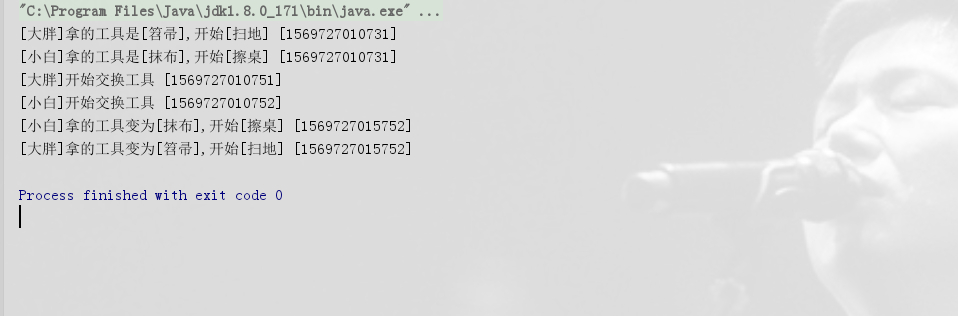
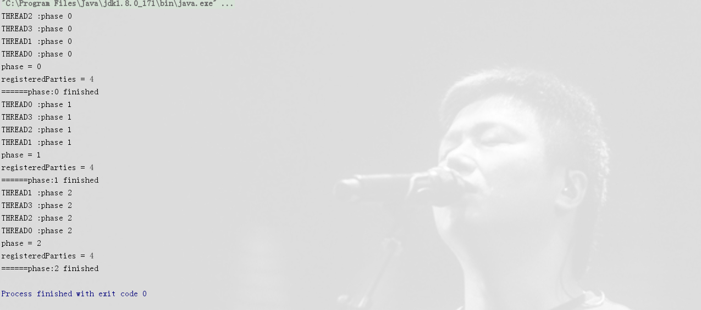
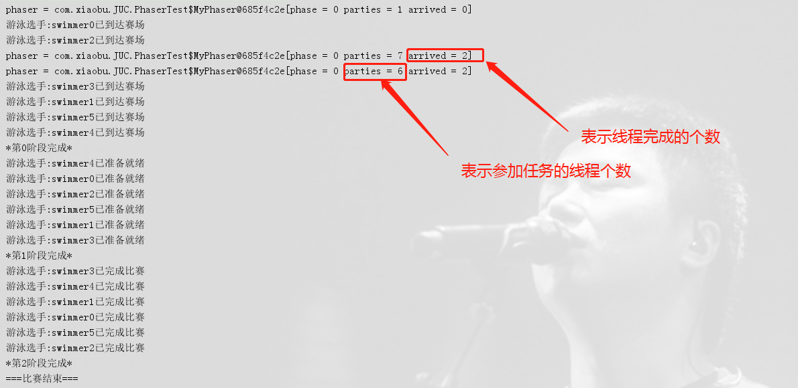

# Java并发| Exchanger和Phaser

> 原创 最新推荐文章于 2026-01-11 14:10:56 发布 · 公开 · 345 阅读 · 0 · 0 · 本内容遵循CC 4.0 BY-SA版权协议 版权声明：本文为博主原创文章，遵循 CC 4.0 BY-SA 版权协议，转载请附上原文出处链接和本声明。 · 编辑
> 文章链接：https://blog.csdn.net/tanhongwei1994/article/details/102564485

#### Exchanger

```java
package com.xiaobu.JUC;

import java.util.concurrent.Exchanger;
import java.util.concurrent.TimeUnit;

/**
 * @author xiaobu
 * @version JDK1.8.0_171
 * @date on  2019/9/27 16:58
 * @description  两个线程在预设点交换变量，先到达的等待对方。
 */
public class ExchangeDemo {

    static Exchanger<Tool> ex = new Exchanger<>();

    static class Staff implements Runnable {
        private Tool tool;
        private Exchanger<Tool> ex;
        private String name;

        public Staff(String name,Tool tool,Exchanger<Tool> ex){
            this.name=name;
            this.tool = tool;
            this.ex = ex;
        }

        @Override
        public void run() {
            System.out.printf ("[%s]拿的工具是[%s],开始[%s] [%s] \n", name, tool.name, tool.work,System.currentTimeMillis());
            System.out.printf ("[%s]开始交换工具 [%s]\n", name,System.currentTimeMillis());
            try {
                TimeUnit.SECONDS.sleep(5);
                ex.exchange(tool);
            } catch (InterruptedException e) {
                e.printStackTrace();

            }
            System.out.printf ("[%s]拿的工具变为[%s],开始[%s] [%s]\n", name, tool.name, tool.work,System.currentTimeMillis());

        }
    }

    static class Tool{
        String name;
        String work;

        public Tool(String name,String work){
            this.name = name;
            this.work = work;
        }
    }

    public static void main(String[] args) {
        new Thread(new Staff("大胖", new Tool("笤帚", "扫地"), ex)).start();
        new Thread(new Staff("小白", new Tool("抹布", "擦桌"), ex)).start();
    }

}

```

 

#### Phaser

> Phaser可以把一组线程的执行分为多个阶段(phase),并在每个阶段实现线程同步,而且每个阶段可以减少或者增加线程.概言之,一个phaser可以包含一个或者多个phase.

- arrive(): 通知phaser该线程已到达,并且不需等待其它线程,直接进入下一个执行阶段(phase)

- arriveAndAwaitAdvance(): 通知phaser该线程已到达,并且等待其它线程.如果当前线程是该阶段最后一个到达的，则当前线程会执行onAdvance()方法，并唤醒其它线程进入下一个阶段。

- arriveAndDeregister():动态撤销线程在phaser的注册，通知phaser对象，该线程已经结束该阶段且不参与后面阶段。

- awaitAdvance(int phase): 阻塞线程,直到phaser的phase计数从参数中的phase变化成为另一个值.比如awaitAdvance(2),会导致线程阻塞,直到phaser的phase计数变为3以后才会继续执行.

- awaitAdvanceInterruptibly(int phase)

- onAdvance(int phase, int registeredParties).参数phase是阶段数.每经过一个阶段该数加1，registeredParties是当前参与的线程数。

- register(): phaser的线程计数加1.如果调用该方法时，onAdvance()方法正在执行，则该方法等待其执行完毕。

```java
package com.xiaobu.JUC;

import java.util.concurrent.Phaser;

/**
 * @author xiaobu
 * @version JDK1.8.0_171
 * @date on  2019/10/12 16:44
 * @description 方法arriveAndAwaitAdvance()的作用与CountDownLatch类中的await()方法大体一样，通过从方法的名称解释来看，arrive是到达的意思，wait是等待的意思，而advance是前进、促进的意思，所以执行这个方法的作用就是当前线程已经到达屏障，在此等待一段时间，等条件满足后继续向下一个屏障继续执行。
 */
public class PhaserDemo {

    private static final int PARTIES = 3;
    private static final int PHASES = 4;

    public static void main(String[] args) {
        Phaser phaser = new Phaser(PHASES){
            @Override
            protected boolean onAdvance(int phase, int registeredParties) {
                System.out.println("phase = " + phase);
                System.out.println("registeredParties = " + registeredParties);
                System.out.println("======phase:"+phase+" finished");
                return super.onAdvance(phase, registeredParties);
            }
        };

        //4个线程，三个阶段
        for (int i = 0; i <PHASES ; i++) {
            new Thread(() -> {
                for (int j = 0; j <PARTIES ; j++) {
                    System.out.println(String.format("%S :phase %d",Thread.currentThread().getName(),j));
                    phaser.arriveAndAwaitAdvance();
                }
            },"Thread"+i).start();

        }
    }


}
```

 

```java
package com.xiaobu.JUC;

import java.util.concurrent.Phaser;

/**
 * @author xiaobu
 * @version JDK1.8.0_171
 * @date on  2019/10/12 16:44
 * @description
 */
public class PhaserTest {

  static class MyPhaser extends Phaser {

      //定义结束阶段.这里是完成3个阶段以后结束

      private int phaseToTerminate = 2;
      @Override
      protected boolean onAdvance(int phase, int registeredParties) {
          System.out.println("*第"+phase+"阶段完成*");
         // return super.onAdvance(phase, registeredParties);
          return phase==phaseToTerminate || registeredParties==0;
      }
  }


  static class Swimmer implements Runnable{
      private Phaser phaser;

      public Swimmer(Phaser phaser){
          this.phaser = phaser;
      }

      @Override
      public void run() {
          System.out.println("游泳选手:"+Thread.currentThread().getName() + "已到达赛场");
          System.out.println("phaser = " + phaser);
          phaser.arriveAndAwaitAdvance();
          System.out.println("游泳选手:"+Thread.currentThread().getName()+"已准备就绪");
          System.out.println("phaser = " + phaser);
          phaser.arriveAndAwaitAdvance();
          System.out.println("游泳选手:"+Thread.currentThread().getName() + "已完成比赛");
          phaser.arriveAndAwaitAdvance();
      }
  }


    public static void main(String[] args) {
        int swimmerNum=6;
        MyPhaser phaser = new MyPhaser();
        //注册主线程,用于控制phaser何时开始第二阶段
        phaser.register();
        System.out.println("phaser = " + phaser);
        for (int i = 0; i <swimmerNum ; i++) {
            phaser.register();
            new Thread(new Swimmer(phaser),"swimmer"+i).start();

        }
       System.out.println("phaser = " + phaser);
        //主线程到达第一阶段并且不参与后续阶段.其它线程从此时可以进入后面的阶段.
        phaser.arriveAndDeregister();
        System.out.println("phaser = " + phaser);
        //只要phaser不终结，主线程就循环等待
        while (!phaser.isTerminated()) {
        }

        System.out.println("===比赛结束===");
    }
}
```

 

```java
package com.xiaobu.JUC;

import com.xiaobu.base.util.DateTimeUtils;

import java.util.concurrent.Phaser;
import java.util.concurrent.TimeUnit;

/**
 * @author xiaobu
 * @version JDK1.8.0_171
 * @date on  2019/10/12 16:44
 * @description  在Phaser内有2个重要状态，分别是phase和party。
 *    phase就是阶段，初值为0，当所有的线程执行完本轮任务，同时开始下一轮任务时，
 *    意味着当前阶段已结束，进入到下一阶段，phase的值自动加1。party就是线程，
 *    party=4就意味着Phaser对象当前管理着4个线程。Phaser还有一个重要的方法经常需要被重载，
 *    那就是boolean onAdvance(int phase, int registeredParties)方法。此方法有2个作用：
 *    1、当每一个阶段执行完毕，此方法会被自动调用，因此，重载此方法写入的代码会在每个阶段执行完毕时执行，
 *   相当于CyclicBarrier的barrierAction。
 *    2、当此方法返回true时，意味着Phaser被终止，因此可以巧妙的设置此方法的返回值来终止所有线程。
 *
 */
public class StudentPhaser {

    static class MyPhaser extends Phaser {
        @Override
        protected boolean onAdvance(int phase, int registeredParties) {
            switch (phase) {
                case 0:
                    return studentArrived();
                case 1:
                    return finishFirstExercise();
                case 2:
                    return finishSecondExercise();
                case 3:
                    return finishExam();
                default:
                    return true;
            }
        }

        private boolean studentArrived() {
            System.out.println("学生准备好了,学生人数：" + getRegisteredParties());
            return false;
        }


        private boolean finishFirstExercise() {
            System.out.println("第一题所有学生做完");
            return false;
        }

        private boolean finishSecondExercise() {
            System.out.println("第二题所有学生做完");
            return false;
        }

        private boolean finishExam() {
            System.out.println("第三题所有学生做完，结束考试");
            return true;
        }
    }


    static class StudentTask implements Runnable {

        private Phaser phaser;

        public StudentTask(Phaser phaser){
            this.phaser = phaser;
        }

        @Override
        public void run() {
            System.out.println(Thread.currentThread().getName() +"于"+ DateTimeUtils.getCurrentLongDateTimeStr()+"到达考试现场...");
            phaser.arriveAndAwaitAdvance();
            System.out.println(Thread.currentThread().getName()+"于"+ DateTimeUtils.getCurrentLongDateTimeStr()+"开始做第一题...");
            doExercise();
            System.out.println(Thread.currentThread().getName()+"于"+ DateTimeUtils.getCurrentLongDateTimeStr()+"做第一题完成...");
            phaser.arriveAndAwaitAdvance();
            System.out.println(Thread.currentThread().getName()+"于"+ DateTimeUtils.getCurrentLongDateTimeStr()+"开始做第二题...");
            doExercise();
            System.out.println(Thread.currentThread().getName()+"于"+ DateTimeUtils.getCurrentLongDateTimeStr()+"做第二题完成...");
            phaser.arriveAndAwaitAdvance();
            System.out.println(Thread.currentThread().getName()+"于"+ DateTimeUtils.getCurrentLongDateTimeStr()+"开始做第三题...");
            doExercise();
            System.out.println(Thread.currentThread().getName()+"于"+ DateTimeUtils.getCurrentLongDateTimeStr()+"做第三题完成...");
            phaser.arriveAndAwaitAdvance();

        }


        public static void doExercise(){
            long time = (long) (Math.random() * 10);
            try {
                TimeUnit.SECONDS.sleep(time);
            } catch (InterruptedException e) {
                e.printStackTrace();
            }

        }
    }


    public static void main(String[] args) {
        MyPhaser phaser = new MyPhaser();
        for (int i = 0; i < 5; i++) {
            phaser.register();
            new Thread(new StudentTask(phaser), "studentTask" + i).start();

        }
        //为了防止其它线程没结束就打印了"结束”
        while (!phaser.isTerminated()) {
        }
        System.out.println("Phaser"+"于"+ DateTimeUtils.getCurrentLongDateTimeStr()+" has finished:"+phaser.isTerminated());
    }
}


```

结果:

```java
studentTask1于2019-10-15 11:47:33 313到达考试现场...
studentTask0于2019-10-15 11:47:33 316到达考试现场...
studentTask4于2019-10-15 11:47:33 316到达考试现场...
studentTask2于2019-10-15 11:47:33 316到达考试现场...
studentTask3于2019-10-15 11:47:33 316到达考试现场...
学生准备好了,学生人数：5
studentTask4于2019-10-15 11:47:33 339开始做第一题...
studentTask3于2019-10-15 11:47:33 339开始做第一题...
studentTask0于2019-10-15 11:47:33 340开始做第一题...
studentTask2于2019-10-15 11:47:33 342开始做第一题...
studentTask1于2019-10-15 11:47:33 342开始做第一题...
studentTask1于2019-10-15 11:47:34 341做第一题完成...
studentTask3于2019-10-15 11:47:34 344做第一题完成...
studentTask0于2019-10-15 11:47:39 338做第一题完成...
studentTask4于2019-10-15 11:47:39 338做第一题完成...
studentTask2于2019-10-15 11:47:41 340做第一题完成...
第一题所有学生做完
studentTask0于2019-10-15 11:47:41 340开始做第二题...
studentTask3于2019-10-15 11:47:41 340开始做第二题...
studentTask2于2019-10-15 11:47:41 340开始做第二题...
studentTask4于2019-10-15 11:47:41 340开始做第二题...
studentTask1于2019-10-15 11:47:41 340开始做第二题...
studentTask2于2019-10-15 11:47:43 340做第二题完成...
studentTask1于2019-10-15 11:47:44 339做第二题完成...
studentTask3于2019-10-15 11:47:47 339做第二题完成...
studentTask4于2019-10-15 11:47:49 338做第二题完成...
studentTask0于2019-10-15 11:47:50 338做第二题完成...
第二题所有学生做完
studentTask2于2019-10-15 11:47:50 338开始做第三题...
studentTask3于2019-10-15 11:47:50 338开始做第三题...
studentTask4于2019-10-15 11:47:50 338开始做第三题...
studentTask0于2019-10-15 11:47:50 338开始做第三题...
studentTask1于2019-10-15 11:47:50 338开始做第三题...
studentTask1于2019-10-15 11:47:51 338做第三题完成...
studentTask0于2019-10-15 11:47:53 338做第三题完成...
studentTask2于2019-10-15 11:47:54 337做第三题完成...
studentTask4于2019-10-15 11:47:56 337做第三题完成...
studentTask3于2019-10-15 11:47:56 337做第三题完成...
第三题所有学生做完，结束考试
Phaser于2019-10-15 11:47:56 337 has finished:true
```

参考: [Java JUC系列：Phaser类的使用](http://www.itsoku.com/article/149) 