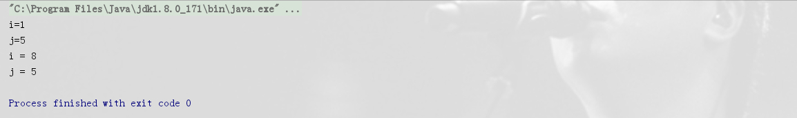
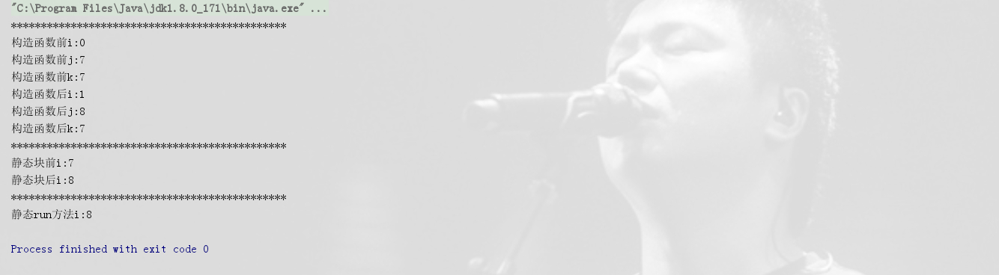
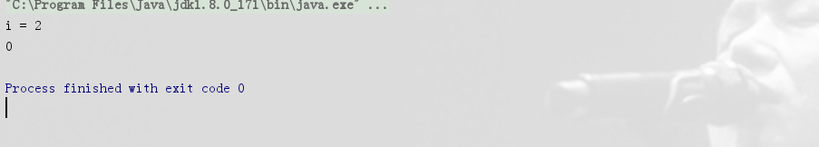

# 类的加载过程

> 原创 于 2019-07-11 16:17:28 发布 · 公开 · 214 阅读 · 0 · 0 · 本内容遵循CC 4.0 BY-SA版权协议 版权声明：本文为博主原创文章，遵循 CC 4.0 BY-SA 版权协议，转载请附上原文出处链接和本声明。 · 编辑
> 文章链接：https://blog.csdn.net/tanhongwei1994/article/details/95488440

类加载过程

- 加载

- 验证

- 准备

> 准备阶段是正式为类变量分配内存并设置类变量初始值的阶段，这些内存都将在方法区中分配。类变量赋初始值（初始化阶段复制value值）,常量直接赋value值。

- 解析

> 解析阶段是虚拟机将常量池内的符号引用替换为直接引用的过程，也就是得到类或者字段、方法在内存中的指针或者偏移量。

- 初始化

> 真正执行类中定义的 Java 程序代码(字节码)，初始化阶段是执行类构造器 ()方法的过程。

我们在定义（声明）实例变量的同时，还可以直接对实例变量进行赋值或者使用实例代码块对其进行赋值。
如果我们以这两种方式为实例变量进行初始化，那么它们将在构造函数执行之前完成这些初始化操作。实际上，
如果我们对实例变量直接赋值或者使用实例代码块赋值，那么编译器会将其中的代码放到类的构造函数中去，
并且这些代码会被放在对超类构造函数的调用语句之后(还记得吗？Java要求构造函数的第一条语句必须是超类构造函数的调用语句)，构造函数本身的代码之前。
示例:

```java
package com.xiaobu.test.JVM.classLoad;

/**
 * @author xiaobu
 * @version JDK1.8.0_171
 * @date on  2019/7/11 14:18
 * @description 实例变量初始化与实例代码块初始化先超类构造方法 再实例变量赋值、实例代码块赋值然后在自身的构造方法
 */
public class ClassLoadDemo {
    private int i = 1;

    private int j = i + 1;

    public ClassLoadDemo(int var){
        System.out.println("i="+i);
        System.out.println("j="+j);
        this.i = var;
        System.out.println("i = " + i);
        System.out.println("j = " + j);
    }

    {
        j += 3;
    }

    public static void main(String[] args) {
        new ClassLoadDemo(8);
    }
}


```

 

```java
package com.xiaobu.test.JVM.classLoad;

/**
 * @author xiaobu
 * @version JDK1.8.0_171
 * @date on  2019/7/11 14:18
 * @description
 */
public class ClassLoad {
    private static ClassLoad classLoad = new ClassLoad();
    //准备阶段直接把初始值0赋值给k
    private static int i = 7;
    //实例变量会在对象实例化时随着对象一块分配在 Java 堆中。
    private int j = 7;
    //准备阶段直接把7赋值给k 因为有final的缘故
    private static final int k = 7;

    //说明构造方法在准备阶段的后面 初始化的前面
    private ClassLoad() {
        System.out.println("**********************************************");
        System.out.println("构造函数前i:" + i);
        System.out.println("构造函数前j:" + j);
        System.out.println("构造函数前k:" + k);
        i++;
        j++;
        System.out.println("构造函数后i:" + i);
        System.out.println("构造函数后j:" + j);
        System.out.println("构造函数后k:" + k);
    }

    //说明静态方法块初始化的后面
    static {
        System.out.println("**********************************************");
        System.out.println("静态块前i:" + i);
        i++;
        System.out.println("静态块后i:" + i);
    }


    public static void run() {
        System.out.println("**********************************************");
        System.out.println("静态run方法i:" + i);
    }


    public static void main(String[] args) {
        ClassLoad.run();
    }

}


```

 

```java
package com.xiaobu.test.JVM.classLoad;

/**
 * @author xiaobu
 * @version JDK1.8.0_171
 * @date on  2019/10/23 14:56
 * @description
 */
public class ClassLoadDemo2  {

    private int j = getI();
    private int i = 1;

    public ClassLoadDemo2() {
        super();
        i = 2;
        System.out.println("i = " + i);
    }

    private int getI() {
        return i;
    }

    public static void main(String[] args) {
        //执行发生在实例变量i初始化之前和构造函数调用之前。
        ClassLoadDemo2 ii = new ClassLoadDemo2();
        System.out.println(ii.j);
    }
}
```

 

参考:
[类的初始化与实例化](https://blog.csdn.net/justloveyou_/article/details/72466416) 