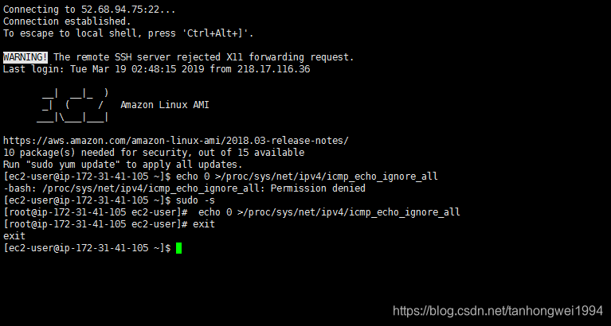

# AWS EC2如何从普通用户切换为root用户

> 原创 于 2019-03-19 11:02:25 发布 · 公开 · 3.3k 阅读 · 1 · 3 · 本内容遵循CC 4.0 BY-SA版权协议 版权声明：本文为博主原创文章，遵循 CC 4.0 BY-SA 版权协议，转载请附上原文出处链接和本声明。 · 编辑
> 文章链接：https://blog.csdn.net/tanhongwei1994/article/details/88657452

一、ec2_user转为root用户

```java
sudo -s 
 
```

二、root转为ec2_user

```java
exit
```


 

