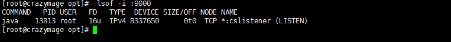
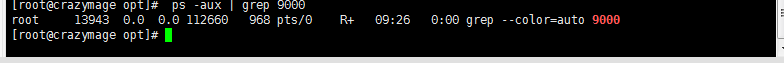
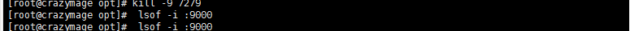
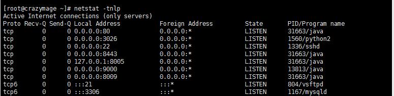

# Linux 查看端口占用并杀掉

> 原创 于 2018-12-27 15:19:14 发布 · 公开 · 3.5k 阅读 · 0 · 1 · 本内容遵循CC 4.0 BY-SA版权协议 版权声明：本文为博主原创文章，遵循 CC 4.0 BY-SA 版权协议，转载请附上原文出处链接和本声明。 · 编辑
> 文章链接：https://blog.csdn.net/tanhongwei1994/article/details/85272402

一、查看端口具体被那个进程占用。

```java
lsof -i :9000
```


 

二、查看详细信息：

```perl
 ps -aux | grep 9000
```


 

三、杀掉某个进程

kill -9 [PID]


```java
 kill -9 9000
```


 

四、显示正在监听使用的端口程序

```java
netstat -tnlp
```


 

五、