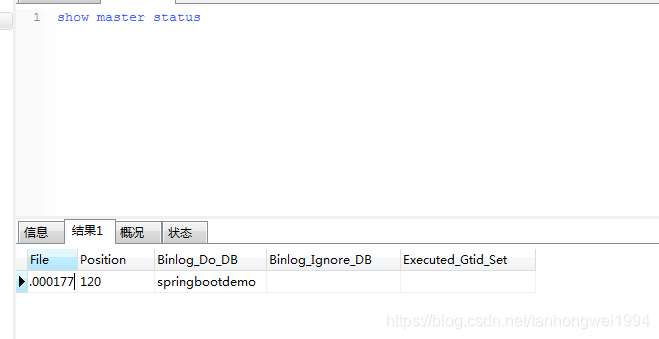
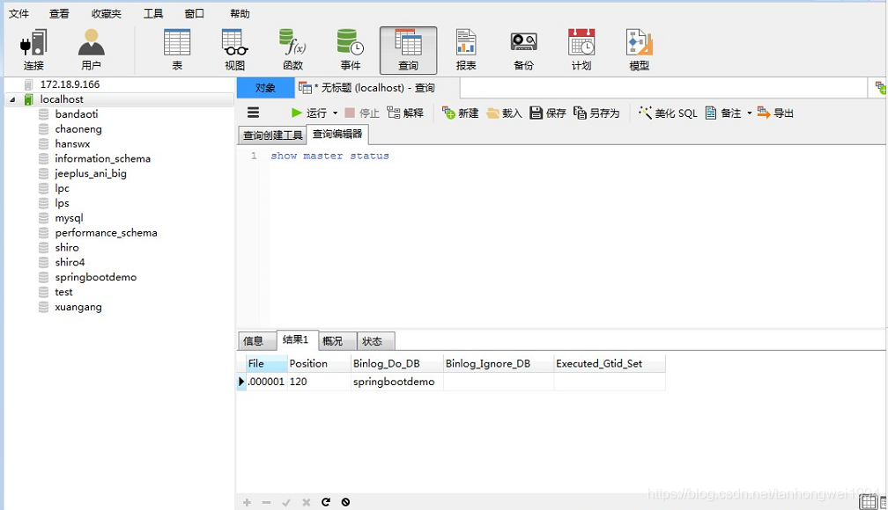
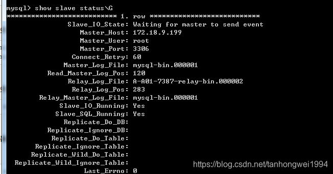
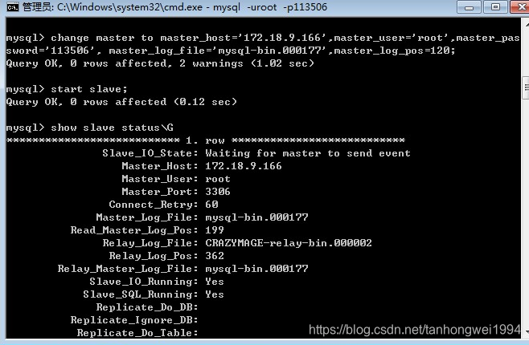
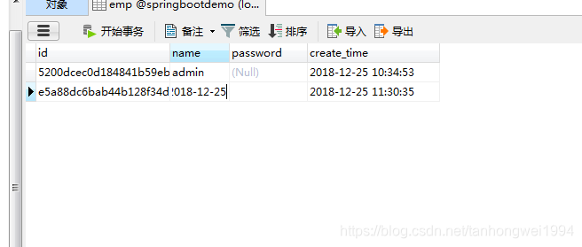

# windows下mysql 主主同步

> 原创 最新推荐文章于 2026-05-19 10:38:12 发布 · 公开 · 1.2k 阅读 · 0 · 2 · 本内容遵循CC 4.0 BY-SA版权协议 版权声明：本文为博主原创文章，遵循 CC 4.0 BY-SA 版权协议，转载请附上原文出处链接和本声明。 · 编辑
> 文章链接：https://blog.csdn.net/tanhongwei1994/article/details/85236878

一、登录mysql，分别给两个服务器的用户赋予权限（两个互为主从数据库）

1.1、从数据库

```java
grant replication slave on *.* to 'root'@'172.18.9.166' identified by '113506';	
flush privileges;
```

1.2、主数据库

```java
grant replication slave on *.* to 'root'@'172.18.9.199' identified by '113506';	
flush privileges;
```

二、【主数据库下操作】

1.1 配置ini文件

```java
[mysql]
# 设置mysql客户端默认字符集
#default-character-set=utf8 
default-character-set=utf8mb4 
[mysqld]
#主主同步配置
#服务器id
server-id=1
#待同步的数据库
binlog_do_db=springbootdemo
#基础配置
max_allowed_packet=500M
wait_timeout=288000
interactive_timeout = 288000
log_bin=mysql-bin
#设置3306端口
port=3306 
# 设置mysql的安装目录
basedir=D:\mysql-5.6.26-winx64
# 设置mysql数据库的数据的存放目录
datadir=D:\mysql-5.6.26-winx64\data
# 允许最大连接数
max_connections=500
# 服务端使用的字符集默认为8比特编码的latin1字符集
#character-set-server=utf8
character-set-server=utf8mb4
# 创建新表时将使用的默认存储引擎
default-storage-engine=INNODB
[client]
port=3306
default-character-set=utf8
#default-character-set=utf8mb4
```

1.2、测试连接从数据库（如果出现"Welcome to the MySQL monitor. "等字样，则表示能登录成功）：

```java
mysql -u root -p  -h 172.18.9.166
```

1.3、重启mysql服务，把File 和 Position 的值记录下来；

```java
show master status;    
```

 

二、【从数据库上操作】

2.1、配置ini文件

```java
[mysql]
# 设置mysql客户端默认字符集
default-character-set=utf8 
[mysqld]
#数据库同步
#服务器id
server-id=2
#待同步的数据库
binlog_do_db=springbootdemo
#基础配置
max_allowed_packet=500M
wait_timeout=288000
interactive_timeout = 288000
log_bin=mysql-bin
#设置3306端口
port=3306 
# 设置mysql的安装目录
basedir=E:\mysql-5.6.24-win32
# 设置mysql数据库的数据的存放目录
datadir=E:\mysql-5.6.24-win32\data
# 允许最大连接数
max_connections=500
# 服务端使用的字符集默认为8比特编码的latin1字符集
character-set-server=utf8
# 创建新表时将使用的默认存储引擎
default-storage-engine=INNODB 
[client]
port=3306
default-character-set=utf8
```


2.2、测试连接主数据库（如果出现"Welcome to the MySQL monitor. "等字样，则表示能登录成功）：

```java
mysql -u root -p 113506 -h 172.18.9.166
```

2.3、重启mysql服务，把File 和 Position 的值记录下来；


 

三、修改对主从数据库的连接的参数

3.1、主数据库配置

```java
change master to master_host='172.18.9.199',master_user='root',master_password='113506', master_log_file='mysql-bin.000001',master_log_pos=120;


start slave;
```


3.2、从数据库配置

```java
change master to master_host='172.18.9.166',master_user='root',master_password='113506', master_log_file='mysql-bin.000177',master_log_pos=120;


start slave;
```

3.3、查看状态：

 

 

四、运行程序测试。

4.1、主服务器运行代码

```java
   @Test
    public void insert(){
       Emp emp = new Emp();
       emp.setId(UUIDUtils.getUUID());
       emp.setName("admin");
       //emp.setPassword("1");
       emp.setCreateTime(LocalDateTime.now());
       empMapper.insert(emp);
       System.out.println("emp = " + emp);
   }
```

结果：两个数据库都增加了

 

4.2、从服务器运行代码：

```java
  @Test
    public void insertSelective(){
        Emp emp = new Emp();
        emp.setId(UUIDUtils.getUUID());
        emp.setName("admin2018-12-25");
        emp.setCreateTime(LocalDateTime.now());
        empMapper.insertSelective(emp);
        System.out.println("emp = " + emp);
    }
```

运行结果：

 

OK！

---

取消同步：

```java
stop slave;
reset slave;
```


主从同步的话，不需要相互配置主从关系。只需配置一端为主一端为从。主数据库写数据，从数据库可以同步。但是从数据库写数据，主数据库不能同步数据。