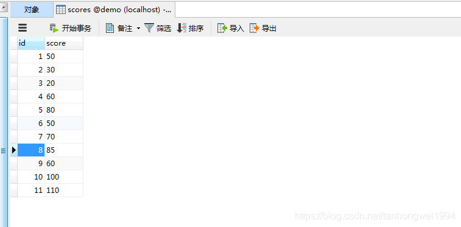
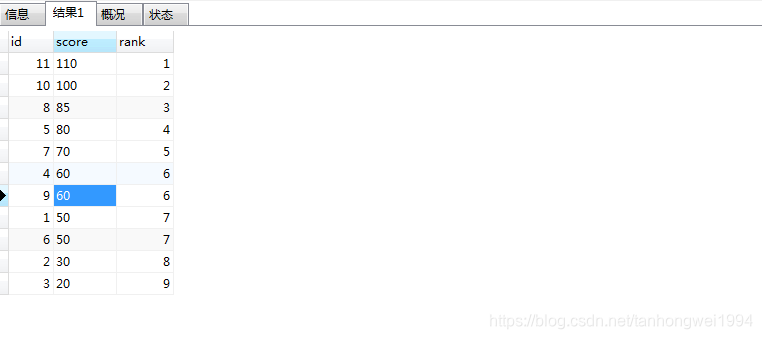
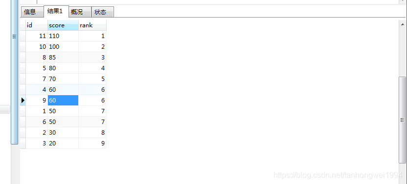
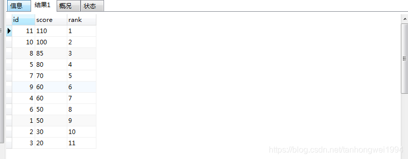

# mysql排行榜并列与不并列

> 原创 最新推荐文章于 2024-08-28 13:26:46 发布 · 公开 · 616 阅读 · 0 · 1 · 本内容遵循CC 4.0 BY-SA版权协议 版权声明：本文为博主原创文章，遵循 CC 4.0 BY-SA 版权协议，转载请附上原文出处链接和本声明。 · 编辑
> 文章链接：https://blog.csdn.net/tanhongwei1994/article/details/88820124

分数表：

 

一、普通并列排行

```sql
SELECT
	*, (
		SELECT
			count(DISTINCT score)
		FROM
			scores AS b
		WHERE
			a.score < b.score
	) + 1 AS rank
FROM
	scores AS a
ORDER BY
	`rank`
```


 

mysql 5.7


```sql
SELECT
	Score,
	dense_rank () over (ORDER BY Score DESC) 'Rank'
FROM
	score;
```

二、高级并列排行

```sql
SELECT
	id,
	score,
	rank
FROM
	(
		SELECT
			id,
			score,
			@curRank :=
		IF (
			@prevRank = score,
			@curRank,
			@incRank
		) AS rank,
		@incRank := @incRank + 1,
		@prevRank := score
	FROM
		scores p,
		(
			SELECT
				@curRank := 0,
				@prevRank := NULL,
				@incRank := 1
		) r
	ORDER BY
		score
	) s
```


 

三、不并列排行

```sql
SELECT
	id,
	score ,@rank := @rank + 1 AS rank
FROM
	(
		SELECT
			*
		FROM
			scores
		ORDER BY
			score DESC
	) AS obj,
	(SELECT @rank := 0) r
```


 

