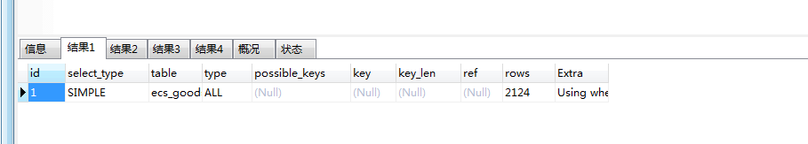
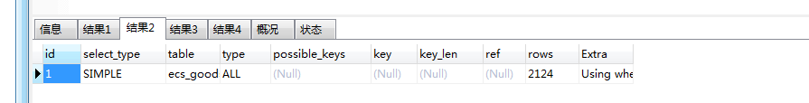
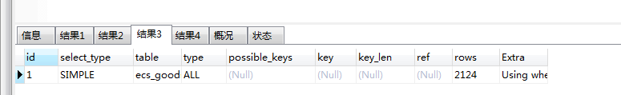
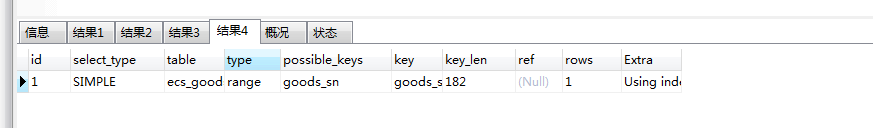

# 记录一下Mysql模糊查询

> 原创 最新推荐文章于 2024-03-19 10:17:36 发布 · 公开 · 250 阅读 · 0 · 1 · 本内容遵循CC 4.0 BY-SA版权协议 版权声明：本文为博主原创文章，遵循 CC 4.0 BY-SA 版权协议，转载请附上原文出处链接和本声明。 · 编辑
> 文章链接：https://blog.csdn.net/tanhongwei1994/article/details/89497901

一、使用LOCATE查询

```sql
EXPLAIN SELECT * from ecs_goods  WHERE LOCATE('CICI0001',goods_sn)>0;
```

 

二、使用LIKE ‘%CICI0001%’查询

```sql
EXPLAIN SELECT * from ecs_goods  WHERE goods_sn like '%CICI0001%';
```

```sql
EXPLAIN SELECT * from ecs_goods  WHERE goods_sn like CONCAT('%','CICI0001','%') 
```


 

三、使用LIKE ‘%CICI0001’

```sql
EXPLAIN SELECT * from ecs_goods  WHERE goods_sn like '%CICI0001';
```

 

四、使用LIKE 'CICI0001%'查询

```sql
EXPLAIN SELECT * from ecs_goods  WHERE goods_sn like 'CICI0001%';
```

 

---

从上面可以看出只有第四种情况走了索引。