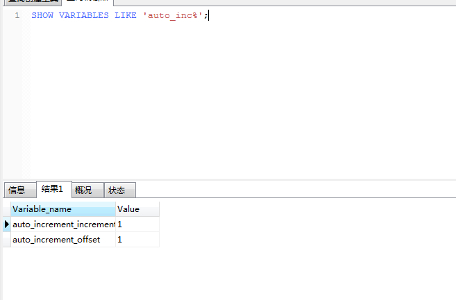
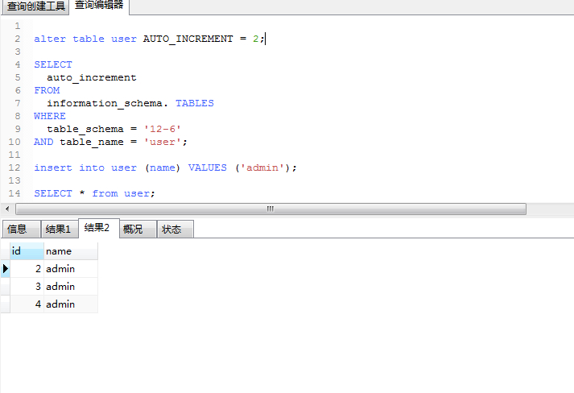

# MYSQL常用语句总结（二）

> 原创 最新推荐文章于 2025-05-09 14:09:23 发布 · 公开 · 188 阅读 · 0 · 0 · 本内容遵循CC 4.0 BY-SA版权协议 版权声明：本文为博主原创文章，遵循 CC 4.0 BY-SA 版权协议，转载请附上原文出处链接和本声明。 · 编辑
> 文章链接：https://blog.csdn.net/tanhongwei1994/article/details/97915879

#索引

### MYSQL常用语句总结（二）

- 添加主键索引

```sql
CREATE UNIQUE INDEX indexName ON mytable(username) ;
```

```sql
ALTER TABLE `table_name` ADD PRIMARY KEY ( `column` ) ;
```

- 添加唯一索引

```sql
CREATE UNIQUE INDEX indexName ON mytable(username) ;
```

```sql
ALTER TABLE `table_name` ADD UNIQUE ( `column` ) ;
```

- 添加普通索引

```sql
alter table `table_name` add index index_name(`column`);
```

```sql
CREATE INDEX indexName ON mytable(username); 
```

- 添加多列索引

```sql
CREATE INDEX orderNum_itemNum_index ON xg_material(orderNumber,itemNumber); 
```

```sql
alter table `table_name` add index index_name(`column1`,`column2`);
```

- 删除索引

```sql
DROP   INDEX   index_name  ON  table_name;
```

- 查看是否锁表

```sql
show OPEN TABLES where In_use > 0;
```

- 显示了有哪些线程在运行(只显示100条，如要全部显示需要执行 show full processlist;只有root账号才会显示所有的，其他账号只会显示自己的)

```sql
show processlist;
```

- 查看正在锁的事务

```sql
SELECT * FROM INFORMATION_SCHEMA.INNODB_LOCKS; 
```

- 查看正在等待锁的事务

```sql
SELECT * FROM INFORMATION_SCHEMA.INNODB_LOCK_WAITS;
```

- 锁住表

```sql
lock table emp write; 
```

- 解锁

```sql
unlock tables; 
```

- 查看当前数据库自增设置

```sql
SHOW VARIABLES LIKE 'auto_inc%';
```

 

- 修改表的自增初始值

```sql
alter table user AUTO_INCREMENT = 2;

```

- 查看某个数据库的某个表的自增初始值

```sql

SELECT
	auto_increment
FROM
	information_schema. TABLES
WHERE
	table_schema = '12-6'
AND table_name = 'user';
```

 

- 设置主键自增，初始值从10开始，每次自增10

```sql
CREATE TABLE mytest13
(
id INT PRIMARY KEY AUTO_INCREMENT,
age VARCHAR(10)
)AUTO_INCREMENT=9;
SET auto_increment_increment=10;
INSERT INTO mytest13(age) VALUES('20');
INSERT INTO mytest13(age) VALUES('15');
INSERT INTO mytest13(age) VALUES('20');
INSERT INTO mytest13(age) VALUES('15');

```

 

- 主键设置为自增的时候才会查询到主键的值，否则为0

```sql
SELECT LAST_INSERT_ID();
```

- 创建新用户并授权

```sql
CREATE USER 'shenmm'@'localhost' IDENTIFIED BY '113081';

GRANT ALL ON lpc.* TO 'shenmm'@'%';

GRANT ALL PRIVILEGES ON lpc.* TO 'shenmm'@'%' IDENTIFIED BY '113081' WITH GRANT OPTION;


grant select on lpc.lpc_data_1k_b_1 to 'hans'@'%' IDENTIFIED BY 'hans2019';
```

参考:
[MySQL show processlist说明](https://www.cnblogs.com/f-ck-need-u/p/7742153.html) 