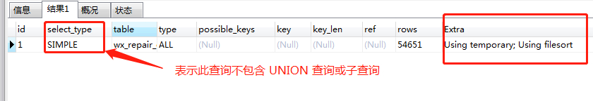
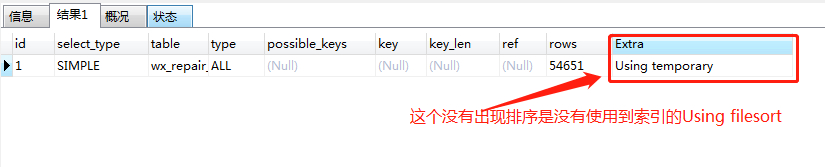
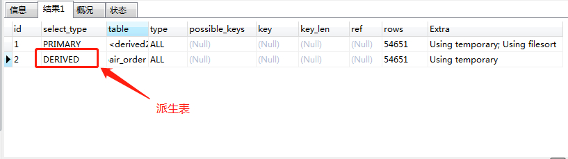

# MYSQL查询优化（一）

> 原创 最新推荐文章于 2023-03-02 21:27:26 发布 · 公开 · 170 阅读 · 0 · 0 · 本内容遵循CC 4.0 BY-SA版权协议 版权声明：本文为博主原创文章，遵循 CC 4.0 BY-SA 版权协议，转载请附上原文出处链接和本声明。 · 编辑
> 文章链接：https://blog.csdn.net/tanhongwei1994/article/details/100160705

### Using filesort

> 排序的时候无法用到索引

```sql
 EXPLAIN SELECT DISTINCT
	hostSn,
	engineer_id,
	COUNT(*) AS count
FROM
	wx_repair_order
GROUP BY
	engineer_id

```

 

### Using temporary

> 使用了临时表：A temporary table is created to hold the result. This typically happens if you are using GROUP BY, DISTINCT or ORDER BY.

```sql
 EXPLAIN SELECT DISTINCT
	hostSn,
	engineer_id,
	COUNT(*) AS count
FROM
	wx_repair_order
GROUP BY
	engineer_id
ORDER BY NULL
```

 

### DERIVED

> 派生表：实际上是一种特殊的subquery，它位于SQL语句中FROM子句里面，可以看做是一个单独的表。

先去重然后统计hostSn出现的次数。

```sql
EXPLAIN SELECT
	hostSn,
	engineer_id,
	COUNT(*) AS count
FROM
	(
		SELECT DISTINCT
			hostSn,
			engineer_id
		FROM
			wx_repair_order
	) a
GROUP BY
	engineer_id
ORDER BY
	count DESC
```

 

参考:
[MySQL show processlist说明](https://www.cnblogs.com/f-ck-need-u/p/7742153.html) 

[Using index, using temporary, using filesort - how to fix this?](https://stackoverflow.com/questions/13633406/using-index-using-temporary-using-filesort-how-to-fix-this) 