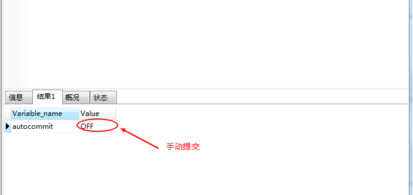
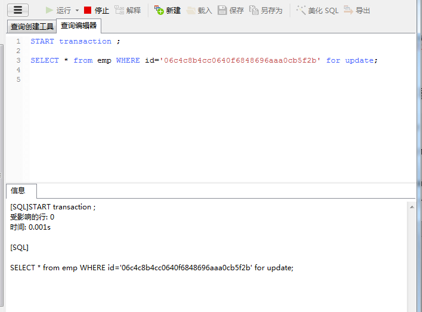
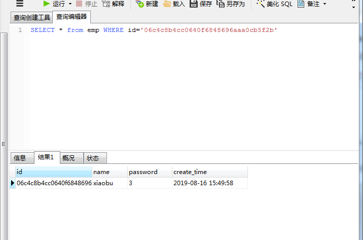
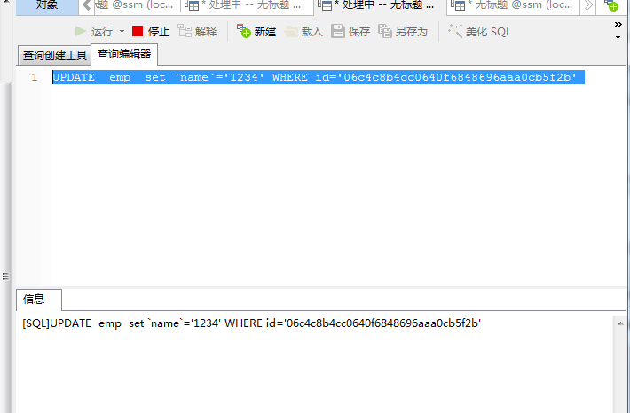

# Mysql手动提交事务

> 原创 最新推荐文章于 2024-12-03 23:32:50 发布 · 公开 · 1.3w 阅读 · 1 · 3 · 本内容遵循CC 4.0 BY-SA版权协议 版权声明：本文为博主原创文章，遵循 CC 4.0 BY-SA 版权协议，转载请附上原文出处链接和本声明。 · 编辑
> 文章链接：https://blog.csdn.net/tanhongwei1994/article/details/101030738

设置事务手动提交

```sql
set @@autocommit=0;
```

查询事务是否为自动提交

```sql

SHOW VARIABLES like '%autocommit%'
```

结果如下:
 

开启事务

```sql
START transaction ;

SELECT * from emp WHERE id='06c4c8b4cc0640f6848696aaa0cb5f2b' for update; 

```

事务一直没有提交,结果如下:

 

执行查询:

```sql
SELECT * from emp WHERE id='06c4c8b4cc0640f6848696aaa0cb5f2b' 
```

可以正常执行,结果如下:

 

执行修改

```sql
UPDATE  emp  set `name`='1234' WHERE id='06c4c8b4cc0640f6848696aaa0cb5f2b' 
```

一直处于等待锁的状态,需要持有锁的先释放掉才能执行修改:
 

提交事务

```sql
COMMIT;
```

手动提交

```sql
 set @@autocommit=0;

SHOW VARIABLES like '%autocommit%';

START transaction ;

SELECT * from emp WHERE id='06c4c8b4cc0640f6848696aaa0cb5f2b' for update; 

COMMIT;
  
```