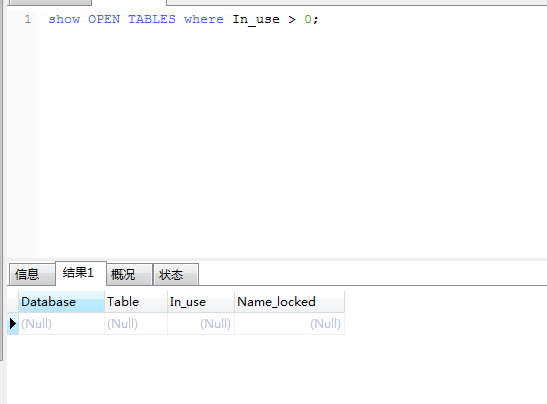
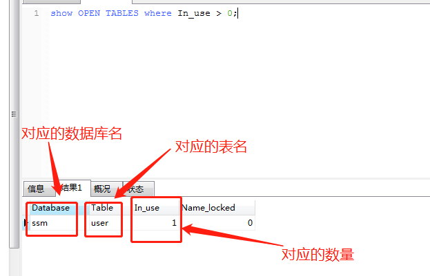
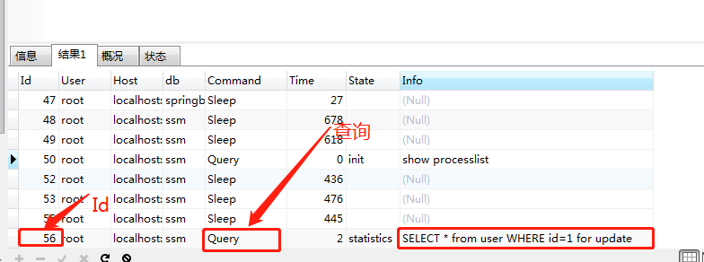
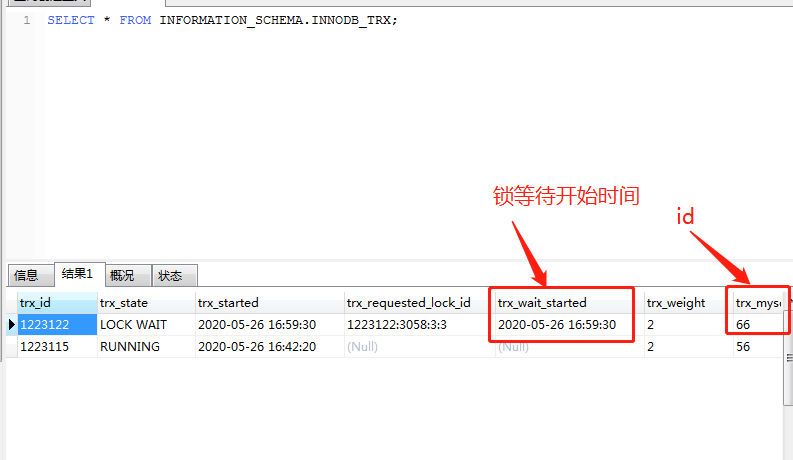
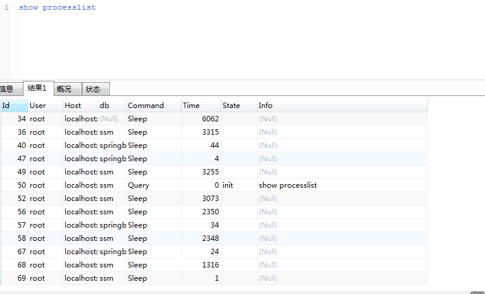

# mysql查看死锁和解锁

> 原创 最新推荐文章于 2024-12-15 16:15:36 发布 · 公开 · 2k 阅读 · 1 · 3 · 本内容遵循CC 4.0 BY-SA版权协议 版权声明：本文为博主原创文章，遵循 CC 4.0 BY-SA 版权协议，转载请附上原文出处链接和本声明。 · 编辑
> 文章链接：https://blog.csdn.net/tanhongwei1994/article/details/106360553

一、查询是否锁表

```sql
show OPEN TABLES where In_use > 0;
```

 

设置手动提交事务

```sql
set @@autocommit=0;

```

用for update锁住一条数据

```sql
START transaction ;

SELECT * from user WHERE id=1 for update; 
```

再执行查询是否锁表命令

```sql
show OPEN TABLES where In_use > 0;
```

可以看到有一个表正在锁定中

 

二、查看进程

```sql
show processlist
```

可以看到有个查询语句正在执行

 

三、查看在锁的事务

```sql
SELECT * FROM INFORMATION_SCHEMA.INNODB_TRX;

```

 

四、杀死进程(实测kill 两次id才能成功杀掉进程 kill一次之后再执行show processlist 出现了新的id)

```sql
kill id
```

 

五、其它查看死锁命令

1. 查看当前的事务

```sql
SELECT * FROM INFORMATION_SCHEMA.INNODB_TRX;
```

1. 查看当前等锁的事务

```sql
SELECT * FROM INFORMATION_SCHEMA.INNODB_LOCK_WAITS;
```