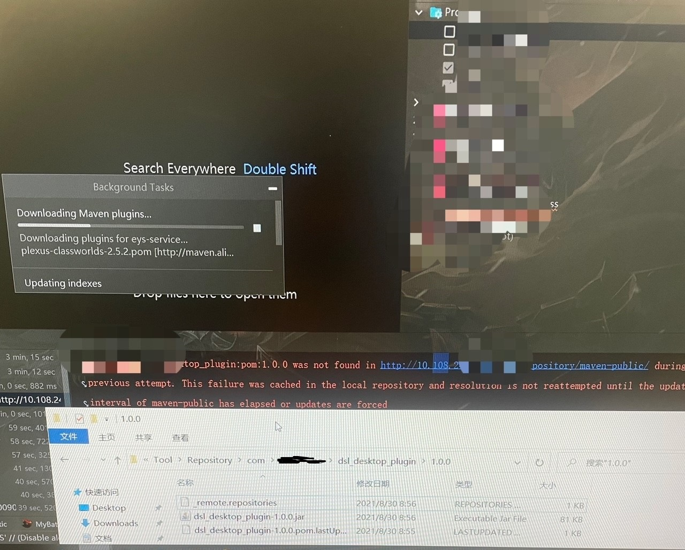
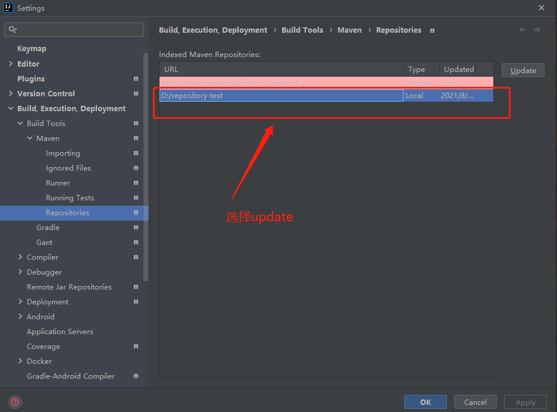
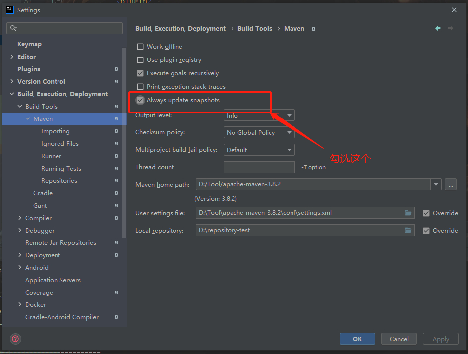
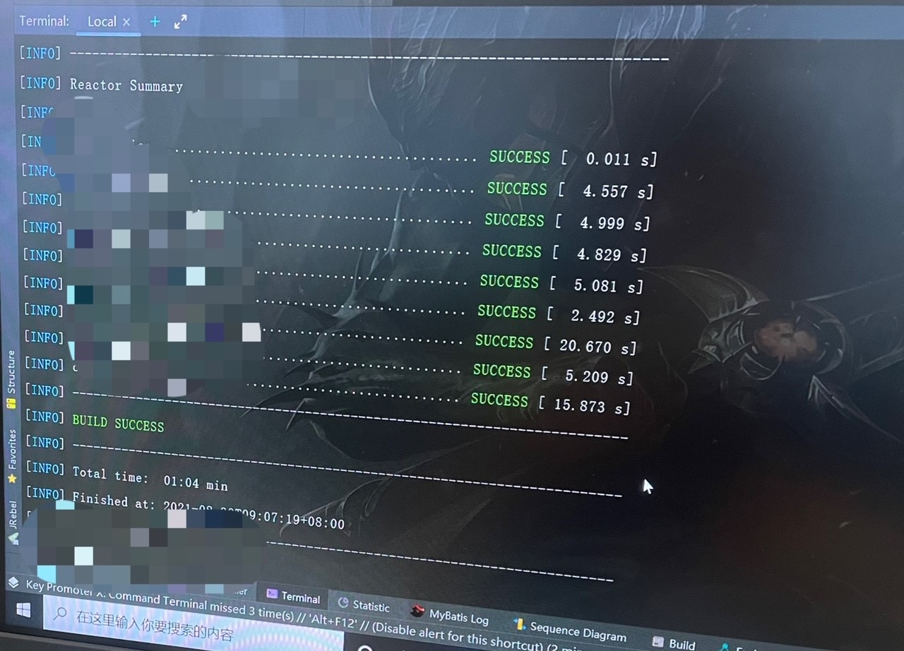
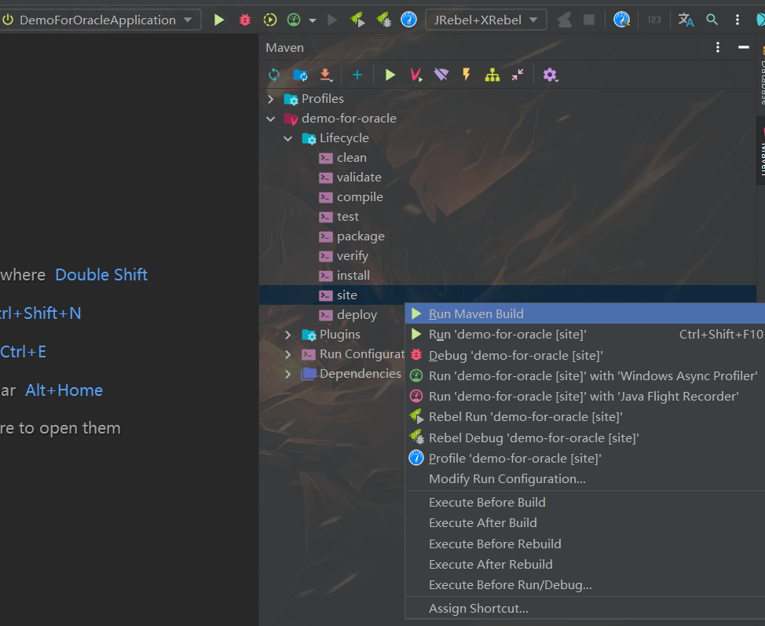
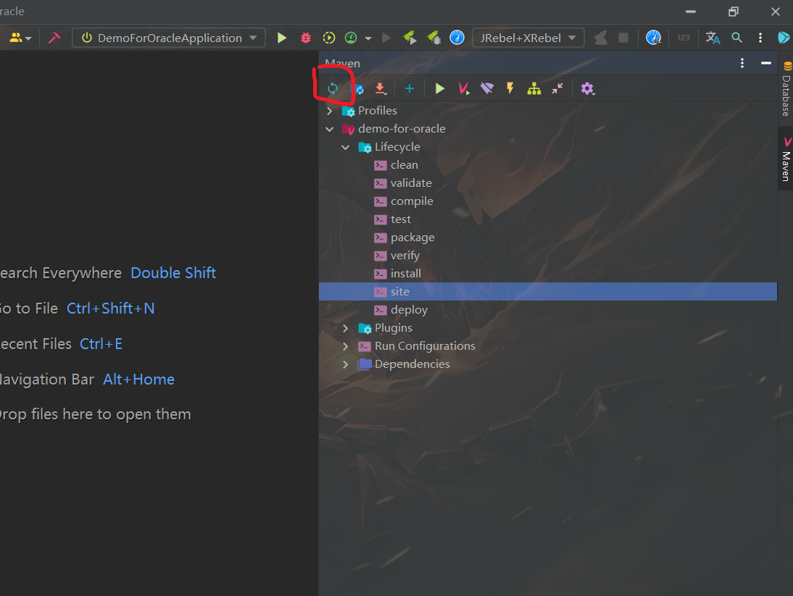

# idea Maven异常：Could not find artifact(本地仓库确实存在)

> 原创 于 2021-08-28 22:28:33 发布 · 公开 · 10w+ 阅读 · 50 · 136 · 本内容遵循CC 4.0 BY-SA版权协议 版权声明：本文为博主原创文章，遵循 CC 4.0 BY-SA 版权协议，转载请附上原文出处链接和本声明。 · 编辑
> 文章链接：https://blog.csdn.net/tanhongwei1994/article/details/119974358

问题 通过IDEA从Git上导出Maven项目后， reload 项目 pom.xml文件产生多处dependency not found错误，同时无法关联相应jar包。(很奇怪Idea 不加载本地仓库，却去阿里云仓库下载)

 

一、项目从本地Maven仓库关联jar包，使用Nexus管理。 选择local repository 然后点击update 点击OK

 

二、pom文件剪切下 重新让Idea读取识别

三、勾选Always update snapshot（更新快照）,项目开始重新加载dependency，错误全部解决。

 

最后操作：pom.xml -> maven ->Generate Source And Update folds

四、上面的方式试过都不行。然后在Terminal 命令下执行了

```cmd
mvn compile
```

显示build成功,猜想是Idea抽风，果不其然过了一会就好了。。。

 

五、在maven lifecycle那选中site 右键Run Maven Build

 

然后Reload All Maven Projects

六、重启Idea

七、重启电脑

 

参考:

[idea Maven异常：Could not find artifact](https://blog.csdn.net/guanshanyue96/article/details/106136764) 

[maven编译或打包时，本地仓库已经存在文件，仍然去远程下载，导致打包失败](https://blog.csdn.net/gbfmachunyan/article/details/97666700) 

[IDEA Maven Plugins 里的插件报错，有红色波浪线](https://blog.csdn.net/qq_35553465/article/details/97652990) 