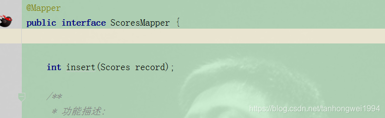
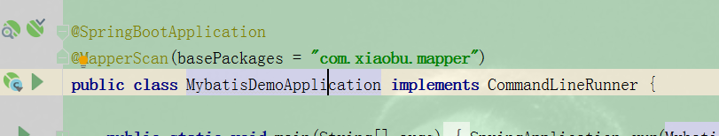

# SpringBoot | Mybatis申明为Mapper文件

> 原创 于 2019-03-26 16:50:26 发布 · 公开 · 300 阅读 · 0 · 0 · 本内容遵循CC 4.0 BY-SA版权协议 版权声明：本文为博主原创文章，遵循 CC 4.0 BY-SA 版权协议，转载请附上原文出处链接和本声明。 · 编辑
> 文章链接：https://blog.csdn.net/tanhongwei1994/article/details/88824008

第一种方式:Mapper文件加@Mapper注解

 

第二种方式：启动类添加@MapperScan

 

