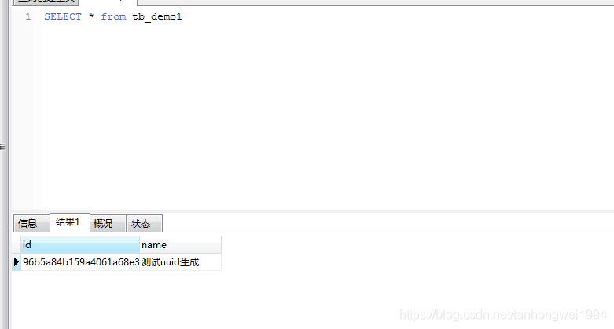

# tk.mybatis实现uuid主键生成

> 原创 于 2019-03-27 17:09:01 发布 · 公开 · 6.9k 阅读 · 3 · 7 · 本内容遵循CC 4.0 BY-SA版权协议 版权声明：本文为博主原创文章，遵循 CC 4.0 BY-SA 版权协议，转载请附上原文出处链接和本声明。 · 编辑
> 文章链接：https://blog.csdn.net/tanhongwei1994/article/details/88849811

#### 一、引入依赖

```java
 <dependency>
            <groupId>tk.mybatis</groupId>
            <artifactId>mapper-spring-boot-starter</artifactId>
            <version>2.0.2</version>
        </dependency>
```

1、创建一个GenId的实现类

```java
package com.xiaobu.base.entity;
 
import tk.mybatis.mapper.genid.GenId;
 
import java.util.UUID;
 
/**
 * @author xiaobu
 * @version JDK1.8.0_171
 * @date on  2019/3/27 11:37
 * @description V1.0
 */
public class UUIdGenId implements GenId<String> {
    @Override
    public String genId(String s, String s1) {
        return UUID.randomUUID().toString().replace("-","");
    }
}
```

2、创建实体类

```java
package com.xiaobu.entity;
 
import com.xiaobu.base.entity.UUIdGenId;
import lombok.Data;
import tk.mybatis.mapper.annotation.KeySql;
 
import javax.persistence.Id;
import java.io.Serializable;
 
/**
 * 功能描述: 测试uuid主键生成
 * @author xiaobu
 * @date 2019/3/27 16:30
 * @version 1.0
 */
@Data
public class TbDemo1 implements Serializable {
    /**
	* 
	*/
    @Id
    @KeySql(genId = UUIdGenId.class)
    private String id;
 
    /**
	* 
	*/
    private String name;
 
    private static final long serialVersionUID = 1L;
}
```


3、mapper类集成通用mapper

```java
package com.xiaobu.mapper;
 
import com.xiaobu.base.mapper.MyMapper;
import com.xiaobu.entity.TbDemo1;
import org.apache.ibatis.annotations.Mapper;
 
/**
 * 功能描述:继承通用mapper
 * @author xiaobu
 * @date 2019/3/27 17:06
 * @version 1.0
 */
@Mapper
public interface TbDemo1Mapper extends MyMapper<TbDemo1> {
 
}
```

4、测试

```java
package com.xiaobu;
 
import com.xiaobu.entity.TbDemo1;
import com.xiaobu.mapper.TbDemo1Mapper;
import org.junit.Test;
import org.junit.runner.RunWith;
import org.springframework.beans.factory.annotation.Autowired;
import org.springframework.boot.test.context.SpringBootTest;
import org.springframework.test.context.junit4.SpringRunner;
 
/**
 * @author xiaobu
 * @version JDK1.8.0_171
 * @date on  2019/3/27 11:11
 * @description V1.0
 */
@RunWith(SpringRunner.class)
@SpringBootTest
public class TbDemo1Test {
 
    @Autowired
    private TbDemo1Mapper tbDemo1Mapper;
 
    @Test
    public void insert(){
        TbDemo1 tbDemo1 = new TbDemo1();
        tbDemo1.setName("测试uuid生成");
        tbDemo1Mapper.insert(tbDemo1);
        System.out.println("新增完成.....");
    }
}
```


 

tk.mapper的insertList不支持，自己写的插入方法也是不支持的。