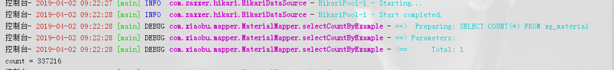
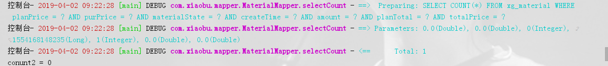
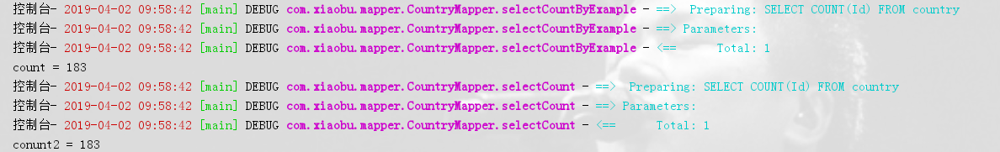

# tk.mybatis的使用记录

> 原创 于 2019-04-02 10:25:20 发布 · 公开 · 2.1k 阅读 · 0 · 0 · 本内容遵循CC 4.0 BY-SA版权协议 版权声明：本文为博主原创文章，遵循 CC 4.0 BY-SA 版权协议，转载请附上原文出处链接和本声明。 · 编辑
> 文章链接：https://blog.csdn.net/tanhongwei1994/article/details/88963420

主键为uuid

一、统计总行数

```java
        //统计总数
        Example example = new Example(Material.class);
        int count = materialMapper.selectCountByExample(example);
        System.out.println("count = " + count);
```


 

---

二、按条件查询

```java
        //按条件查询
        Material material = new Material();
        int conunt2 = materialMapper.selectCount(material);
        System.out.println("conunt2 = " + conunt2);
```

执行的查询如下：

 

可以看出为null的参数是不参与条件筛选的。通过count(*)来查询记录的行数

---

主键为int型自增长

```java
    @Test
    public void  countTotal(){
        //统计总数
        Example example = new Example(Material.class);
        int count = materialMapper.selectCountByExample(example);
        System.out.println("count = " + count);
 
        //按条件查询
        Material material = new Material();
        int conunt2 = materialMapper.selectCount(material);
        System.out.println("conunt2 = " + conunt2);
    }
```


执行的查询如下：

 

可以看出主键为int类型的 ，通过 count(id)来查询记录的行数

---