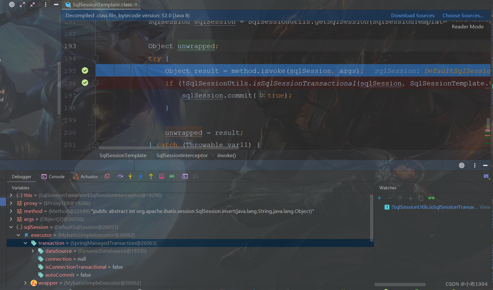
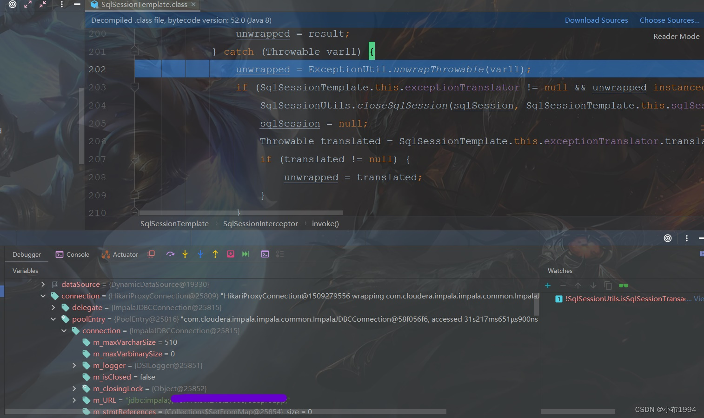
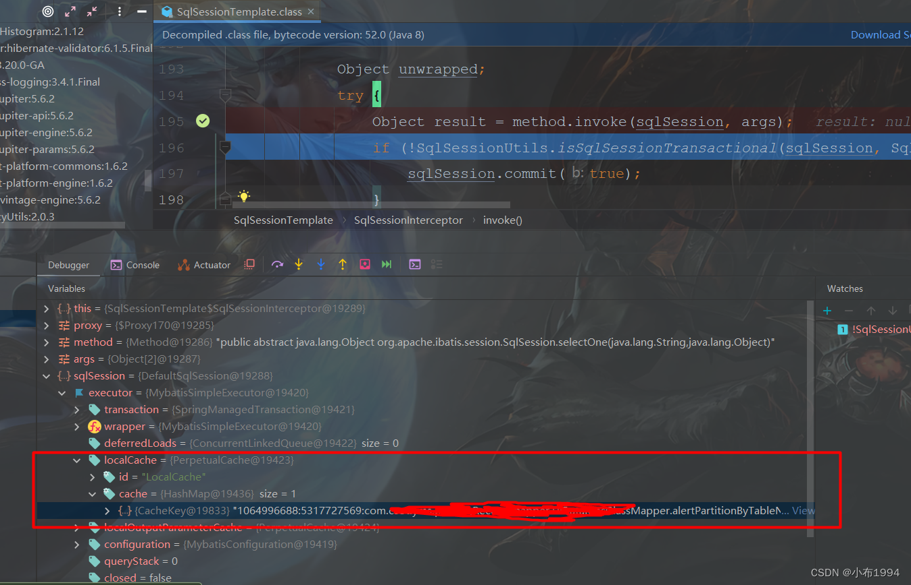

# Debug查看Mybatis相关信息

> 原创 已于 2023-04-25 19:16:07 修改 · 公开 · 909 阅读 · 1 · 0 · 本内容遵循CC 4.0 BY-SA版权协议 版权声明：本文为博主原创文章，遵循 CC 4.0 BY-SA 版权协议，转载请附上原文出处链接和本声明。 · 编辑
> 文章链接：https://blog.csdn.net/tanhongwei1994/article/details/120726013

#### SqlSessionTemplate 内部类SqlSessionInterceptor #invoke()方法

路径：
org.mybatis.spring.SqlSessionTemplate.SqlSessionInterceptor#invoke

```java
         public Object invoke(Object proxy, Method method, Object[] args) throws Throwable {
        SqlSession sqlSession = SqlSessionUtils.getSqlSession(SqlSessionTemplate.this.sqlSessionFactory, SqlSessionTemplate.this.executorType, SqlSessionTemplate.this.exceptionTranslator);

        Object unwrapped;
        try {
        Object result = method.invoke(sqlSession, args);
        if (!SqlSessionUtils.isSqlSessionTransactional(sqlSession, SqlSessionTemplate.this.sqlSessionFactory)) {
        sqlSession.commit(true);
        }

        unwrapped = result;
        } catch (Throwable var11) {
        unwrapped = ExceptionUtil.unwrapThrowable(var11);
        if (SqlSessionTemplate.this.exceptionTranslator != null && unwrapped instanceof PersistenceException) {
        SqlSessionUtils.closeSqlSession(sqlSession, SqlSessionTemplate.this.sqlSessionFactory);
        sqlSession = null;
        Throwable translated = SqlSessionTemplate.this.exceptionTranslator.translateExceptionIfPossible((PersistenceException)unwrapped);
        if (translated != null) {
        unwrapped = translated;
        }
        }

        throw (Throwable)unwrapped;
        } finally {
        if (sqlSession != null) {
        SqlSessionUtils.closeSqlSession(sqlSession, SqlSessionTemplate.this.sqlSessionFactory);
        }

        }

        return unwrapped;
        }

```

查看连接信息等

执行完 Object result = method.invoke(sqlSession, args); 才能获取到 connection的值

debugger查看这个对象的属性 可以看出连接信息等

```text
sqlSession.executor.transaction.connection.poolEntry.connection
```

#### MybatisSimpleExecutor#doQuery

查看sql语句
如果用的是mybatis-plus则在下面的方法看到sql

com.baomidou.mybatisplus.core.executor.MybatisSimpleExecutor#doQuery

普通的则是在SimpleExecutor#doQuery 方法下

```text
boundSql.sql
```

显示sql内容

执行完method.invoke(sqlSession, args) 后 watch 变量sqlSession.executor.localCache.cache 他的key就是sql

```text
sqlSession.executor.localCache.cache
```

查看连接信息等

[外链图片转存失败,源站可能有防盗链机制,建议将图片保存下来直接上传(img-Ofm5Oohw-1634026601934)(https://i.loli.net/2021/10/12/VfF2LHG4MNbCaOQ.png)]



执行完 Object result = method.invoke(sqlSession, args); 才能获取到 connection的值

[外链图片转存失败,源站可能有防盗链机制,建议将图片保存下来直接上传(img-SfnJZs5y-1634026601936)(https://i.loli.net/2021/10/12/whRtd8iWsVzqYv3.jpg)]



查看sql语句



[外链图片转存失败,源站可能有防盗链机制,建议将图片保存下来直接上传(img-Y7syC8NG-1634026601939)(https://i.loli.net/2021/10/12/D9Einw23fKbz65a.png)]