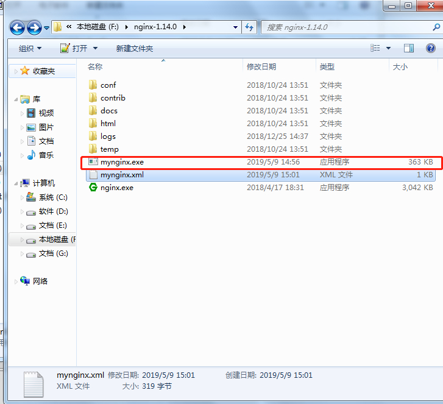
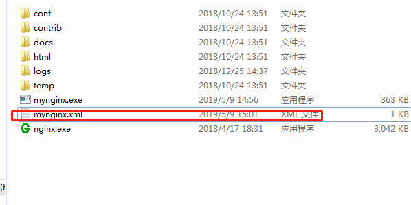

# windows下把nginx注册成服务

> 原创 最新推荐文章于 2026-05-19 08:00:00 发布 · 公开 · 9k 阅读 · 2 · 7 · 本内容遵循CC 4.0 BY-SA版权协议 版权声明：本文为博主原创文章，遵循 CC 4.0 BY-SA 版权协议，转载请附上原文出处链接和本声明。 · 编辑
> 文章链接：https://blog.csdn.net/tanhongwei1994/article/details/90041594

### 添加微博图床

1. 进入 [chrome 网上应用店](https://chrome.google.com/webstore/category/extensions?hl=zh-CN)

2. 搜索框输入 pinjkilghdfhnkibhcangnpmcpdpmehk

3. 添加扩展

### 下载nginx

首先去 [官网](http://nginx.org/en/download.html) 下载

### 下载Windows Service Wrapper

[github](http://github.com/kohsuke/winsw) 下载

 

### 安装服务

1. 将WinSW.NET4.exe重命名为mynginx.exe(名称可以任意命名)复制到nginx的根目录下。
    

2. 在nignx的根目录下新建个mynginx.xml(必须和前面的mynginx.exe一致)，编辑内容:

```
<service>

 <id>nginx</id>

 <name>nginx</name>

 <description>nginx</description>

 <logpath>F:\nginx-1.14.0</logpath>

 <logmode>roll</logmode>

 <depend></depend>

  <executable>F:\nginx-1.14.0\nginx.exe</executable>

  <stopexecutable>F:\nginx-1.14.0\nginx.exe -s stop</stopexecutable>

</service>
```

> stopexecutable、executable、logpath为nignx的真实路径

 

1. 进入nginx根目录执行以下命令

```cmd
mynginx.exe install
```

大功告成！

---

### nginx常用命令

进入nginx根目录

1. 启动nginx

```cmd
start nginx
```

1. 停止nginx

```cmd
nginx -s stop
```

1. 停止nginx

```cmd
nginx -s quit
```

> stop表示立即停止nginx,不保存相关信息
> quit 表示正常退出nginx,并保存相关信息

4.重启nginx

```cmd
nginx -s reload
```

5.查看配置是否正常

```cmd
nginx -t
```

6.删除所有的nginx进程（可以启动多个nginx.exe）

```cmd
taskkill /IM  nginx.exe  /F 
```

有可能电脑权限导致配置文件不生效！！！